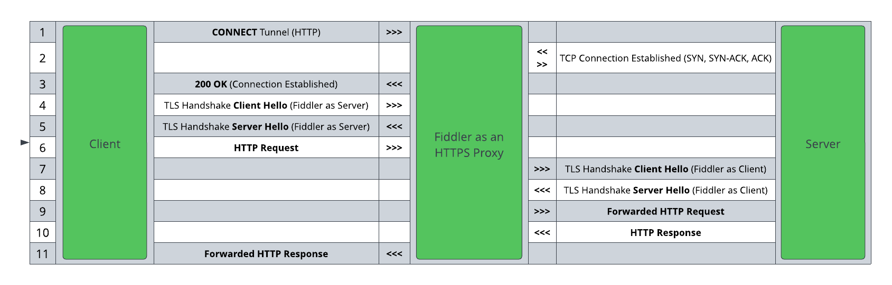

## Brief Story of HTTPS and TLS

Almost all modern-day web pages, plus many desktop and mobile applications, use [the HTTPS protocol](https://en.wikipedia.org/wiki/HTTPS) to secure communication from the client to the server and vice-versa. The **S** in HTTPS stands for **Secure** and implies that the data is transferred not in plain text but in encrypted form. The encryption in HTTPS is achieved by using a cryptographic protocol named Transport Layer Security (**TLS**) or, formerly, Secure Sockets Layer (**SSL**). The idea is that no man-in-the-middle can sniff the ongoing packets and obtain sensitive data (like usernames, passwords, financial data, personal content, etc.) - the cryptographic encryption ensures that all data is unreadable for third parties.

There is widespread support for TLS versions **TLS 1.2** (in use since 2008) and **TLS 1.3** (in use since 2018), which are considered a standard for creating a secure application. Older versions of TLS (**TLS 1.0** and **TLS 1.1**) were discontinued in 2019 and, alongside the obsolete versions of SSL (**SSL 2.0** and **SSL 3.0**), are considered insecure. 

If you are writing an application today and wondering which TLS version you should use - go for **TLS 1.3**! The latest version of TLS has significant improvements such as:

- Fasted and simpler TLS handshake&mdash;In older TLS versions, the TLS handshake was carried in plain text, introducing additional steps for encryption and description. With version 1.3, the server certificate encryption applies by default, which lowered the number of packets needed for a successful handshake from 5-7 to 0-3.

- Better latency with Zero Round-Trip Time (0-RTT) key exchanges&mdash;The TLS 1.3 specification allows the client to send application data to the server immediately after the ClientHello message, with zero round-trip time and refers to that data as 0-RTT data.

- More secure cryptohgraphic ciphers&mdash;Version 1.3 supports only [five cipher suites](https://ciphersuite.info/cs/?security=secure&tls=tls13&singlepage=true&software=all) compared to [over 58 suited in TLS 1.2](https://ciphersuite.info/cs/?security=secure&tls=tls13&singlepage=true&software=all)). Only ciphers implementing [Perfect Forward Secrecy](https://www.keycdn.com/blog/perfect-forward-secrecy) are supported, while vulnerable algorithms and ciphers are removed.

In conclusion, TLS 1.3 provides better handshake performance, improved latency, and more robust security.

## Decrypting HTTPS with Fiddler Everywhere

By default, Fiddler Everywhere works a local forward proxy and that captures non-secure HTTP traffic. To enable capturing and decrypting of HTTPS traffic, you need to go a step further and allow Fiddler to act as a man-in-the-middle by explicitly[ installing and trusting its root CA, and enabling HTTPS capturing](https://docs.telerik.com/fiddler-everywhere/installation-and-update/trust-certificate-configuration).

## TLS 1.3 Support in Fiddler Everywhere

Fiddler Everywhere 4.2.0 officially introduced support for **TLS 1.3**.  Note that Fiddler Everywhere will accept inbound connections using any protocol version including obsolete ones (All supported versions are SSL2, SSL3, TLS1.0, TLS1.1, TLS1.2, and now TLS 1.3). However, there is specific behavour when the proxy stands in the middle and if the client and server are supporting different TLS versions.

Fiddler Everywhere acts as a server for the client (that sends the HTTPS request) and as a client to the server (that receives the HTTPS request and returns the HTTPS response). It is important to note that Fiddler will negotiate the TLS connections with the client and the server separately. When the Fiddler proxy establishes the TCP connection, it uses the client's TLS version. Then Fiddler negotiates the TLS version with the server. If the server supports the client's TLS version, it will select it for the connection. The latest version of Fiddler Everywhere will always try to use TLS 1.3 as default TLS version.

If the server does not support TLS 1.3, Fiddler will negotiate different version (through the Fiddler-Server TLS handshake as depicted in steps 7 and 8) and will establish the connection while using a lower TLS version. In that case, the connections between the client and Fiddler, and between Fiddler and the server will use different TLS versions.

The above behavour leads to a major implication - Fiddler can unexpectedly "fix" your application while it fails in real-life! Let's demonstrate the above while using the BadSSL endpoint.

