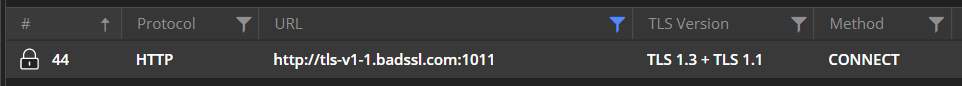

## Brief Story of HTTPS and TLS

Almost all modern-day web pages, plus many desktop and mobile applications, use [the HTTPS protocol](https://en.wikipedia.org/wiki/HTTPS) to secure communication from the client to the server and vice-versa. The **S** in HTTPS stands for **Secure** and implies that the data is transferred not in plain text but in encrypted form. The encryption in HTTPS is achieved by using a cryptographic protocol named Transport Layer Security (**TLS**) or, formerly, Secure Sockets Layer (**SSL**). The idea is to prevent an intermediate from sniffing the ongoing packets and obtaining sensitive data (like usernames, passwords, financial data, personal content, etc.) - cryptographic encryption ensures that all data is unreadable for third parties.

There is widespread support for TLS versions **TLS 1.2** (in use since 2008) and **TLS 1.3** (in use since 2018), which are considered a standard for creating a secure application. Older versions of TLS (**TLS 1.0** and **TLS 1.1**) were discontinued in 2019 and, alongside the obsolete versions of SSL (**SSL 2.0** and **SSL 3.0**), are considered insecure. 

If you are writing an application today and wondering which TLS version you should use - go for TLS 1.3! The latest version of TLS has significant improvements such as:

- Fasted and simpler TLS handshake&mdash;In older TLS versions, the TLS handshake was carried in plain text, introducing additional steps for encryption and decryption. With version 1.3, the server certificate encryption applies by default, which lowered the number of packets needed for a successful handshake from 5-7 to 0-3.

- Better latency with Zero Round-Trip Time (0-RTT) key exchanges&mdash;The TLS 1.3 specification allows the client to send application data to the server immediately after the ClientHello message, with zero round-trip time and refers to that data as 0-RTT data. TLS 0-RTT (also known as “TLS early data”) is a method of lowering the time to first byte on a TLS connection. TLS 1.3 only requires 1-RTT (a single round trip) of the protocol, where TLS 1.2 and below required two.

- More secure cryptohgraphic ciphers&mdash;Version 1.3 supports only [five cipher suites](https://ciphersuite.info/cs/?security=secure&tls=tls13&singlepage=true&software=all) compared to [over 58 suited in TLS 1.2](https://ciphersuite.info/cs/?security=secure&tls=tls13&singlepage=true&software=all)). Only ciphers implementing [Perfect Forward Secrecy](https://www.keycdn.com/blog/perfect-forward-secrecy) are supported, while vulnerable algorithms and ciphers are removed.

In conclusion, TLS 1.3 provides better handshake performance, improved latency, and more robust security.

## Fiddler Everywhere as a TLS Proxy

By default, Fiddler Everywhere is a local forward proxy, capturing non-secure HTTP traffic. To enable capturing and decrypting of HTTPS traffic, you need to go a step further and allow Fiddler to decrypt TLS traffic by explicitly [installing and trusting its root CA and enabling HTTPS capturing](https://docs.telerik.com/fiddler-everywhere/installation-and-update/trust-certificate-configuration). Once the Fiddler CAs is trusted the proxy works as an intermediate TLS proxy.


The above depicts how Fiddler Everywhere acts as a server for the client (that sends the HTTPS request) and as a client to the server (that receives the HTTPS request and returns the HTTPS response). It is important to note that Fiddler will negotiate the TLS connections with the client and the server separately. When the Fiddler proxy establishes the TCP connection, it uses the client's TLS version. Then Fiddler negotiates the TLS version with the server. If the server supports the client's TLS version, it will select it for the connection - otherwise, it will negotiate a lower version. The latest version of Fiddler Everywhere will always try to use TLS 1.3 as the default TLS version.


## TLS 1.3 Support in Fiddler Everywhere

Fiddler Everywhere 4.2.0 officially introduced support for **TLS 1.3**. Note that Fiddler Everywhere will accept inbound connections using any protocol version, including obsolete ones (All supported versions are **SSL 2.0**, **SSL 3.0**, **TLS 1.0**, **TLS 1.1**, **TLS 1.2**, and now **TLS 1.3**). However, there is specific behavior when the proxy stands in the middle and if the client and server are negotiating different TLS versions.

Suppose the server does not support TLS 1.3. In that case, Fiddler will negotiate a different version (through the Fiddler-Server TLS handshake in steps 7 and 8 depicted above ) and establish the connection using a lower TLS version. In that case, the connections between the client and Fiddler and between Fiddler and the server will use different TLS versions.

The above behavior leads to a significant implication - Fiddler can unexpectedly "fix" your application while it fails in real-life! Let's demonstrate the above while using the BadSSL endpoint.

- [Instal Fiddler Everywhere](https://www.telerik.com/download/fiddler-everywhere) and [enable HTTPS capturing](https://docs.telerik.com/fiddler-everywhere/installation-and-update/trust-certificate-configuration).

- Start Fiddler Everywhere and click the **Open Browser** button to load a [preconfigured browser instance](https://docs.telerik.com/fiddler-everywhere/traffic/capture-traffic#preconfigured-browser-capturing).

- Execute a request to the BadSSL endpoint below. The endpoint targets a server that will explicitly negotiate TLS 1.1.
    ```
    https://tls-v1-1.badssl.com:1011/
    ```

    >important By default, Windows 10 does not support TLS 1.3. To test TLS 1.3, you must execute the request from a compatible OS (Windows 11, the latest macOS, or Ubuntu) and a client supporting TLS 1.3.

As a result, when Fiddler Everywhere stands in the middle, it will establish a TLS 1.3 handshake with the client. Then it will try to negotiate a TLS 1.3 handshake with the BadSSL server. However, the server will downgrade the TLS version to TLS 1.1 (as it explicitly supports that version). In Fiddler Everywhere, you will notice different badges that inform you of the TLS versions used for the HTTP Request and HTTP Response.


The direct implication is that you will be able to successfully load the BadSSL page because, as an intermediate, the Fiddler proxy successfully negotiated the TLS version with each of the parties (client and server). 



When Fiddler is not in the middle, you might hit an unsupported protocol error (like **ERR_SSL_VERSION_OR_CIPHER_MISMATCH**) if the client and the server don't support a standard SSL/TLS protocol or cipher suite.

## Conclusion

The support for all TLS versions in Fiddler Everywhere opens many possibilities. You can create and apply specific rules for endpoints using a particular SSL/TLS version, inspect detailed TLS-related information (extensions, ciphers, compression), or filter your traffic through the **TLS Version** column. And this is just the beginning! The team is planning to provide options to extend Fiddler's TLS capabilities. Features like setting custom TLS versions and using specific cipher suites are just some things you could expect from the Fiddler Everywhere in the future.

