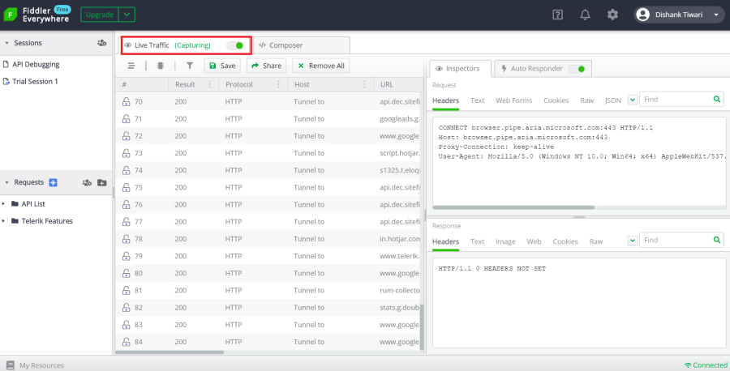
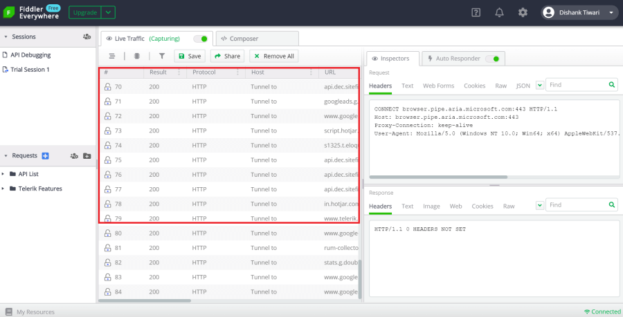
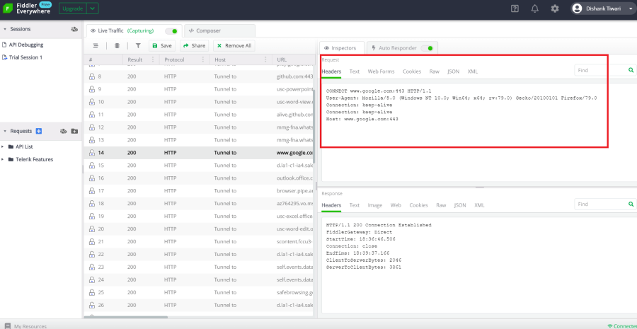
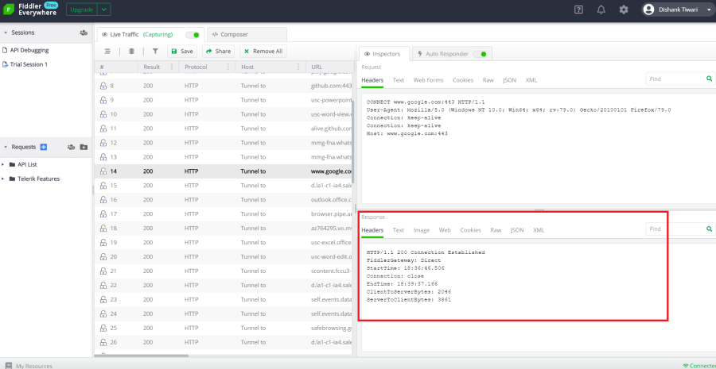

#### Environment

|   |   |
|---|---|
| Product   |
| Product Version | 1.0.2 and above  |

#### Description

Fiddler Everywhere captures and inspects web traffic through HTTP and HTTPS. The captured traffic allows you to debug your web application while using [the Fiddler's Request and Response Inspectors]().

## Capturing Web Traffic

Fiddler Everywhere can capture web traffic (for example, from a browser) made through HTTP or HTTPS. The captured traffic is listed as __sessions__ in the [__Live Traffic__]().

Follow the steps below to capture web traffic:

1. Open Fiddler Everywhere and focus the main [__Live Traffic__ tab.](). Make sure that __Live Traffic__ switch is set to __Capturing__. To stop capturing the live traffic, switch it back to __Paused__.

    

    >tip By default, Fiddler Everywhere can capture only non-secure traffic (HTTP). If you want to enable capturing of secure traffic (HTTPS), then follow the steps described in the [Settings > HTTPS article]().

2. With the __Live Traffic__ being set to __Capturing__, open a browser, enter the HTTP address and make the request. Alternatively, if you do not make the HTTP/HTTPS request through a browser, open the application and make the web request. For example: Open Google Chrome browser and enter [https://docs.telerik.com/fiddler-everywhere](https://docs.telerik.com/fiddler-everywhere)

3. Go back to Fiddler Everywhere. In the __Live Traffic__ section, you will notice the live traffic being captured.

    

    >tip Any new outgoing requests and upcoming responses (for example, after navigating deeper into a website or opening a new website) are continuously captured in the **Live Traffic** panel. Switch back to **Paused** to stop the live capturing and investigate specific sessions without polluting your **Live Traffic**. You can also select one or more sessions from the **Live Traffic** and save and share them or remove them from the list.

## Inspect Web Traffic

Fiddler Everywhere provides functionality to inspect the already captured sessions. The live traffic sessions are composed of HTTP/HTTPS requests and responses. Each HTTP request can be observed through the __Request Inspector__. Each HTTP response can be observed through the __Response Inspector__. Both inspectors are powerful tools that can visualize the received content through different [Inspector types]().

Follow the steps below to inspect a request and its respective response:

1. Open Fiddler Everywhere and capture traffic, as mentioned above.

2. Select a session row in the __Live Traffic__.

3. To the right, at the top, is located the __Request Inspector__. You can choose a different inspector type to visualize the requested content. The default one is __Headers__.

    

4. To the right, at the bottom, is located the __Response Inspector__. You can choose a different inspector type to visualize the requested content. The default one is __Headers__.

    
