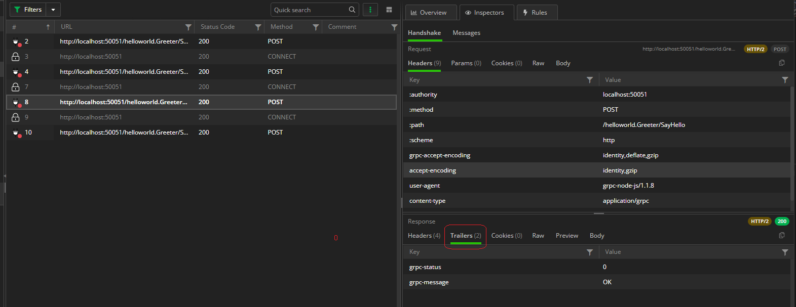
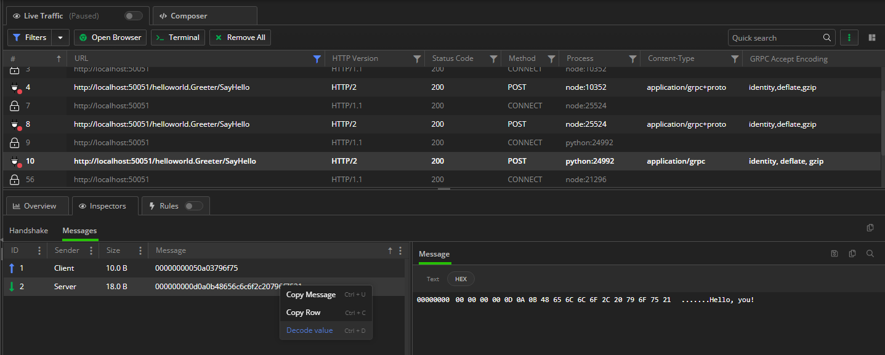
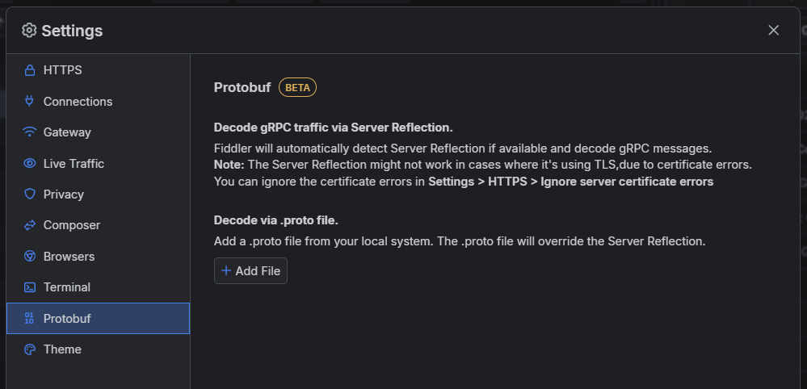

## Environment

|   |   |
|---|---|
| Product version | Fiddler Everywhere 4.2.0 and above  |
| 3rd-party tools | [gRPC](https://gRPC.io/), [Wikipedia gRPC page](https://en.wikipedia.org/wiki/GRPC) |
| Supported OS | macOS, Linux, Windows, iOS, Android |

## Description

My client application utilizes the gRPC framework. What exactly is gRPC? Can I capture and inspect gRPC traffic with Fiddler Everywhere?

## Capturing gRPC in Fiddler Everywhere

[gRPC](https://grpc.io/) is an open-source, cross-platform Remote- Procedure Call (RPC) framework. One of its common usages is to connect services in and across servers with pluggable support for tracing, load balancing, and authentication. 

Fiddler Everywhere captures gRPC traffic out-of-the-box through [all capturing modes]() with the clarification that as gRPC is utilizing HTTP/2, you need to ensure that HTTP/2 capturing is enabled in Fiddler Everywhere. With Fiddler's proxy, you can capture gRPC traffic with all supported streaming modes - unary RPC (no streaming), server-streaming RPC, client-streaming RPC, and bi-directional streaming RPC. [Learn more about the streaming modes in gRPC here...](https://grpc.io/docs/what-is-grpc/core-concepts/#unary-rpc)

To capture gRPC traffic with Fiddler Everywhere, the following conditions must be satisfied:

1. Enable HTTP/2 capturing in Fiddler Everywhere through **Settings** > **Connections** > **Enable HTTP/2 support**.

2. Configure the client using the gRPC framework to go through the Fiddler proxy. The execution of this step differs depending on the client's application. Here are some setup guidelines for different clients:

    - **Terminals and shell applications**&mdash;A terminal and shells can be configured explicitly through the Fiddler proxy. [Learn how to capture traffic from a terminal here...]()

    - **Bash**&mdash;A bash application can be configured to go through the Fiddler proxy. [Learn how to capture traffic from Bash here...]()

    - **Node.js**&mdash;A Node.js application can be configured to go through the Fiddler proxy. [Learn how to capture traffic from Node.js here...]()

    - **Python applications**&mdash;Python applications can be configured to go through the Fiddler proxy. [Learn how to capture traffic from Python applications here...]()

    - **Java applications**&mdash;A Java application can be configured explicitly through the Fiddler proxy. [Learn how to capture traffic from Java applications here...]()

    - **Other gRPC clients**&mdash; If your gRPC client utilizes a different technology stack, you must find the proper method for configuring its proxy settings and set Fiddler's address (by default, http://127.0.0.1:8866) as an HTTP and HTTPS proxy.

3. Start capturing! That's it! Fiddler Everywhere will start capturing gRPC immediately.

## Inspecting gRPC Traffic

Fiddler Everywhere introduces a specific user interface to ease the inspection of gRPC traffic. [The gRPC inspectors](#websocket-grpc-sse-and-socketio-inspectors) are pretty similar to the inspectors used for capturing WebSocket traffic with one exception - the new gRPC Response inspector called **Trailer** (part of the **Handshake** tab). 

You can use the **Trailer** inspector to examine the specific trailers the server sends or mock particular gRPC behavior. For example, you can modify (through a rule) the `grpc_status` trailer header and test how your application behaves in unexpected scenarios like unexpected errors in the stream.



The captured gRPC session will have a green badge until the gRPC channel is open and a red badge when the gRPC channel is closed.


Double-click on a gRPC session to automatically open [the **Messages** tab](#messages-tab) and [the **Message** inspector](#message-inspector) that allows you to inspect each gRPC message as originally received (the context menu provides decoding option) or through [the **HEX inspector**](#hex-body-inspector).



The **Messages** tab lists the outgoing (Sender: Client) and incoming (Sender: Server) gRPC messages. Fiddler Everywhere shows the size and the original content of each message. You can use the context menu to copy the whole row message quickly.

It's important to note that the gRPC uses [Protobuf format](https://protobuf.dev/overview/), which is in unreadable form. That means that the **Decode value** context menu option can't be used for proper decoding of any gRPC channel message. The only way to decode a Protobuf message is to own the **.proto** file, which can't be extracted over the gRPC session. Only the scheme creators are aware of the **.proto** format. Fiddler can help developers (that have access to the **.proto** scheme) by allowing them to extract a specific message and then decode it through the owner **.proto** file and the following command:

```js
// [message_object_name] is the name of the message object in the .proto file. If the message is inside a package in the .proto file, use package_name.message_object_name.
// [.proto_file_path] is the path to the .proto file where the message is defined.
// [binary_message_file_path] is the path to the file you want to decode.
protoc --decode [message_object_name] [.proto_file_path] < [binary_message_file_path]
```

Selecting a specific message allows you to inspect the message in detail through the **Message** inspector. You can examine the context as text or use the HEX inspector, which consists of an offset column, a hex view column, and a text view column.

## Decoding gRPC traffic

Often, the content in the received gRPC messages will be encoded. Meanwhile, Fiddler Everywhere will try to present the content automatically in a readable form, which is often impossible. To further improve the decoding potions, Fiddler Everywhere also supports decoding through the following options:

- Decoding through gRPC server reflection.

- Decoding through Protobuf schema files (files with extension `.proto`).

### Decoding through Server Reflection

Fiddler Everywhere will automatically detect if the gRPC server supports and uses server reflection. The server reflection might not work when it uses TLS due to certificate errors. You can ignore the errors through the **Settings> HTTPS > Ignore Server Certificate Errors** option.

The received gRPC messages will be automatically decoded if server reflection is available.

### Decoding through Protobuf

If you own the Protobuf schema files, you can provide them in Fiddler Everywhere through the **Settings > Protobuf > Decode via .proto file** option. Fiddler Everywhere will try to use the available `.proto` files to decode all received gRPC messages.



As a result, the gRPC message will have a tooltip indicating that Fiddler used a Protobuf file for its decoding.
