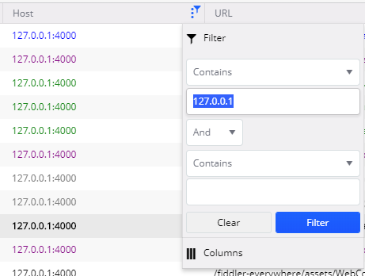

## Environment

|   |   |
|---|---|
| Product   |  Fiddler Everywhere  |
| Product Version | 1.0.0 and above  |

## Description

While testing my application the traffic sent to `localhost` or `127.0.0.1` is not captured by [Fiddler Everywhere system capturing](). How can I handle this issue?

## Solution

Some frameworks (like .NET) are not proxying the localhost traffic. To solve that issue, you can utilize either of the following approaches:

- [Use the machine name](#using-the-machine-name) instead of `localhost`.
- [Use one of the specially provided aliases](#using-aliases) in Fiddler Everywhere.

Both solutions require you to enable the [**Capturing**]() mode.

### Using the Machine Name

Use the machine name as an alias for `localhost` or the `127.0.0.1` loopback addresses. For example, if the machine name is `myrootuserid`, replace `http://localhost:8081/mytestpage.aspx` with `http://myrootuserid:8081/mytestpage.aspx` in the Shell.

### Using Aliases

Depending on the specific scenario, you can replace `localhost` or `127.0.0.1` with one of the following special Fiddler aliases:

* `ipv4.fiddler` for connections using Internet Protocol version 4.
* `ipv6.fiddler` for connections using Internet Protocol version 6.
* `localhost.fiddler` to hit `localhost` in the `Host` header (applicable for IIS Express).

For example, traffic sent to the following URL may not be captured:

```Shell
http://localhost:8081/mytestpage.aspx
```

To capture that traffic with Fiddler Everywhere, use any of the following approaches:

* Replace `localhost` with the `ipv4.fiddler` alias to hit `localhost` on an `IPv4` adapter:

    ```Shell
    http://ipv4.fiddler:8081/mytestpage.aspx
    ```

* Replace `localhost` with the **ipv6.fiddler** alias to hit `localhost` on an `IPv6` adapter:

    ```Shell
    http://ipv6.fiddler:8081/mytestpage.aspx
    ```

* Replace `localhost` with the `localhost.fiddler` alias to hit `localhost` in the `Host` header:

    ```Shell
    http://localhost.fiddler:8081/mytestpage.aspx
    ```

### Filtering Localhost Traffic

While using one of the above solutions to capture localhost requests, the traffic will be captured in the **Live Traffic** grid, and the loopback address will be displayed as a host name, usually `127.0.0.1`. To filter by the **Host** column so that only localhost traffic is displayed, enter the loopback address, and not the aliases used in the browsers, as a `host` value.




## Additional Resources

* [Learn how to direct localhost requests from the mobile application through the Fiddler proxy... ]()

If you have more questions or need help capturing localhost traffic with Fiddler Everywhere, you can reach out to our support team through the **Contact Support** option.