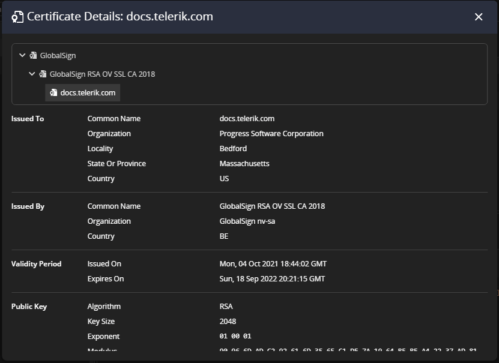
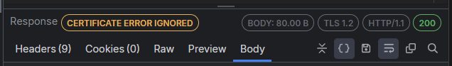
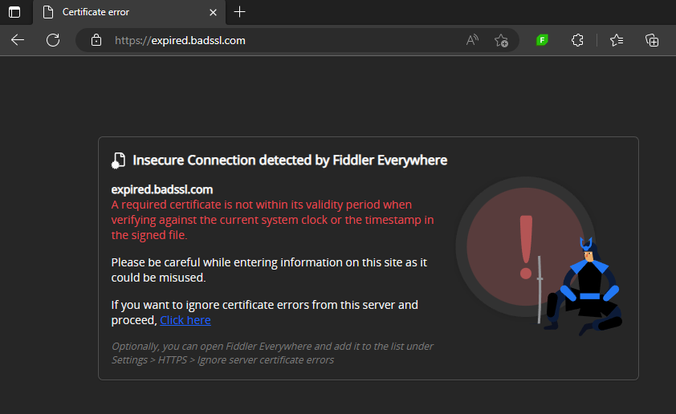
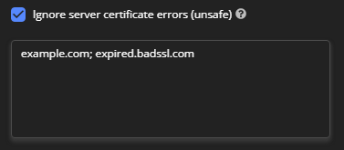

## Environment

|   |   |
|---|---|
| Product   | Fiddler Everywhere
| Product Version | 3.2.0 and above  |

## Description

The Fiddler Everywhere client captures HTTPS traffic and obtains information about the used server certificates. How can I see details about each certificate and catch potential issues related to expiring certificates or certificate errors?

## Solution

Fiddler Everywhere version 3.2.0 and above contain [indicators and notifications](#certificate-indicators) that show if a server certificate is valid, expiring, or causes errors.

Note that certificate information is available only for Live traffic and is not available for saved sessions from the [**Sessions** section]() or for SAZ and other imported files.

### Extracting Certificate Details

Each session that successfully establishes secure connections over HTTPS stores information about the server certificate. Follow the steps to inspect the certificate full details:

- Open Fiddler Everywhere and capture the HTTPS session

- Go to the Response Inspector and click on the **Certificate Valid** note

    

- Inspect the public certificate in detail. The prompt windows might contain the following sections:
    
    * **Issued to**&mdash;Contains public information in fields such as **Common Name, Organization, Locality, Province, Country**
    * **Issued by**&mdash;Contains public information in fields such as **Common Name, Organization, Country**
    * **Validity Period**&mdash;Contains **Issued on** and **Expires on** date fields.
    * **Public Key**&mdash;Contains information about the used **Algorithm**, **Key Size**, **Exponent**, and **Modulus**.
    * **Miscellaneous**&mdash;Different miscellaneous data like **Signature Algorithm**, **Serial Number**, and **Version**.
    * **Fingerprints**&mdash;Lists the **SHA-256** and **SHA-1 fingerprints**.
    * **Extensions**&mdash;Addition information about the certificate ppolicies, constraints, usag, distribution points, etc.

    

### Expiring Certificates

Fiddler Everywhere explicitly indicates if a server certificate is about to expire within the next 30 days. The indicator is in the form of an orange triangle on top of the session's list icon and as a **Certificate Expiring** warning note in the Response Inspector. 

You can still extract certificate data through the [certificate details window](#extracting-certificate-details).

>tip A trivial use-case for the expiring warning is to prepare the update of the certificates on your servers before their expiration. 

### Certificate Errors

Fiddler Everywhere will automatically respect server certificate errors (with **HTTPS** > **Ignore server certificate errors** disabled by default) and show error indicators. The certificate error indicator is in the form of a red triangle on top of the session's list icon and as a **Certificate Error** note in the Response Inspector. 

If you change the certificate error handling (by enabling **HTTPS** > **Ignore server certificate errors**), then the note in the Response Inspector will remind you that the error is ignored.

>tip A typical use case for the **Ignore server certificate errors** option will be certificate validation errors on macOS while trying to access `*.icloud.com` domains. Use the option to ignore the validation error and continue the debugging process.

### Ignoring Sever Certificate Errors

Fiddler Everywhere provides a way to quickly go around any certificate-related error through the **Settings** > **HTTPS** > **Ignore server certificate errors (unsafe)** option.

When the **Ignore server certificate errors** checkbox is active, but no endpoints are added, all certificate errors from all servers will be ignored. 

>important The **Ignore server certificate errors** option is considered **unsafe** and should be used cautiously! It sets if Fiddler Everywhere should warn you when an HTTPS server has presented a certificate that did not validate. You should not check this box when surfing the Internet due to the possibility of [spoofing attack](https://en.wikipedia.org/wiki/Spoofing_attack).

To minimize the security risk of automatically ignoring all server certificates, Fiddler Everywhere allows adding specific endpoints to the list of trusted servers. You can add custom endpoints to the list as follows: 

- Upon opening a page that returns a server certificate error, a custom Fiddler page will present the possibility of automatically adding the endpoint to the list of "trusted" servers. Works only when **Ignore server certificate errors** is inactive or active but not with an empty list.

    

- Tick the **Settings** > **HTTPS** > **Ignore server certificate errors (unsafe)** checkbox and add one or multiple endpoints separated by a semicolon.

    

### Certificate Details in SAZ files

Fiddler Everywhere version 4.2.0 extended the SAZ format, the native format used for saving captured session snapshots (local saves, cloud saved, or manual SAZ exports). Consider the following when working with saved sessions snapshots and certificate details: 

- (Fiddler Everywhere version 4.2.0 and above) All sessions saved locally or through the cloud option will contain the certificate details (that were valid when the capturing took place).
- (Fiddler Everywhere version 4.2.0 and above) All sessions exported in SAZ format will contain the certificate details (that were valid when the capturing took place).
- (Fiddler Everywhere version 4.1.2 and below) All sessions saved locally or through the cloud option won't contain the certificate details.
- (Fiddler Everywhere version 4.1.2 and below) All sessions exported in SAZ format won't contain the certificate details.

#### Deep-Dive with the SAZ format and the Certificate Details

The SAZ file (translates as **Session Archive ZIP** but is also known as **Fiddler Session Archive** or just as **Fiddler Archive**) in its nature is an archive that contains a snapshot of all saved sessions where each session is represented with three different text files.

Inside a SAZ file, you will find:

- [Content_Types.xml] file&mdash;A metadata file that specifies a few MIME types so the archive can be read by System.IO.Packaging or other clients that support the Open Packaging Conventions.
- a **raw** folder&mdash;Contains the files that represent each captured session. Inside the **raw** folder, you can find three or four files for each session.

    * **sessid#_c.txt**&mdash;File that contains the raw client request.
    * **sessid#_s.txt**&mdash;File that contains the raw server request.
    * **sessid#_m.xml**&mdash;File containing metadata including session flags, socket reuse information, etc.
    * (optional) sessid#_w.txt&mdash;File that contains WebSocket messages.

With version 4.2.0 and above, the XML file (**sessid#_m.xml**) now contains an element called **CertificateChainInfo**, which allows you to load and inspect client and server certificate details for each saved sessions. The updated SAZ format is backward-compatible with older versions of Fiddler Everywhere and Fiddler Classic.