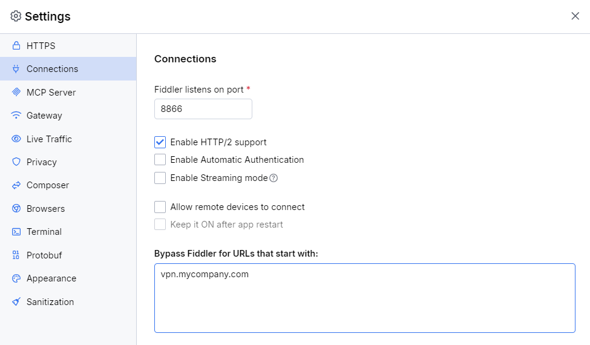
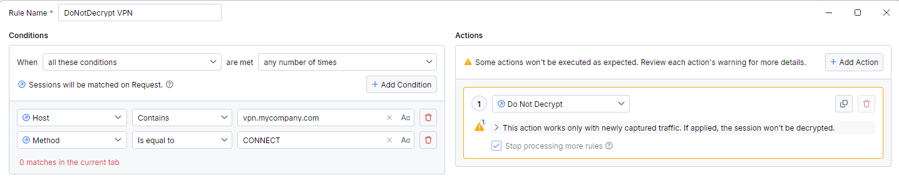

## Environment

|   |   |
|---|---|
| Product   | Fiddler Everywhere |
| Product Version | 1.1.0 and above  |
| 3rd-party tool| [Cisco AnyConnect](https://www.cisco.com/c/en/us/products/security/anyconnect-secure-mobility-client/index.html) |

## Description

How can I configure Fiddler Everywhere to use VPN software like [Cisco AnyConnect](https://www.cisco.com/c/en/us/products/security/anyconnect-secure-mobility-client/index.html)?

## Solution

To properly configure CiscoVPN alongside the Fiddler's system and network capturing modes, follow the steps in the approach suggested below.

### Prerequisites

- Install the latest version of [Fiddler Everywhere](https://www.telerik.com/download/fiddler-everywhere).
- Provide the VPN software with pre-configured VPN network access. The article covers the steps needed for [Cisco AnyConnect](https://www.cisco.com/c/en/us/products/security/anyconnect-secure-mobility-client/index.html).

### Configuring CiscoVPN alongside System Capturing Mode

The following section showcases how to use Cisco VPN alongside [the Fiddler's **system capturing mode**](slug://capture-system-traffic). Executing the steps in the exact order suggested in this section is crucial for properly setting up Cisco AnyConnect alongside Fiddler Everywhere.

1. Make sure your Cisco AnyConnect client is disconnected.
1. Start Fiddler Everywhere and toggle on the **System Proxy** switch (system capturing mode).
1. Open the **Settings** > **HTTP** menu, trust the Fiddler's certificate, and check the **Capture HTTPS traffic** box.
1. Open the **Settings** > **Connections** menu and, in **Bypass Fiddler for URLs that starts with:**, add the VPN addresses of your VPN servers. Click the **Save** button to preserve the bypass list.
    

 You can use a comma, semicolon, new line, and white space as a separator for multiple addresses in the bypass list. All separators will be converted to the OS-supported separator after saving the values. Once the addresses in **Bypass Fiddler for URLs that start with:** are set, the values persist and are used by Fiddler Everywhere to set the OS bypass list. For example, you can open the **Proxy Settings** on Windows OS and check that the values are persisted in the **Use the proxy server except for addresses that start with..** textbox.

1. Start the Cisco VPN client and connect to the VPN network.
1. Start capturing the traffic with Fiddler Everywhere using the system capturing mode.
1. Capture the traffic.
1. Disconnect the Cisco AnyConnect client.
1. Toggle off the **System Proxy** switch and stop the Fiddler Everywhere application.

To preserve the proper OS network configuration ensure that the VPN is started after Fiddler's system capturing mode, and stopped before the system capturing mode as highlighted in the [Reusing the VPN](#reusing-the-cisco-vpn-alongside-system-capturing-mode) section.

## Reusing the Cisco VPN alongside System Capturing Mode

To prevent Cisco AnyConnect from using cached proxy information, stop the Cisco VPN software and close Fiddler Everywhere or pause its system capturing mode.

The workflow for Cisco AnyConnect alongside Fiddler Everywhere is as follows:

1. Start Fiddler Everywhere and toggle on the **System Proxy** switch (system capturing mode).
1. Connect the Cisco AnyConnect client.
1. Capture the traffic.
1. Disconnect the Cisco AnyConnect client.
1. Toggle off the **System Proxy** switch and stop the Fiddler Everywhere application.

## Configuring CiscoVPN alongside Network Capturing Mode

The following section showcases how to use Cisco VPN alongside [the Fiddler's **network capturing mode**](slug://capture-network-traffic). Executing the steps in the exact order suggested in this section is crucial for properly setting up Cisco AnyConnect alongside Fiddler Everywhere.

1. Make sure your Cisco AnyConnect client is disconnected.
1. Start Fiddler Everywhere and enable the network capturing mode.
1. Open the **Settings** > **HTTP** menu, trust the Fiddler's certificate, and check the **Capture HTTPS traffic** box.
1. Create a **Do Not Decrypt** rule to bypass the VPN endpoints.
    - Open **Traffic** pange and go to the **Rules** tab.
    - Use **Add Rule** to open the **Rule Builder**.
    - Create a match condition through **Add Condition** and match the targeted VPN host (for example, match `vpn.mycompany.com`). Additionally, match all sessions that use **CONNECT** HTTP methods (to match the so called proxy tunnels).
    - Create a new action through **Add Action**. Select the **Do Not Decrypt** action.
    
    - Save and enable the rule.
1. Start the Cisco VPN client and connect to the VPN network.
1. Start capturing the traffic with Fiddler Everywhere using the network capturing mode.

## Configuring CiscoVPN alongside Browser and Terminal Capturing Modes

You can directly use Cisco VPN alongside Fiddler's [**browser capturing mode**](slug://capture-browser-traffic) or [**network capturing mode**](slug://capture-terminal-traffic). By default, the CiscoVPN tool does not explicitly restrict the option to set third-party properties on clean browser or terminal instances, which Fiddler does when using one of the said modes.

## In-app VPN Notifications

Due to how the CiscoVPN tool works, if the VPN tool is started before the Fiddler's system capturing mode and the VPN is not exlicitly bypassed (as in the [configuration instructions](#configuring-ciscovpn-alongside-system-capturing-mode)) then you won't see most of the traffic in Fiddler.

The Fiddler Everywhere application can automatically detect when a VPN tool was started before starting up the Fiddler application. In similar cases, the in-app nitoficaitons will warn users about the required order of exectuion so that the traffic can be succesfully captured.

## Lost Internet Access Troubleshooting

In some cases where the Fiddler's system capturing is stopped before the VPN tool, the host device can entirely lose its internet connectivity. This is because the CiscoVPN tool "caches" the proxy settings and does not dynamically change them on some operating systems like macOS. T

To recover from a similar scenario:
- Stop the CiscoVPN tool.
- Stop the Fiddler Everywhere application.
- Open your operating system proxy settings and ensure the Fiddler proxy is successfully unset.