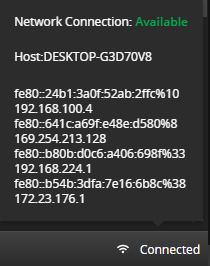

# Connections Section

The **Connections** section is located at the bottom-right corner of Fiddler Everywhere and contains information about the state of the connection and the network configuration.

The section pops up on mouse interaction and lists the following information:

- **Network Connection***&mdash;Shows the state of the network that provides the Internet connectivity.

- **Host**&mdash;Outputs the machine's hostname that Fiddler Everywhere runs on.

- A list of the active network adapters on the machine that hosts Fiddler Everywhere. Each entry is listed by its IPv6 and IPv4 addresses.

The following figure demonstrates the **Connections** section.

