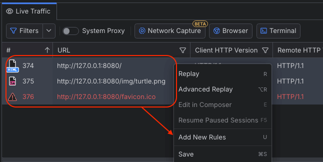
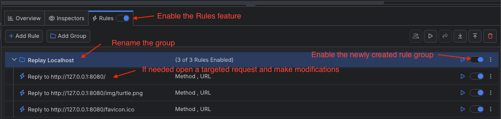
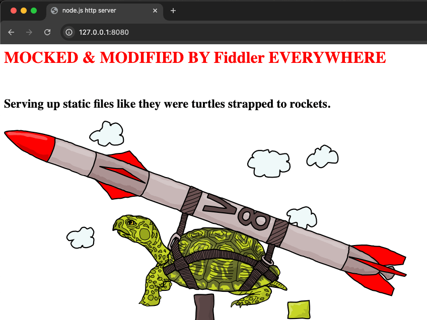

## Environment

|   |   |
|---|---|
| Product | Fiddler Everywhere |
| Features | Live Traffic Grid + Rules Tab |
| Aim | Mock multiple server responses |

## Description

How do you create a single rule to replay traffic from multiple server responses?

## Solution

Using the ** Live Traffic ** grid alongside the ** Rules ** tab, you can quickly create a single rule to replay all traffic generated from a server endpoint.

- Start Fiddler Everywhere and capture the traffic from the targeted server endpoint.
- Select all captured sessions and invoke the Fiddler's context menu (right mouse click).
- Click on the **Add New Rules** option. As a result, Fiddler Everywhere will immediately create a group containing multiple rules mocking the captured traffic. At this point (and if needed), you can modify each rule depending on the scenario you are trying to mock. If you need to simply have a snapshot of the current state, leave the rules unmodified.
    
- Enable the **Rules** tab and the newly created rule group.
    
- Finally, reload the URL used by the client to generate the captured sessions. 

The newly shown page is not the original, but the mocked one was created from the Fiddler rules. 

[Learn more about mocking traffic in Fiddler Everywhere here...](slug://mock-traffic-get-started)
[Learn more about replaying traffic in Fiddler Everywhere here...](slug://replaying-traffic)