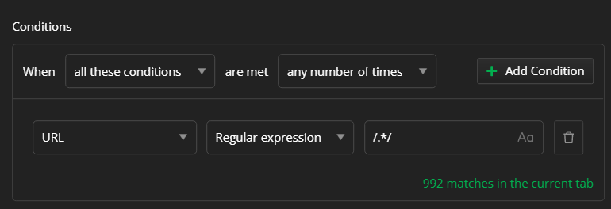
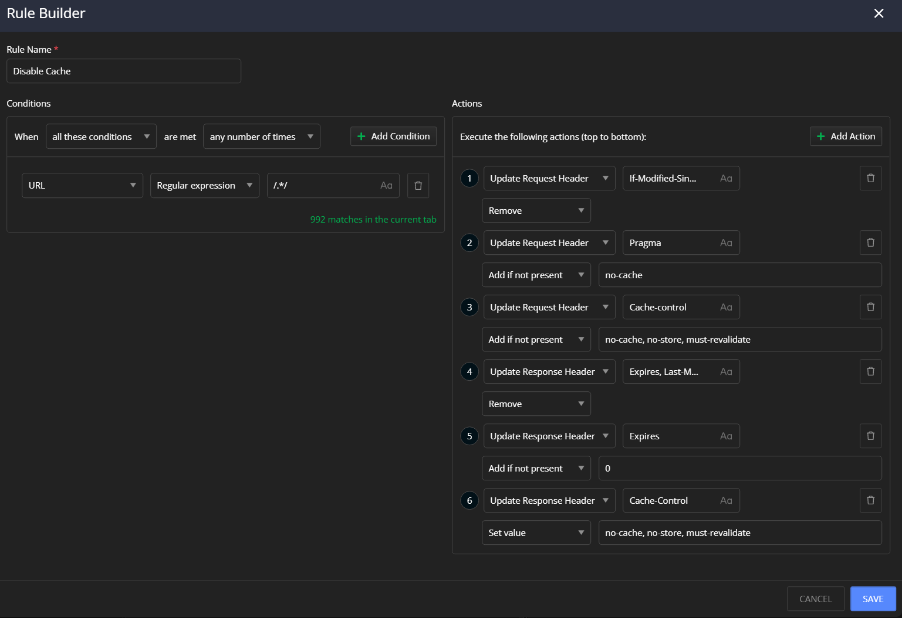
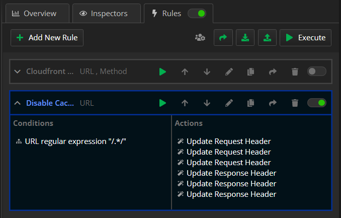

## Environment

|   |   |
|---|---|
| Fiddler Everywhere | all versions  |

## Description

I want to always get the latest content from the server. How to prevent the server or client application from caching an HTTP(S) Request or Response?

## Solution

You can use the **Rules** tab to create and apply a rule for all traffic that goes through the proxy. 

- Create a condtition that matches all captured trafficc. For demonstartion purposes we are using regular expression `.*` which matches every string.

    

- Add actions to overwrire and remove all HTTP Requests and Responses Headers that are related to caching:

    | Fiddler Action | Headers | Value | Action |
    |---|---|---|---|
    | **Update Request Header** | `If-Modified-Since` | any | Remove |
    | **Update Request Header** | `Pragma` | `no-cache` | Set Value |
    | **Update Request Header** | `Cache-Control` | `no-cache, no-store, must-revalidate` | Set Value |
    | **Update Response Header** | `Expires, Last-Modified, ETag`| any | Remove |
    | **Update Response Header** | `Expires` | `0` | Set Value |
    | **Update Response Header** | `Cache-Control` | `no-cache, no-store, must-revalidate` | Set Value |

    As a result, the newly created rule looks like this:

    

- Enable the **Rules** tab and the newly created rule.

    