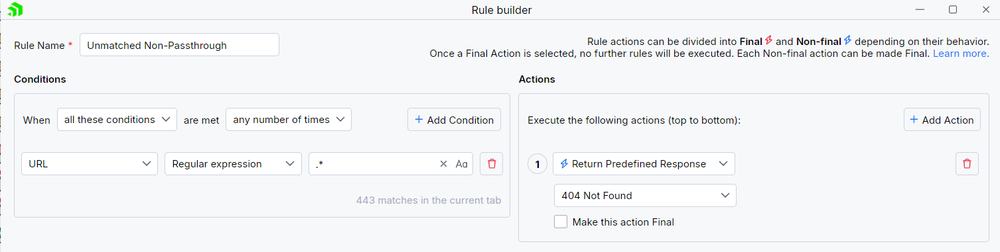
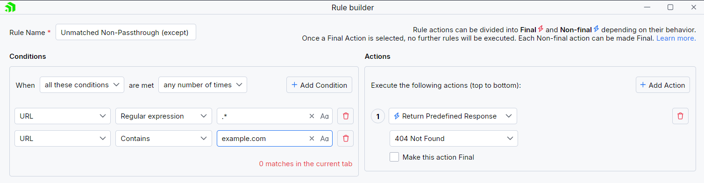

## Environment

|   |   |
|---|---|
| Product   |  Fiddler Everywhere  |
| Product Version | 3.4.0 and above  |

## Description

Fiddler Everywhere 3.4.0 removed the **Unmatched Requests Passthrough** option (previously available through **Settings > Rules**). The legacy option was obsolete as it often confused users and was not easily accessible for quick management. How can I achieve the same functionality with version 3.4.0 and above?

## Solution

Fiddler Everywhere comes with the powerful [**Rules** tab](slug://modify-traffic-get-started) that allows you to easily create a rule that extends the behavior of the **Unmatched Requests Passthrough** option. By default, with Fiddler Everywhere, all requests are sent to the server as is, without modifications from the **Rules** tab. Creating rules that modify that behavior is easily achievable through the [**Rules Builder**](slug://modify-traffic-get-started#rule-builder).


### Creating basic "Unmatched Requests Non-Passthrough" rule:

- Open the **Rules** tab and use **Add New Rule** to create new rule.
- Set a condition to match a specific set of endpoints. For demonstration purposes, we will match **all** URLs.
    ```
    Condition: URL → Regular Expression → .*
    ```
- Create an action to modify the response for the matched requests. For demonstration purposes, we are using a predefined 404 response.
    ```
    Action: Predefined Response → 404_Plain.dat
    ```



When active, the above rule will return 404 for all URLs (because the used regular expression uses wildcard match).

### Creating basic "Unmatched Requests Non-Passthrough (except for <URL>)" rule:

- Open the **Rules** tab and use **Add New Rule** to create new rule.
- Set the first match condition to match **all** URLs.
    ```
    Condition: URL → Regular Expression → .*
    ```
- Set a match condition that will exclude a specific URL through **Does not contain** operator. For demonstration purposes, we are matching all URLs that contain **example.com**
    ```
    Condition: URL → Does not contain → example.com
    ```
- Create an action to modify the response for the matched requests. For demonstration purposes, we are changing the response manually.
    ```Java
    // Action: Manual Response → 
    HTTP/1.1 200 Generated
    Content-Length: 95
    Content-Type: text/plain; charset=utf-8

    Fiddler modifies this request as it does not match the conditions of the activated rules.
    ```



When active, the above rule will return the manual response for all URLs except those containing **example.com**.