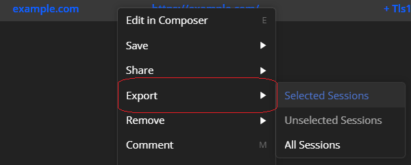
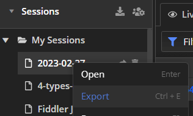

## Environment

|   |   |
|---|---|
| Product version | Fiddler Everywhere 1.0.0 and above |
| Supported OS | macOS, Linux, Windows |

## Description

What is a SAZ file? How do Fiddler Everywhere stores capture traffic?


## SAZ File

The SAZ abbreviation stands for **Session Archive Zip** and is the native Fiddler format used to store HTTP(S), WebSocket, and GRPC traffic. Also known as **Fiddler Archive** or **Fiddler Session Archive**, it is officially supported by Fiddler Everywhere, Fiddler Classic, Fiddler Cap, and FiddlerCore. The SAZ format uses ZIP compression and, as such, can be opened by most of the popular archiving tools. The format is backward and forward-compatible, but newer versions of the SAZ format contain more information than older ones.

>tip Some archiving tools like 7-Zip are recognizing SAZ files by default, while for others, you can need to change the file extension to ZIP.

Any SAZ files produced from Fiddler Everywhere version 4.2.0 and above contains the following:

* a **raw** folder&mdash;The **raw** folder contains several files for each captured session.

    * **sessid#_c.txt**&mdash;The file contains the raw client HTTP(S) request.

        ```
        GET https://expired.badssl.com/ HTTP/1.1
        Host: expired.badssl.com
        Connection: keep-alive
        sec-ch-ua: "Chromium";v="110", "Not A(Brand";v="24", "Google Chrome";v="110"
        sec-ch-ua-mobile: ?0
        sec-ch-ua-platform: "Windows"
        Upgrade-Insecure-Requests: 1
        User-Agent: Mozilla/5.0 (Windows NT 10.0; Win64; x64) AppleWebKit/537.36 (KHTML, like Gecko) Chrome/110.0.0.0 Safari/537.36
        Accept: text/html,application/xhtml+xml,application/xml;q=0.9,image/avif,image/webp,image/apng,*/*;q=0.8,application/signed-exchange;v=b3;q=0.7
        Sec-Fetch-Site: same-site
        Sec-Fetch-Mode: navigate
        Sec-Fetch-User: ?1
        Sec-Fetch-Dest: document
        Referer: https://badssl.com/
        Accept-Encoding: gzip, deflate, br
        Accept-Language: en-US,en;q=0.9,bg-US;q=0.8,bg;q=0.7
        ```

    * **sessid#_s.txt**&mdash;The file contains the raw server HTTP(S) request.

        ```xml
        HTTP/1.1 502 Bad Gateway
        Content-Length: 82269
        Connection: close
        Cache-Control: max-age=0
        Content-Type: text/html; charset=UTF-8

        <!DOCTYPE html>
        <html lang="en">

        <head>
            <meta charset="UTF-8">
            <meta http-equiv="X-UA-Compatible" content="IE=edge">
            <meta name="viewport" content="width=device-width, initial-scale=1.0">
            <title>Certificate error</title>
        </head>

        <body>
            <fdl-card>
                <div class="card__background-image warning-icon"></div>
                <div class="card__background-image"></div>
            </fdl-card>
        </body>
        </html>
        ```

    * **sessid#_m.xml**&mdash;The file contains metadata, including session flags (element `SessionFlags`), certificate chain information (element `CertificateChainInfo`), socket reuse information, etc.

    * **sessid#_w.txt**&mdash;(Optional) The file contains WebSocket messages.

    * **sessid#_g.txt**&mdash;(Optional) The file contains GRPC messages.

* **[Content_Types.xml]**&mdash;A metadata file that specifies a few MIME types so the archive can be read by System.IO.Packaging or other clients that support the Open Packaging Conventions.

## Using SAZ with Fiddler Everywhere

The Fiddler Everywhere uses SAZ behind-the-scenes for each session that is explicitly saved locally or in the cloud. The application also provides options to manually export and import captured and saved traffic through the UI. 

>tip The Fiddler Everywhere application can be set as the default application for opening SAZ files through the opering system default applications settings.

 SAZ files use the following UI options:

- Use the **Export** option from the Live Traffic context menu and then choose **Fiddler Archive (SAZ)** as format.

    

- Use the **Export** option from the **Sessions** list's context menu and then choose **Fiddler Archive (SAZ)** as format.

    

- Use the **Import** option from the **Sessions** list's context menu and then locate the *.saz file from the OS file system.   

All session saved in the local storage is also available as a SAZ file in the application folders. You can manually access and backup your locally saved from the following path:

* Windows path
    ```curl
    C:\Users\<currently-logged-user>\.fiddler\<unique-fiddler-user-GUID>\Snapshots
    ```

* macOS path

    ```curl
    ~/.fiddler/<unique-fiddler-user-GUID>/Snapshots
    ```

* Linux path

    ```curl
    ~/.fiddler/<unique-fiddler-user-GUID>/Snapshots
    ```

>important Deleting SAZ files from the above destinations is irreversible and might result in data loss. Consider backing up data (manually or through the cloud save options) if you plan to delete the `.fiddler` folder or any of its subfolders.