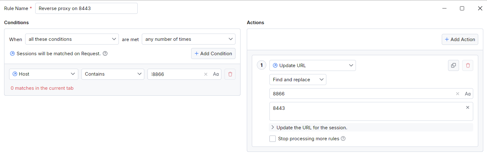
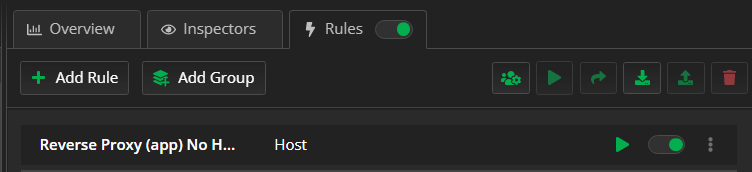
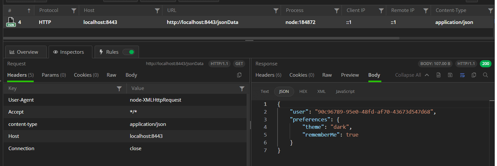
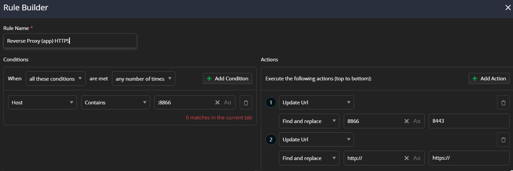

One common scenario for developers, QA and support engineers is to test how their server behaves when a client request is received. A common technique is the usage of reverse proxies, where the proxy tool is installed on the server and all inbound HTTP requests are explicitly going through it before landing on the server. Using a standalone reverse proxy can be hard to setup, and an overkill for cases, when you like only to test and inspect the received HTTP requests. Additionally, in the usual case, developers are using localhost servers to mock and test their web applications, so setting up a full-blown reverse proxy can be over complicated. 

This is where Fiddler Everywhere can fill in - with few simple steps and a single rule, you can create a reverse proxy setup and test requests coming from your web application to the server.

The article provides detailed technical instructions on how to use Fiddler Everywhere as a reverse proxy. Note that the described reverse proxy configuration is limited only for requests made through HTTP version 1.x (version 2.x is currently does not work with the reverse proxy setup explained below).

## Reverse Proxy Configuration

Before explaining how to create a rule that will let Fiddler Everywhere act as a reverse proxy, we will demonstrate how the web application communicates with a simple localhost server.

Let's take a look at a web application that makes HTTP requests on port `8443`. For example:

```JavaScript
const XMLHttpRequest = require("xmlhttprequest").XMLHttpRequest;

const xmlHttp = new XMLHttpRequest();
try {
    xmlHttp.open("GET", 'http://localhost:8443/jsonData', false); // The application uses custom port 8443
    xmlHttp.setRequestHeader('content-type', 'application/json');
    xmlHttp.send(null);
    result = xmlHttp.responseText;
} catch (err) {
    console.log(`Status: ${xmlHttp.status}, Error: ${err.message}`);
}
```

The above demo, sends a HTTP request to a server that works on `localhost:8443`. For example:

```JavaScript
const http = require('http');
const fs = require('fs');

http.createServer()

const server = http.createServer(null, (req, res) => {
});

server.on('error', (err) => console.error(err));
server.on('request', (req, res) => {
    const path = req.url;
    const method = req.method;

    if (path === "/jsonData" && method == 'GET') {
        res.writeHead(200, 'Success',  {
            'Content-Type': 'application/json',
            'Access-Control-Allow-Origin': '*',
            'Access-Control-Allow-Headers': '*'
        });

        const returnData = {
            user: '90c96789-95e0-48fd-af70-43673d547d68',
            preferences: {
                theme: 'dark',
                rememberMe: true
            }
        };

        res.end(JSON.stringify(returnData));
    } 
});

server.listen(8443); // The server works on port 8443

```

In the above scenario, the web application makes a GET request on port `8443`, and the server will directly handle that request as it's configured to listen on that port. If you run Fiddler Everywhere, it won't capture the ongoing traffic as it's not configured to listen on port 8443.

## Creating Reverse Proxy Rule for HTTP


To create a reverse proxy setup, in which the request are first going through Fiddler Everywhere, and only then landing in the localhost server, you need to modify the web application, and create a Fiddler Everywhere rule as follows:

- Change the default port that your application uses (in the demo above that was port `8443`) to the Fiddler Everywhere port (by default that is port `8866`). For example:

    ```JavaScript
    xmlHttp.open("GET", 'http://localhost:8866/jsonData', false); // The application now uses Fiddler's port 8866
    ```

- Open Fiddler Everywhere, load the **Traffic** pane and open the **Rules** tab.

- Click on **Add Rule** and create a rule to redirects all request made to 8866 (Fiddler's port `8866`) to the server's port (`8443`).

    

- Enable both the newly created rule and the **Rules** tab.

    

- Start the localhost server on its original port `8443`.

- Finally, execute the HTTP request from your web application.

As a result, the request goes through Fiddler Everywhere. You can immediately inspect, modify, replay, share the client's HTTP request or track the server behavior on-the-fly.




## Creating Reverse Proxy Rule for HTTPS

Most developers are testing locally through HTTP, but in some cases you are explicitly running local HTTPS server with the sole idea to test the secure requests. The above configuration will work for HTTPS servers, but if you prefer to skip the HTTPS configuration for your web application, then once again you can do it with the help of Fiddler's rules.

- Change the default port that your application uses (in the demo above that was port `8443`) to the Fiddler Everywhere port (by default that is port `8866`). For example:

    ```JavaScript
    xmlHttp.open("GET", 'http://localhost:8866/jsonData', false); // The application now uses Fiddler's port 8866. It still uses the non-secure HTTP as a protocol
    ```

- Open Fiddler Everywhere, load the **Traffic** pane and open the **Rules** tab.

- Click on **Add Rule** and create a rule to redirects all request made to 8866 (Fiddler's port `8866`) to the server's port (`8443`). In addition, add an action to change all HTTP requests to HTTPS requets.

    

- Enable both the newly created rule and the **Rules** tab.

    

- Start the localhost HTTPS server on its original port `8443`.

- Finally, execute the HTTP request from your web application.

As a result, the request goes through Fiddler Everywhere. You can immediately inspect, modify, replay, share the client's HTTP request or track the server behavior on-the-fly.


