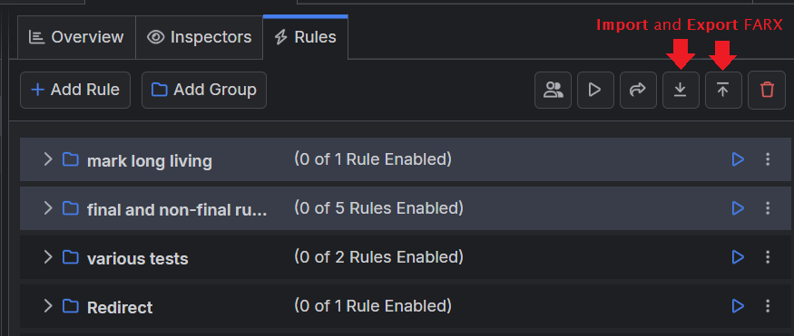
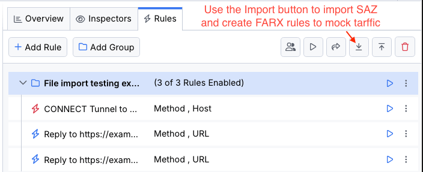
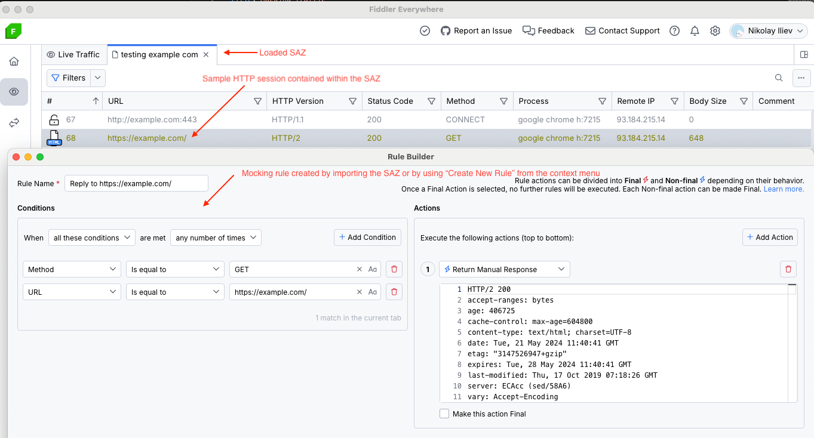
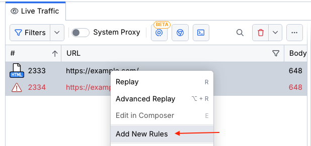

The FARX abbreviation stands for Fiddler Rules Archive, the native format in which Fiddler applications (like Fiddler Everywhere and Fiddler Classic) can generate and export rules or groups of rules.

>tip The rules archives originated from Fiddler Classic, where they were used alongside the AutoResponder feature. Thus, the FARX abbreviation originally came from the Fiddler AutoResponder Archive. The Fiddler Everywhere application enhanced the AutoResponder feature through its **Rules** tab.

## Using FARX with Fiddler Everywhere

The Fiddler Everywhere application automatically recognizes the FARX extension as a native extension. Double-clicking on the FARX file immediately loads it as a new group in the **Rules** tab of Fiddler Everywhere.

Through the **Rules** toolbar, you can also manually import existing FARX files or export selected rules as FARX files.

## Importing Rules from Fiddler Classic

The import wizard in Fiddler Everywhere allows you to import AutoResponder rules from the Fiddler Classic application. The imported rules load it as a new group in the **Rules** tab of Fiddler Everywhere and can be exported at any point as *FARX* files.

[Learn more about the import wizard here..](#importing-autoResponder-rules)

## Using SAZ to create FARX Rules

In addition to creating rules from scratch, you can use any saved SAZ archive and import it as a rule while using the  **Import** button within the **Rules** toolbar. 

As a result, the session contained in the SAZ archive will create a rule that mocks the traffic. For example, you can load any HTTPS Session with the GET method to produce a rule that will mock the HTTP Response and then make additional modifications per your requirements.

Once the rule is created, export it as a FARX file through the **Export** option in the **Rules** toolbar.

## Using Live Traffic to create FARX Rules

Apart from creating a rule from SAZ, you can also directly use captured HTTPS traffic to create a new mocking rule. Use the **Create New Rules** option from the context menu in the **Live Traffic** grid for that purpose.

## Additional Resources

- [Moodify traffic with Fiddler's Rules]()
- [Mocking traffic with Fiddler's Rules]()
- [Replaying HTTPS Traffic with Fiddler's Rules]()
- [Rules tab options and structure]()
- [Creating and Using Breakpoints in Fiddler Everywhere]()
- [Understanding and Using Conditions and Actions in Fiddler's Rules]()
- [Introducing the Rules tab (blog post)](https://www.telerik.com/blogs/introducing-new-rule-builder-fiddler-everywhere)

