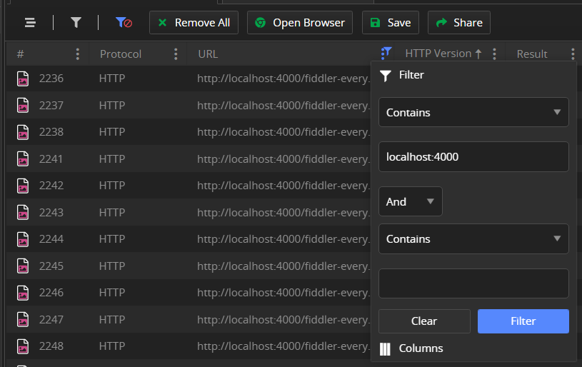
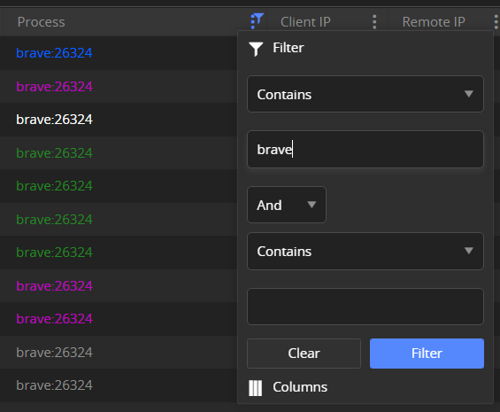
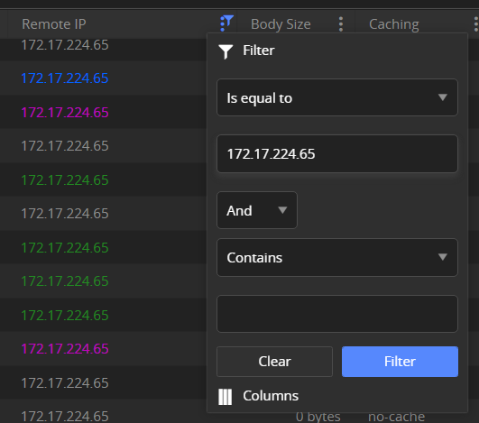

## Environment

|   |   |
|---|---|
| Product   |
| Product Version | Fiddler Everywhere 1.0.0 and above  |

## Description

When the [system capturing](#system-capturing) is enabled, Fiddler Everywhere sets itself as a system proxy. That means that all HTTP/HTTPS/WebSocket traffic from client applications that respect the system proxy will be captured and output as session entries in the [**Live Traffic list**](#live-traffic-list). 

Modern applications are often generating hundreds and even thousands of requests, which might pollute your list with a lot of unwanted information. This article reveals some of the options you can use to filter the captured traffic or to lower the amount of traffic that is captured.

- [Filter the traffic through column filters](#column-filters)
- [Filter the traffic through advanced filters](#advanced-filters)
- [Turn off the global capturing and use a single browser instance](#using-predefined-browser-capturing)
- [Bypass requests to specific domains from using the Fiddler proxy](#bypassing-the-proxy)

## Column Filters

Each column from the [**Live Traffic list**](#live-traffic-list) has its own [filtering menu](#filtering-options). Each filter condition contains different logical operations, for example, **contains**, **starts with**, **ends with**, **is equal to**, and so on. Each condition combines with the filter value, which, depending on the column type, can be a string, number, or boolean. You can apply up to two filter conditions per column filter.

Below, you will find column filter examples and a short description of their use.

### Filtering by the URL Column

One of the most common scenarios is to observe traffic from a single API endpoint or single domain name.

### Filtering by the Process Column

To filter traffic from a specific application, use the **Process** column.

### Filtering by the Client IP Column

When Fiddler Everywhere captures traffic only from the host machine, the **Client IP** column will always have an identical value, usually a localhost address such as `:ffff:127.0.0.1`. However, that is not the case when Fiddler captures traffic from multiple hosts, that is, through **Allow remote computers to connect** and when the remote machines are set to follow the Fiddler proxy. Here is where filtering by the **Client IP** column is beneficial because it allows you to filter the traffic that comes from a specific IP.

### Filtering by the Remote IP Column

When you filter by a domain name or a specific API endpoint, you can still observe some sessions which contain the filter term and which come from third parties like Google Analytics, click trackers, and so on. You can further restrict the output by explicitly filtering by the **Remote IP** column, which indicates the server IP address used for this request.

## Advanced Filters

The **Advanced Filters** toolbar option enables you to apply complex filtering solutions such as creating multiple filtering conditions and combining them with logical operations when all, any, or none conditions are met, using regular expressions, and tracking in real-time if the filters match captured sessions.

Set the advanced filters as follows:

1. Click the **Advanced Filters** button to open the advanced filters popup window.
1. The **Advanced Filters** window allows you to set specific criteria to filter the captured traffic.
1. Set the **When** rule based on one of the following statements:
    - **all these conditions**&mdash;The rule applies when all conditions are true (logical TRUE).
    - **any of these conditions**&mdash;The rule applies when any conditions are true (logical OR).
    - **none of these conditions**&mdash;The rule applies when none of the conditions is true (logical FALSE).
    >tip Learn more about the available [**match conditions**](#conditions), which apply for both in the advanced filters and rule creation.
1. Add one or more match conditions based on the HTTP Request and Response headers and provide logical operators.
1. Click **Apply** to close the **Advanced Filters** and apply immediatly the newly created filter.   

>tip All condition values connected to a **Live Traffic** column can be auto-completed, and the auto-completion suggestions are based on the captured data. Additionally, after adding a condition, a counter will show the number of matches (from the currently captured sessions).

The following example demonstrates five filter conditions that match 18 sessions in the current **Live Traffic** tab. The filter is applied when all conditions are satisfied, and each condition does the following:
- The first condition (`URL` > `contains` > `fiddler-everywhere`) will match when the URL address contains the `fiddler-everywhere` term.
- The second condition (`Client IP` > `is equal to` > `:ffff:127.0.0.1`) will match only the localhost IP address. The `:ffff:` is a subnet prefix for IPv4 (32 bit) addresses placed inside an IPv6 (128 bit) space.
- The third condition (`Status Code` > `is equal to` > `200`) will match only when the status code of the response is 200.
- The fourth condition (`Response Body` > `Regular Expression` > `filter|ip|url`) will match only a session where the Response Body contains any terms set through the regular expression. The regex can be interpreted as `regexp/filter|ip|url`.
- The fifth condition (`Process` > `Contains` > `chrome`) will match only requests coming from a client application in which the local OS process name contains `chrome`.
- The sixth condition (`Remote IP` > `is equal to` > `::1`) will match only when the request comes from the localhost. The `::1` is the loopback address in IPv6. This specific condition is useful when testing HTTP/HTTPS sessions from a localhost development environment, but it can also be applied to any real-life IP server address.

## Using Predefined Browser Capturing

The [predefined browser capturing](#preconfigured-browser-capturing) opens a separate instance of your default Chromium browser and captures traffic from that instance only. Using this option while **Live Traffic** capturing is paused will ensure that only traffic from the browser instance is output in the **Live Traffic** list. All additional columns and advanced filters are still applicable. 

## Bypassing the Proxy

While bypassing the proxy is not technically related to filtering, requests to specific domains may not go through the Fiddler proxy but directly through the upstream proxy. As a result, these sessions won't pollute your **Live Traffic** tab. You can set a list of domains to bypass through the [**Connections** menu]() or, alternatively, you can add URL to the bypass list while using the context menu.
