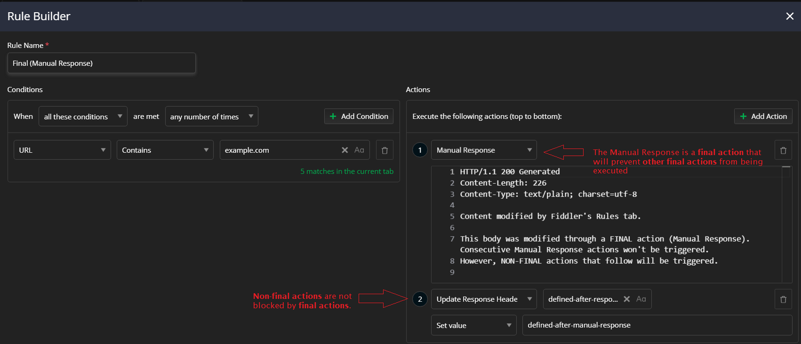
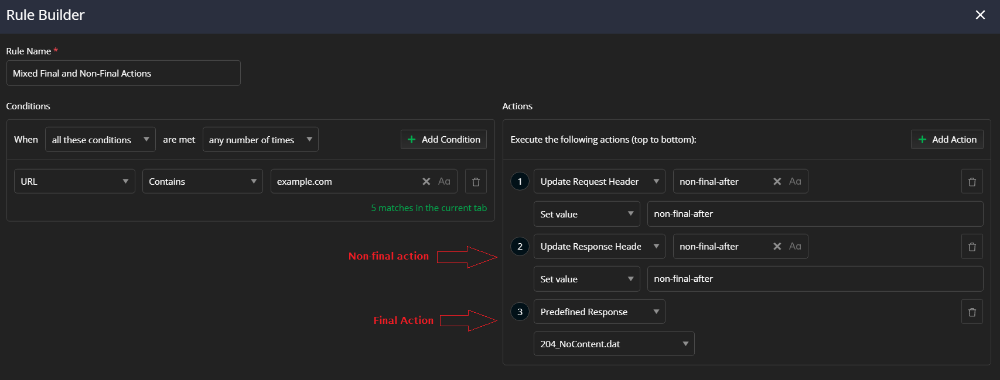
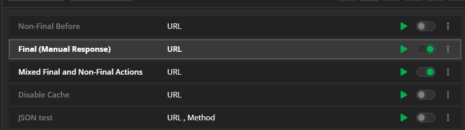

## Environment

|   |   |
|---|---|
| Product  |
| Product Version | 1.0.0 and above  |
| Operating System | macOS, Windows, and Linux |

## Description

Some promoted rules are blocking other rules, and some rules are never effectively executed when I work with the **Rules** tab of Fiddler Everywhere. What is the reason for that?

## Final and Non-Final Actions Specifics

The [**Rules** tab]() provides means to mock client and server behavior by modifying HTTP requests and responses. Each rule you create contains a **match** pattern and one or more **actions** to be applied (in case of a match).

It is important to note that [some actions are **final**, while others are **non-final**](#final-and-non-final-actions). A **final** action executes only once and will effectively prevent any other consecutive **final** actions from being executed. When an active rule or set of active rules contains several final actions, only the top-most (in order of appearance) final action runs, while all other demoted final actions are ignored.

The final actions in Fiddler Everywhere are **Manual Presponse**, **Predefined Response**, **Response File**, **Magic String**, **Graceful Close**, **Non-Graceful Close,**Do Not Show**, and **Do Not Decrypt**.

The following examples demonstrate what will happen when you combine final and non-final actions in one or multiple rules.

### Non-Final Actions Only

When only non-final actions are executed, all matching rules have their actions performed and applied.

### Final Actions Only

When one or more rules include multiple final actions, the execution of other final actions is ignored after the most promoted rule that contains a final action takes place. No other demoted actions will be executed after that. 

### Mix of Final and Non-Final Actions

When one or more rules include both final and non-final actions, the execution of the final actions immediately stops after the most promoted final action takes place. The non-final actions from all rules will be executed in their order of appearance.

## Actions Priority

It is important to note that each action has its priority in the rule, and each rule has its priority in the **Rules** queue. The **actions** are executed by order of appearance in the rule where the top actions are executed first. The **rules** are triggered in the order of appearance in the **Rules** queue. Each rule can be demoted or promoted through the user interface. 

For a better illustration of this scenario, refer to the following cases:

- You have a rule called _Final (Manual Response)_ that contains a final action (**Manual Response**) and non-final actions (**Update Response Headers**).

    

- You have another rule called _Mixed Final and Non-Final acti0ons_ that contains another final action (**Predefined Response**) and non-final actions (**Update Reques Headers**, and **Update Response Headers**).

       

- The first rule (_Final (Manual Response)_) has higher priority than the second rule. Note that only these two rules are active (the other ones are inactive, meaning their priority in the queue does not matter).

    

In the above scenario, the order of execution will be as follows:

- Fiddler Everywhere triggers the first active rule called _Final (Manual Response)_. The actions are executed from top to bottom within the rule, as enumerated.

- Fiddler Everywhere triggers the second active rule called _Final (Manual Response)_. The actions are executed from top to bottom within the rule, as enumerated. However, the final action from that rule (the **Predefined Response**) won't be executed because the first rule has already executed another final action (the **Manual Response**). All non-final actions from all active rules are executed as expected.

>tip **Rules of thumb:** Final actions effectively block all other final actions from any other active rule. Non-final actions always execute.

## Suggested Links

- [Modifying Server Responses]()
- [Using the Rules Tab]()
