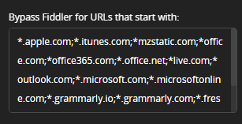
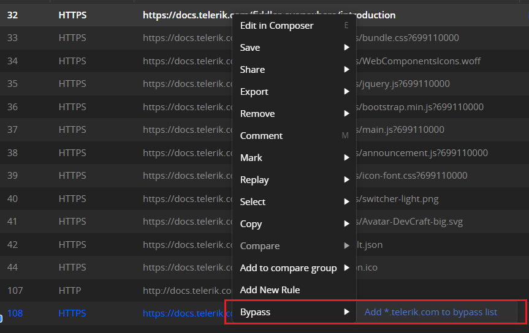
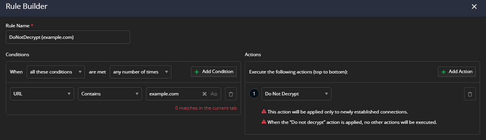

## Environment

|   |   |
|---|---|
| Product   |  Fiddler Everywhere  | 
| Product Version | 1.0.0 and above  |

## Description

**Q:** I would like certain services, client applications, or specific endpoints to bypass the Fiddler Everywhere proxy and directly use the upstream proxy. How can I achieve that?

**Q:** An HTTPS service stopped working due to certificate pinning/SSL errors. How can I prevent that services from going through the Fiddler proxy?

**Q:** The iTunes on my iOS device is not working when Fiddler Everywhere is being set as a proxy. How to resolve that issue?

**Q:** I am using a service that pollutes my Fiddler Everywhere captured traffic. How to prevent this traffic from being caught from Fiddler Everywhere in the first place?

**Q:** Instead of entirely bypassing the proxy, can I just skip decryption for particular endpoints?

## Solution

All the described issues above have a common solution - [bypassing Fiddler](#bypassing-fiddler) so that the specific application endpoints use the default connection directly. As a result, any request to these endpoints will go straight through the upstream proxy, effectively bypassing Fiddler, and they won't use the Fiddler Everywhere certificate. The immediate effect is that Fiddler Everywhere won't capture traffic from the bypassed endpoints. Still, at the same time, the bypassed services will continue to work while using the default internet connection.

Fiddler also allows decrypting only some endpoints while explicitly [skipping decryption](#skipping-decryption-through-rules) for others. This is possible through the **Rules** tab and the action called **Do Not Decrypt**.

Lastly, you might want to filter the captured traffic while preserving all captured sessions temporarily. For that, you can use the [built-in filters](slug://how-to-filter-traffic) or the **Do Not Show** rule action.

## Bypassing Fiddler

### Proxy Bypass List

- Open Fiddler Everywhere on the host machine and go to **Settings > Connections**.

- In the **Bypass Fiddler for URLS that starts with:** field, add the endpoints that you would like to bypass, separated by a comma:

    _Example for bypassing the Apple endpoints (for system services that are using certificate pinning)_
    ```
    *.apple.com, *.itunes.com, *mzstatic.com
    ```
    

- Click **Save** to persist the change.

### Adding to Bypass List

You can add a root domain or specific subdomain address to the bypass list on-the-fly while actively capturing.

- Open Fiddler Everywhere and start capturing traffic.

- Select a session that uses the domain/URL you want to bypass.

- With the session selected, open the context menu and choose **Bypass > Add <*.domain.xxx> to Bypass List** or **Bypass > Add <subdomain.domain.xxx> to Bypass List**.



### Resetting the Bypass List

- Open Fiddler Everywhere on the host machine and go to **Settings > Connections**.

- Delete the endpoints that you no longer want to bypass the Fiddler proxy from the **Bypass Fiddler for URLS that starts with:** field.

- Click **Save** to persist the change.

## Skipping Decryption through Rules

An action called **Do Not Decrypt** is available in the **Rules Builder**. Only the CONNECT tunnel session will appear for the matched sessions when the action is active. You can see the Fiddler message that no further sessions will be decrypted inside the CONNECT tunnel session's response. Only conditions matching **Host**, **URL**, **Process**, **Client IP**, **HTTP Version**, and **Remote IP** can be used alongside the **Do Not Decrypt** action.

Toggling a **Do Not Decrypt** rule on and off will not modify existing connections. The rule works only for newly established connections.

### Creating a Rule to Skip Decryption

- Open Fiddler Everywhere and go to the **Rules** tab.

- Use **Add Rule** to open the **Rules Builder**.

- Set the targeted endpoint as a match condition through **Add Condition**.

- Create new action through **Add Action**. Select the **Do Not Decrypt** action.

    >important The **Do not decrypt** action is **final**, which means that no further actions will be executed once the action is applied. [Learn more about final and non-final actions here...](slug://fiddler-rules-actions)

    

- Save and enable the rule when needed.


