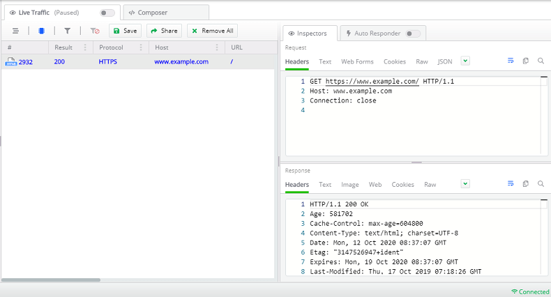

## Environment

|   |   |
|---|---|
| Product   |  Fiddler Everywhere  |
| Product Version | 1.0.0 and above  |
| Node.js Module  | http |
| Node.js Module  | request |

## Description

Many developers use Fiddler Everywhere to capture traffic from Node.js libraries that make HTTP and HTTPS requests. How can I proxy these requests to capture and analyze them with Fiddler Everywhere?

## Solution

Some Node.js modules, such as [`request`](https://www.npmjs.com/package/request), are reading the proxy information from the Windows environment variable ([global proxy settings](#setting-the proxy-globally)). Others, like the state [`HTTP` module](https://nodejs.org/api/http.html), do not respect the global proxy configuration of Node.js, and you need to [proxy their requests explicitly](#setting-the proxy-explicitly).

This section demonstrates the primary approach for each of the mentioned scenarios.

## Using the Fiddler's Terminal

Fiddler Everywhere allows quickly opening dedicated terminal that automatically uses Fiddler as HTTP(S) proxy for Node.js. [Learn more about the Fiddler's terminal here...](slug://capture-terminal-traffic)

## Setting the Proxy Globally

This scenario is helpful for libraries like [request](https://www.npmjs.com/package/request) that reuse the proxy settings in the environment variables. With Node.js, you can set the proxy directly in the terminal.

The following example demonstrates how to define the proxy settings on **macOS** and **Linux**.

```bash
export http_proxy=http://127.0.0.1:8866
export https_proxy=http://127.0.0.1:8866
export NODE_TLS_REJECT_UNAUTHORIZED=0
```

The following example demonstrates how to define the proxy settings on **Windows**.

```bash
set http_proxy=http://127.0.0.1:8866
set https_proxy=http://127.0.0.1:8866
set NODE_TLS_REJECT_UNAUTHORIZED=0
```

Once the above settings are applied, you can now call modules like [request](https://www.npmjs.com/package/request) and make the HTTP request. The request will be captured by Fiddler Everywhere. Once the capturing is over, you can revert the global proxy settings as follows:

The following example demonstrates how to unset the proxy on **macOS** and **Linux**.

```bash
unset http_proxy
unset https_proxy
unset NODE_TLS_REJECT_UNAUTHORIZED
```

The following example demonstrates how to unset the proxy on **Windows**.

```bash
set http_proxy=
set https_proxy=
set NODE_TLS_REJECT_UNAUTHORIZED=
```

Alternatively, instead of using the terminal, you can use simple JavaScript to set the environment variable through code.

The following example demonstrates the `fiddler-everywhere-test.js` file.

```JavaScript
const url = require("url");
const fiddlerProxy = {
    protocol: "http:",
    hostname: "127.0.0.1",
    port: 8866,
};
const setFiddlerProxy = () => {
    var proxyUrl = url.format(fiddlerProxy);
    env.http_proxy = proxyUrl;
    env.https_proxy = proxyUrl;
    // Use this only for debugging purposes, as it introduces a security issue
    env.NODE_TLS_REJECT_UNAUTHORIZED = 0;
};
const removeFiddlerProxy = () => {
    env.http_proxy = "";
    env.https_proxy = "";
    env.NODE_TLS_REJECT_UNAUTHORIZED = "";
};

setFiddlerProxy();

// Make requests with libraries that reuse the global proxy settings.

removeFiddlerProxy();
```

## Setting the Proxy Explicitly

The [global proxy settings](#settingproxy-globally) won't work for modules like the [`HTTP` module](https://nodejs.org/api/http.html), where you need to proxy each HTTP request to Fiddler Everywhere. One way to solve that is to explicitly set the proxy through the code.

The following example demonstrates the `fiddler-everywhere-test.js` file.

```JavaScript
"use strict";

const url = require("url");
const http = require("http");

const fiddlerEverywhereProxy = {
    protocol: "http:",
    hostname: "127.0.0.1",
    port: 8866,
};

// Use this only for debugging as it introduces a security issue.
process.env.NODE_TLS_REJECT_UNAUTHORIZED = 0;

const setFiddlerProxy = (options) => {
    if (typeof options === "string") { // Options can be URL string.
        options = url.parse(options);
    }
    if (!options.host && !options.hostname) {
        throw new Error("host or hostname must have value.");
    }
    options.path = url.format(options);
    options.headers = options.headers || {};
    options.headers.Host = options.host || url.format({
        hostname: options.hostname,
        port: options.port
    });
    options.protocol = fiddlerEverywhereProxy.protocol;
    options.hostname = fiddlerEverywhereProxy.hostname;
    options.port = fiddlerEverywhereProxy.port;
    options.href = null;
    options.host = null;
    return options;
};

const exampleUrl = "https://www.example.com";
http.request(setFiddlerProxy(exampleUrl), (res) => {
    console.log(res);
}).end(); // Through Fiddler.
```

With the above, you can test the request through the terminal.

```Console
node fiddler-everywhere-test.js
```

As a result, Fiddler Everywhere will capture the request and the response.



## Setting Fiddler Everywhere alongside the Node Proxy

After setting the proxy, either globally or explicitly, for your Node.js process, Fiddler Everywhere will immediately start capturing all the traffic that goes through the Node proxy. You can turn off the **System Proxy** switch to capture only the process from your Node.js libraries. Turning on the **System Proxy** switch will set Fiddler as a system proxy, and the application will start capturing traffic for all apps that use the OS system proxy.
