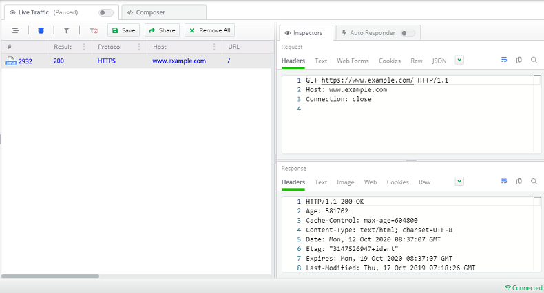

#### Environment

|   |   |
|---|---|
| Product   |
| Product Version | 1.0.0 and above  |
|---|---|
| Node.js Module  | http |
| Node.js Module  | request |

#### Description

Many developers are using Fiddler Everywhere to capture traffic from **Node.js** libraries that make HTTP and HTTPS requests. This article explains how to proxy these requests so that you can capture and analyze them with FIddler Everywhere.

>important Some Node.js modules like [**request**](https://www.npmjs.com/package/request) are reading the proxy information from the windows environment variable ([global proxy settings](#setting-proxy-globally)). Others like the state [**HTTP** module](https://nodejs.org/api/http.html) are not respecting the global proxy configuration (of Node.js), so you need to [proxy their requests explicitly](#setting-proxy-explicitly). The sections that follow below are demonstrating a basic approach for each of the mentioned scenarios.


## Setting Proxy Globally

This scenario is useful for libraries like [request](https://www.npmjs.com/package/request) that reuse the proxy settings in the environment variables. With Node.js, you can set the proxy directly in the terminal.

```Console
set https_proxy=http://127.0.0.1:8866
set http_proxy=http://127.0.0.1:8866
set NODE_TLS_REJECT_UNAUTHORIZED=0
```

Once the above settings are applied, you can now call modules like [request](https://www.npmjs.com/package/request) and make the HTTP request. The request will be captured by Fiddler Everywhere. Once the capturing is over, you can revert the global proxy settings as follows:

```Console
set https_proxy=
set http_proxy=
set NODE_TLS_REJECT_UNAUTHORIZED=
```

Alternatively, instead of using the terminal, you can use simple JavaScript to set the environment variable through code.

_Example file **fiddler-everywhere-test.js**_
```JavaScript
const url = require("url");
const fiddlerProxy = {
    protocol: "http:",
    hostname: "127.0.0.1",
    port: 8866,
};
const setFiddlerPorxy = () => {
    var proxyUrl = url.format(fiddlerProxy);
    env.http_proxy = proxyUrl;
    env.https_proxy = proxyUrl;
    env.NODE_TLS_REJECT_UNAUTHORIZED = 0; // Use this only for debugging purposes as it introduces a security issue
};
const removeFiddlerProxy = () => {
    env.http_proxy = "";
    env.https_proxy = "";
    env.NODE_TLS_REJECT_UNAUTHORIZED = "";
};


setFiddlerPorxy();

// ... make requests with libraries that are reusing the global proxy settings

removeFiddlerProxy();
```

## Setting Proxy Explicitly

The [global proxy settings](#settingproxy-globally) won't work for modules like the [HTTP module](https://nodejs.org/api/http.html), where you need to proxy each HTTP request to Fiddler Everywhere. One way to solve that is to set the proxy through the code explicitly.


_Example file **fiddler-everywhere-test.js**_
```JavaScript
"use strict";

const url = require("url");
const http = require("http");

const fiddlerEverywhereProxy = {
    protocol: "http:",
    hostname: "127.0.0.1",
    port: 8866,
};

// Use this only for debugging purposes as it introduces a security issue
process.env.NODE_TLS_REJECT_UNAUTHORIZED = 0;

const setFiddlerProxy = (options) => {
    if (typeof options === "string") { // options can be URL string.
        options = url.parse(options);
    }
    if (!options.host && !options.hostname) {
        throw new Error("host or hostname must have value.");
    }
    options.path = url.format(options);
    options.headers = options.headers || {};
    options.headers.Host = options.host || url.format({
        hostname: options.hostname,
        port: options.port
    });
    options.protocol = fiddlerEverywhereProxy.protocol;
    options.hostname = fiddlerEverywhereProxy.hostname;
    options.port = fiddlerEverywhereProxy.port;
    options.href = null;
    options.host = null;
    return options;
};

const exampleUrl = "https://www.example.com";
http.request(setFiddlerProxy(exampleUrl), (res) => {
    console.log(res);
}).end(); // Through Fiddler.
```

With the above, you can test the request through the terminal.

```Console
node fiddler-everywhere-test.js
```

As a result, Fiddler Everywhere will capture the request and the response.



## Fiddler Everywhere Alongside Node Proxy

After setting the proxy for your Node.js process (no matter if set [globally](#setting-proxy-globally) or [explicitly](#setting-proxy-explicitly)), it is essential to notice that Fiddler Everywhere will immediately start capturing all of the traffic that goes through the Node proxy. You can turn the **Live Traffic** switch OFF to capture only the process from your Node.js libraries. Turning the **Live Traffic** switch ON will set Fiddler as a system proxy and the **Live Traffic** will start capturing traffic for all applications using the OS system proxy.
