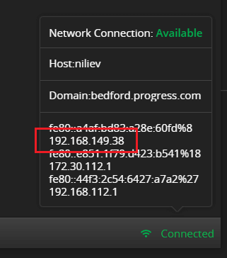

## Environment

|   |   |
|---|---|
| Product   | Fiddler Everywhere |
| Product Version | 1.0.0 and above  |
| Operating System | macOS, Windows, Linux  |

## Description

How to capture HTTP/HTTPS traffic from a client on the same network as the Fiddler Everywhere host?

## Solution

The Fiddler Everywhere proxy can capture HTTP/HTTPS traffic from virtually any device (like a computer, smartphone, smart tv, etc.) on the same network as the Fiddler Everywhere host. Before configuring the proxy on the client machine and the host, you must consider the following prerequisites:

- The Fiddler Everywhere host and the client using the Fiddler Everywhere proxy must be on the same network.
- The Fiddler Everywhere host and the client using the Fiddler Everywhere proxy must be discoverable on the network. There must be no administrative limitations or security policies that prevent device discovery on the local network.

>tip If you can ping the Fiddler host from the client device and the other way around, that would indicate that both devices are "seeing" each other.

## Configuring Fiddler Everywhere (Host) 

1. Enable the remote connections of Fiddler Everywhere through **Settings** > **Connections** > **Allow remote computers to connect**.

1. Check the local IP address of the Fiddler Everywhere application host. You can use [the connection status on the lower right-hand side]({slug connections-section}) to obtain the host IP address. Alternatively, you can get the IP address while using  **ipconfig**/ **ifconfig** (depending on the OS).

    

1. Enable [system capturing](#system-capturing).

## Configuring Fiddler Everywhere (Client)

1. On the target machine, go to the system proxy settings 

1. Open the client's manual proxy settings:

     - Enter the IP address of the Fiddler Everywhere host&mdash;for example, **192.168.148.39**.

     - Enter the Fiddler Everywhere proxy port. By default, the port is **8866**.

1. Open a browser on the iOS device and type the http://ipv4.fiddler:8866 echo service address of Fiddler Everywhere. 

    >important The echo service address is accessible only when the [system capturing](#system-capturing) is turned on.

1. Click the Fiddler root certificate link to download it.

1. Open your client's certificate manager (like Keychain App on macOS or Certificate Manager on Windows), install, and fully trust the downloaded Fiddler certificate.
