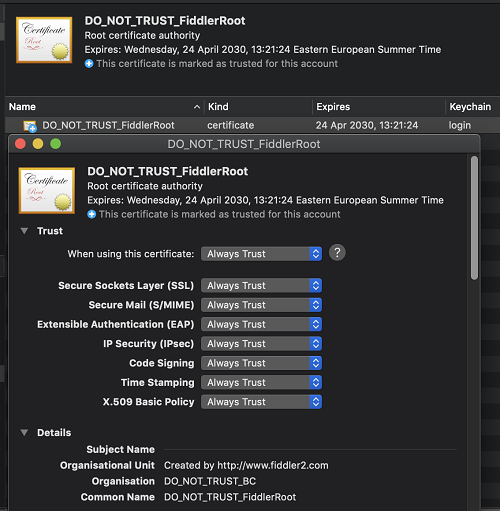

## Environment

|   |   |
|---|---|
| Product   |
| Product Version | 1.0.0 and above  |
| OS | macOS |

## Description

To capture secure traffic (HTTPS), Fiddler Everywhere needs to install a root trust certificate, called `DO_NOT_TRUST_FiddlerRoot`, in the Keychain Access application. How can I install the trust certificate automatically or manually?

## Solution

It is recommended that you install the Fiddler Everywhere root certificate on macOS automatically. For the step-by-step guide, refer to the [First Steps with Fiddler Everywhere on macOS article](#start-system-capturing).  

If the automatic installation and enabling of the trust certificate do not work, you can manually install the trust certificate to your keychain:

1. Open Fiddler Everywhere and go to **Settings** > **HTTPS_** and expand the **Advanced Settings** menu.

1. Click **Export root certificate to Desktop**. As a result, the `FiddlerRootCertificate.crt` file will be created in the **Desktop** folder.

1. Go to the **Desktop** folder and click `FiddlerRootCertificate.crt`. The Keychain Access application will start and will open the **Certificates** section.

1. Double-click the **DO_NOT_TRUST_FiddlerRoot** certificate to open it.

1. Expand the **Trust** section and choose **Always Trust** in the **When using this certificate** drop-down. The **Fiddler root certificate is now installed and trusted.** notification appears.

    

1. Open Fiddler Everywhere and start capturing secure traffic.
