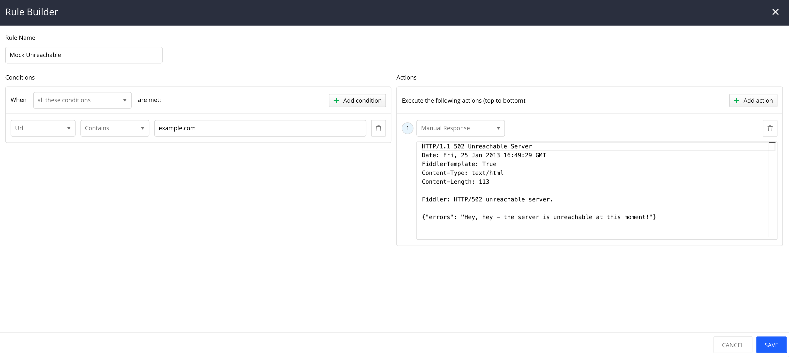
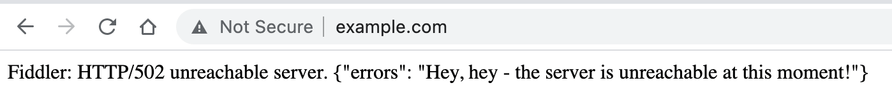
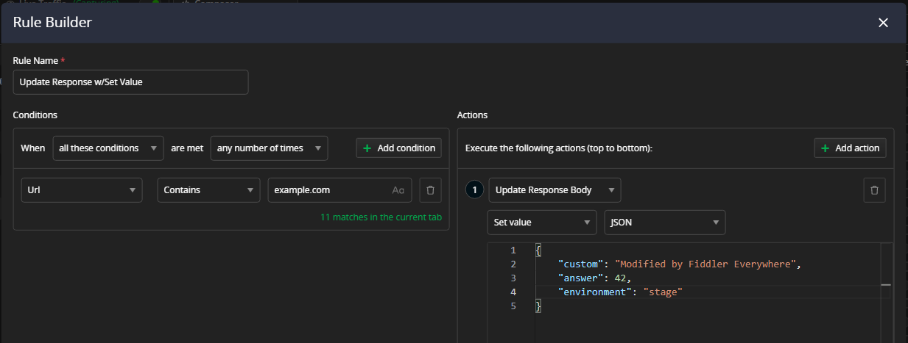

## Environment

|   |   |
|---|---|
| Product   |
| Product Version | 1.0.0 and above  |

## Description

Fiddler Everywhere provides options for modifying the current response (HTML, JS, JSON) that was previously returned by the server. How can I manually simulate and test user conditions to ensure the client-side experience doesn't suffer due to unexpected issues?

## Solution

To achieve this scenario, use the **Manual Response** or the **Response File** actions of the [**Rules**]() tab.

### Manual Response

1. Open the [**Rules**]() tab.

1. Create a new rule through the **Add New rule** button. This will open the [**Rule Builder**](#rule-builder).

1. Add the match condition as per your requirements.

1. Add the action. In this case, choose **Manual Response** from the drop-down, and in the text field, enter the content.

    ```JSON
    HTTP/1.1 502 Unreachable Server
    Date: Fri, 20 Apr 2023 16:42:42 GMT
    Content-Type: text/html
    Content-Length: 113

    Fiddler: HTTP/502 unreachable server.      

    {"errors": "Hey, hey - the server is unreachable at this moment!"}.      
    ```

    

1. Enable the **Rules** tab for **Live Traffic** capturing, activate the newly created rule, and send the request. As a result, the request to https://www.example.com will return status code 502 with your custom error message. Congratulations! You have just mocked a 502 status code response!

    

### Automating Multiple Mock Responses

You may need a better workflow to automate multiple mock responses. For this reason, Fiddler Everywhere provides the functionality to provide a file with the mocked response content through the **Response file** action. The files that will contain the custom response need to be in DAT format.

A DAT file is a generic data file created by a specific application. It may contain data in binary or text format. Text-based DAT files can be viewed in a text editor.

1. Open your favorite text editor.

2. Enter the custom response content. For example:

    ```
    HTTP/1.1 403 Access Denied
    FiddlerTemplate: True
    Date: Fri, 25 Jan 2013 16:49:29 GMT
    Content-Length: 520

    Fiddler: HTTP/403 Access Denied.
    ```

3. Save the file with the `dat` extension. For example, `action-403-status.dat`.

4. Add the **Action** in the rule through **Response file**. In the popup window, choose the newly created `action-403-status.dat` DAT file.

5. Enable the **Rules** tab, activate the newly created rule, and send the request. As a result, the request to https://www.example.com will now return status code 403 with your custom error message. Congratulations! You have just mocked a 403 status code response while using a DAT file!

### Other Response Modification Actions

The **Rules Builder** provides more actions for even more sofisticated modification of your HTTP responses. Use the **Update Response Headers**, **Update Response Body**, and **Update Response Cookies**. Each of these actions provides different set of subactions to further optimize and eazse your mocking process.


### Update Response Body

The **Update Response Body** action allows you to change only the Response body (while preserving the Resp-onse headers and cookies) through setting new value (**Set Value**), by replacing a specific value (**Find and Replace** or **Regular Expression**), or by explcitly deleting the Response body (**Remove**). The example below demonstrates the usage of **Set Value** alongsode a JSON Response inspector.



The **Set Value** subaction supports the following format editors:
 - Plain text
 - JSON
 - CSS
 - XML
 - HTML
 - JavaScript/TypeScript

>tip The specified Response actions are also available as Request counterparts (**Update Request Headers**, **Update Request Body**, and **Update Request Cookies**).