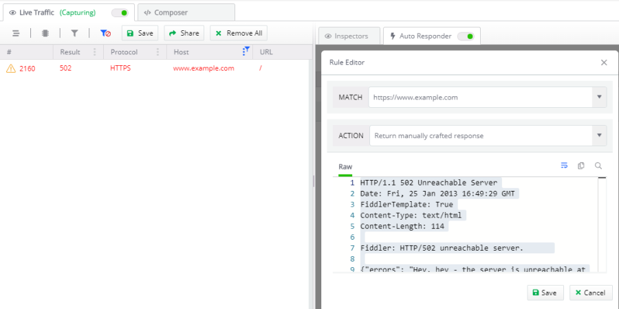
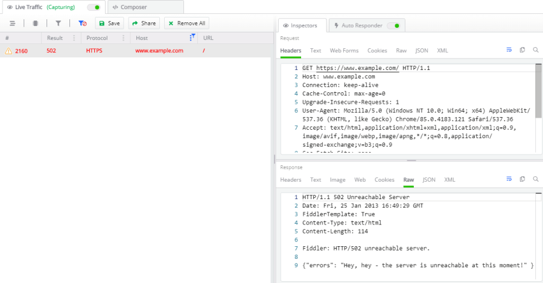

#### Environment

|   |   |
|---|---|
| Product   |
| Product Version | 1.0.0 and above  |

#### Description

As developers, you frequently need to simulate and test various user conditions to ensure the client-side experience doesn't suffer due to unexpected issues. With **Fiddler Everywhere**, you could modify the current response (HTML, JS, JSON) previously returned by the server. This article explains how to achieve that via **Manual Response** or via **Response File** actions of the [**Rules**]() tab.

## Manual Response

1. Open the [**Rules**]() tab.

1. Create a new rule via the **Add New rule** button. This will open the [**Rule Builder**](#rule-builder).

1. Add the match condition as per your requirements.

1. Add the action. In this case, choose **Manual Response** from the dropdown, and in the text field, enter the content, as shown below.

    ```JSON
    HTTP/1.1 502 Unreachable Server
    Date: Fri, 25 Jan 2013 16:49:29 GMT
    FiddlerTemplate: True
    Content-Type: text/html
    Content-Length: 114

    Fiddler: HTTP/502 unreachable server.      

    {"errors": "Hey, hey - the server is unreachable at this moment!"}
    ```
    The newly created rule should look like this:
    

5. Finally, enable the **Rules** tab (for Live Traffic capturing), activate the newly created rule, and send the request. As a result, the request to https://www.example.com will return status code 502 with your custom error message. Congratulations - you have just mocked a 502 status code response!

    

## DAT Files

Using the above action is handy, but we need a better workflow to automate multiple mock responses. For this reason, Fiddler Everywhere provides the functionality to provide a file (with the mocked response content) via the **Response file** action. The files that will contain the custom response need to be in DAT format.

>tip A DAT file is a generic data file created by a specific application. It may contain data in binary or text format (text-based DAT files can be viewed in a text editor).

1. Open your favorite text editor.

2. Enter the custom response content. For example:

    ```
    HTTP/1.1 403 Access Denied
    FiddlerTemplate: True
    Date: Fri, 25 Jan 2013 16:49:29 GMT
    Content-Length: 520
    
    Fiddler: HTTP/403 Access Denied. 
    ```
3. Save the file with **dat** extension . For example save as **_action-403-status.dat_**.

4. Add the **Action** in the rule via **Response file**, and in the popup window, choose the newly created DAT file (**_action-403-status.dat_**).

5. Finally, enable the Rules tab, activate the newly created rule, and send the request. As a result, the request to https://www.example.com will now return status code 403 with your custom error message. Congratulations - you have just mocked a 403 status code response while using a DAT file!