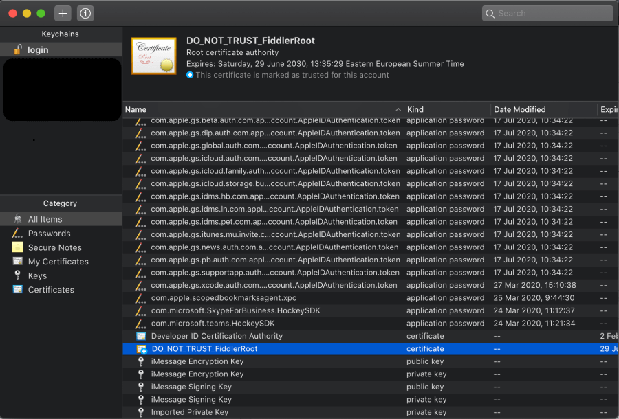
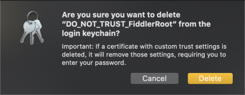
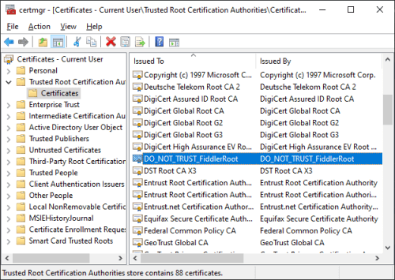
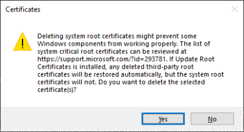

## Environment

|   |   |
|---|---|
| Product   |
| Product Version | 1.0.0 and above  |

## Description

The Fiddler Everywhere certificate is installed to inspect network traffic and debug it. I don't want the traffic monitoring anymore, so how can I remove the HTTPS certificate from my system?

## Solution

To remove the root certificate, follow the steps in each of the sections below depending on the OS you use.

### On macOS

1. In your system, open the Keychain Access application. Select the **login** keychain from the list and **All Items** from the category list.

2. Scroll to the **Fiddler_Root_Certificate_Authority** certificate and press **Delete**.

    

3. Clicking the **Delete** button prompts a window asking for a confirmation. In the popup window, answer **Yes** and enter your system **Password**. This will update the Keychain settings.

    

### On Windows

1. In the search bar of your Windows system, open the **Manage User Certificates** menu.

    

2. A window opens where you can see list of **Certificates - Current User**. In the list, expand the **Trusted Root Certification Authorities** item and select **Certificates**. In the list on the right, search for **Fiddler Root Certificate Authority**.

    

3. Select **Fiddler_Root_Certificate_Authority** and delete the certificate. Click **Yes** in both prompts that will appear. As a result, the certificate will be removed from your system.

    
