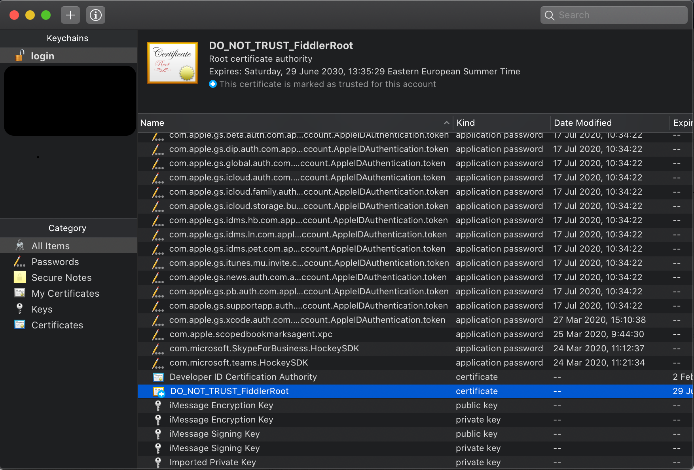
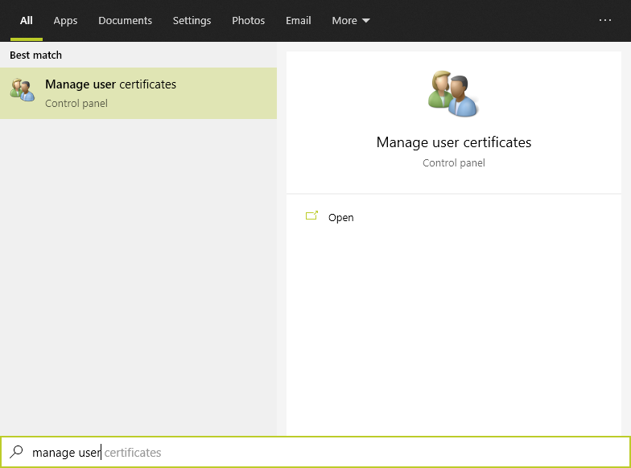
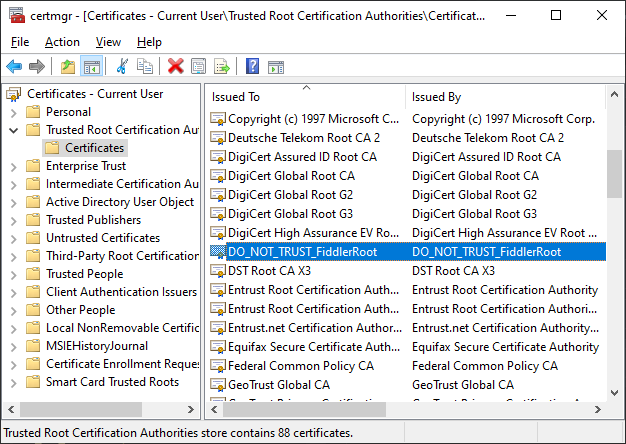

#### Environment

|   |   |
|---|---|
| Product  | Fiddler Everywhere  |
| Product Version | 1.0.0 and above  |

#### Description

Fiddler Everywhere certificate is installed to inspect network traffic and debug it. If you don't want the traffic monitoring anymore, you can remove the Fiddler Everywhere HTTPS certificate from your system. The steps to remove the Fiddler Everywhere HTTPS certificate are given below: 

## macOS 

1. In your system, open the __Keychain Access__ application. Select the __login__ keychain from the list and __All Items__ from the category list. 

2. Scroll to the __DO_NOT_TRUST_FiddlerRoot__ certificate and press __Delete__.

3. Pressing the __Delete__ button prompts a window asking for a confirmation. In the pop-up window, answer __Yes__ and enter your system __Password__ in the prompt window. This will update the Keychain settings. 

Following the above steps will remove the Fiddler Everywhere HTTPS certificate from your macOS. 

## Windows 

1. In the search bar of your Windows system, type __Manage User Certificates__. Click on it to open. 

2. A window opens where you can see list of __Certificates - Current User__. In the list, expand the __Trusted Root Certification Authorities__ item and select __Certificates__. In the list on the right, search for __DO_NOT_TRUST_FiddlerRoot__.

3. Select __DO_NOT_TRUST_FiddlerRoot__ and delete the certificate. When trying to delete the certificate, you will come across couple of prompts. Click __Yes__ in both the prompts. It will completely remove the certificate from your system. 

Following the above steps will remove the Fiddler Everywhere HTTPS certificate from your Windows system. 