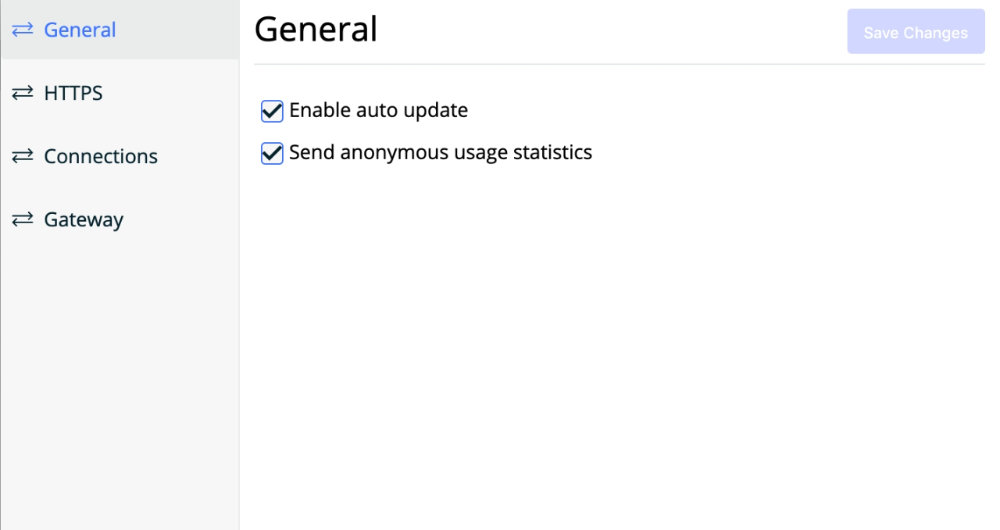
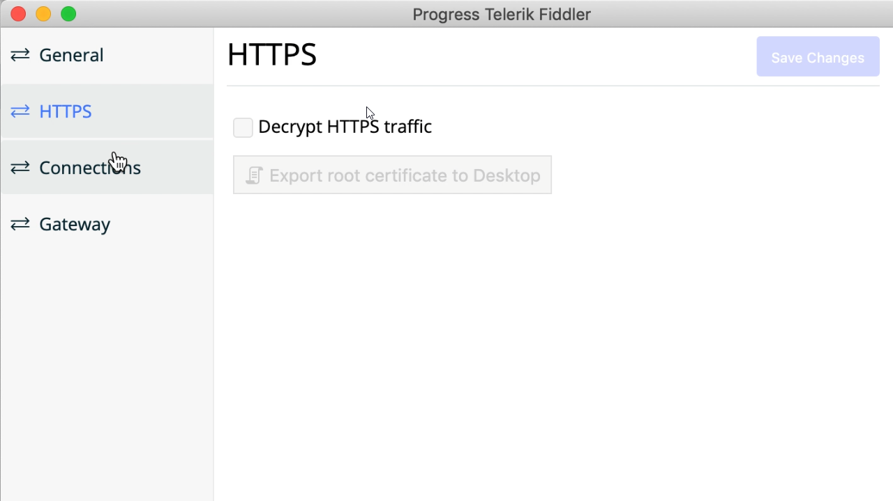
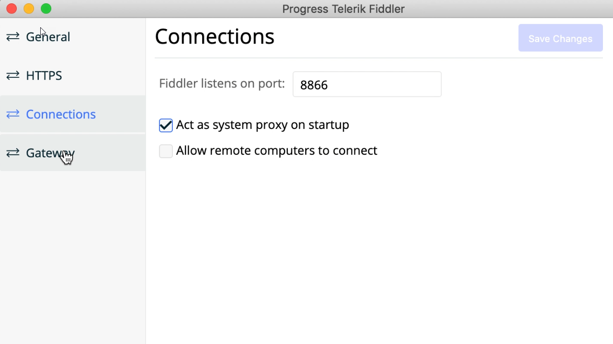

## Environment
<table>
	<tbody>
		<tr>
			<td>Product Version</td>
			<td>0.5.0</td>
		</tr>
		<tr>
			<td>Product</td>
			<td>Fiddler Everywhere</td>
		</tr>
	</tbody>
</table>

## Description
To troubleshoot common issues, resetting the Fiddler Everywhere settings to default values will help.

### Resetting Fiddler Everywhere Settings

 The following screenshots represent the Fiddler Everywhere Default Settings.

#### General Settings

#### HTTPS Settings

#### Connection Settings

#### Gateway Settings

