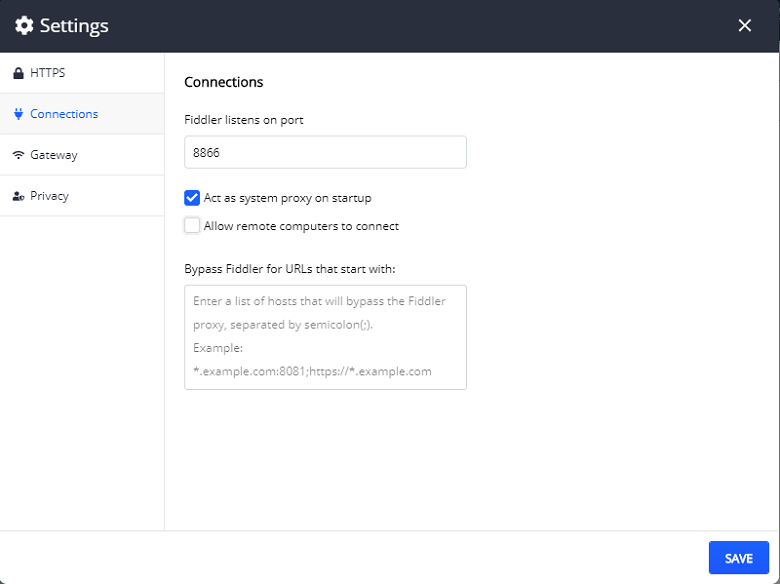
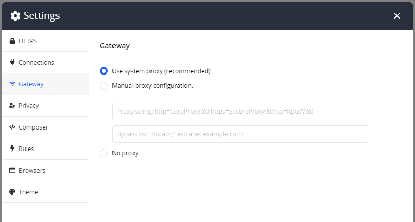
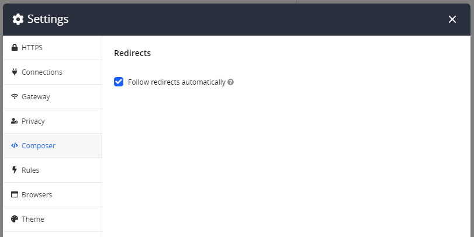

## Environment

|   |   |
|---|---|
| Product   |
| Product Version | 1.0.0 and above  |

## Description

When you have to troubleshoot common issues, you may need to reset the Fiddler Everywhere settings to their default values to facilitate the process.

## Solution

The following screenshots represent the Fiddler Everywhere Default Settings.

* Resetting the **HTTPS** settings&mdash;The default settings will reset Fiddler to its initial state, which means that the secure traffic won't be captured until **Capture HTTPS** is checked.

  

* **Connection** settings

  

* **Gateway** settings

  

* **Composer** settings

  
