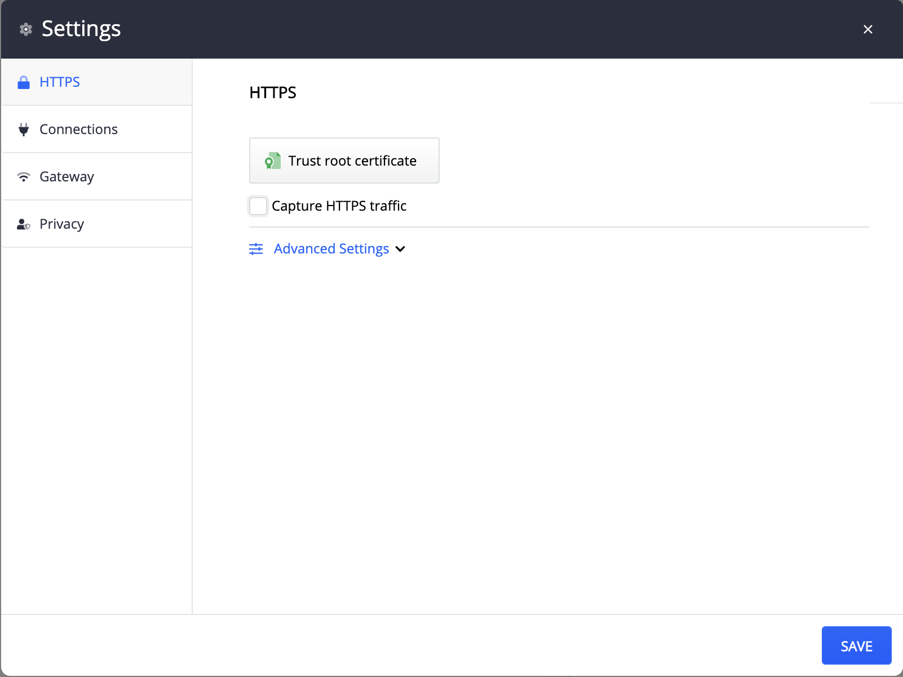
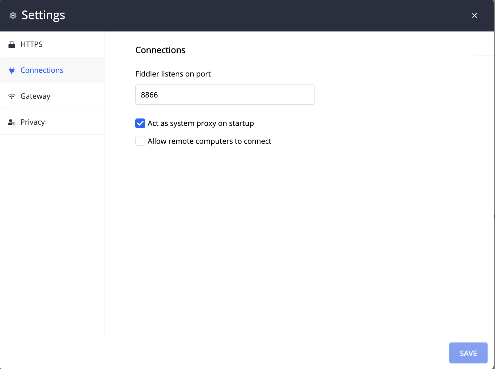
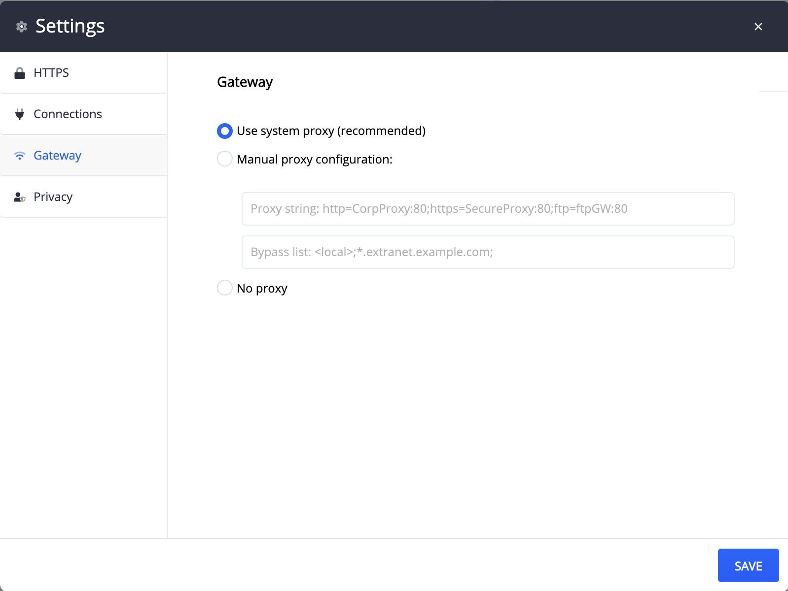

#### Environment

|   |   |
|---|---|
| Product  | Fiddler Everywhere  |
| Product Version | 1.0.0 and above  |

#### Description

To troubleshoot common issues, resetting the Fiddler Everywhere settings to default values will help.

## Resetting Fiddler Everywhere Settings

 The following screenshots represent the Fiddler Everywhere Default Settings.

### HTTPS Settings

### Connection Settings

### Gateway Settings

