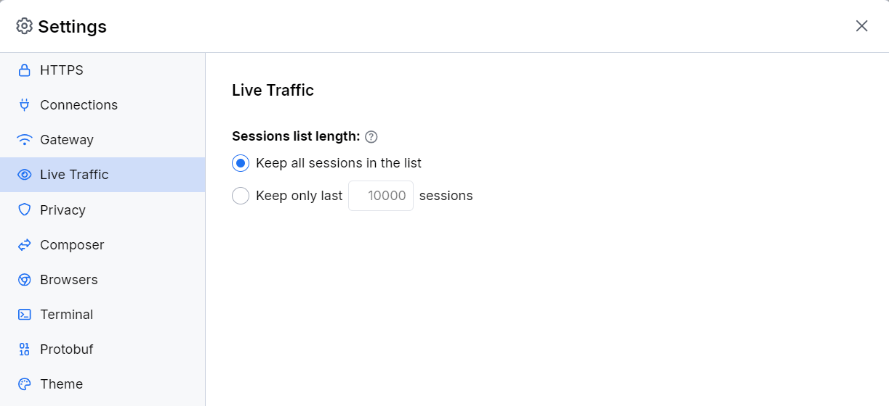
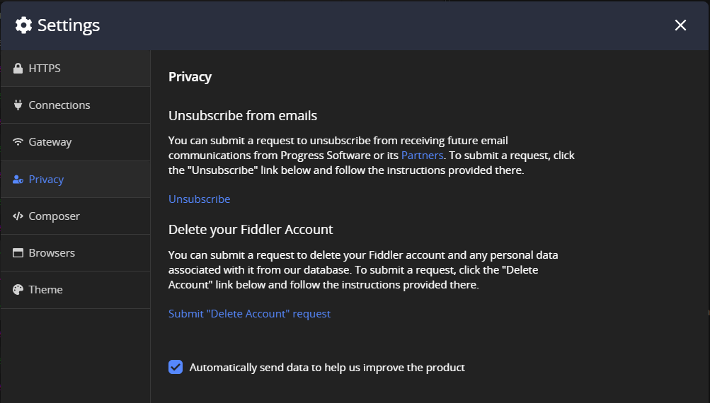
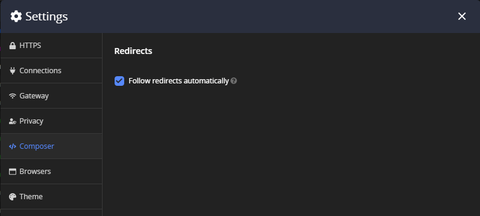
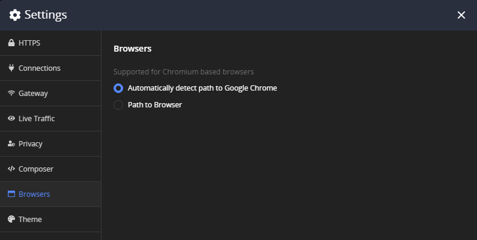
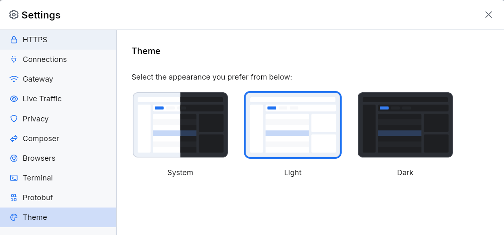

## Environment

|   |   |
|---|---|
| Product   |
| Product Version | 3.0.0 and above  |

## Description

When I troubleshoot common issues, I need to reset the Fiddler Everywhere settings to their default values to facilitate the process. How can I do this?

## Solution

The following screenshots represent the default Fiddler Everywhere settings.

* Default **HTTPS** settings&mdash;Resets Fiddler Everywhere to its initial state, which means the secure traffic won't be captured until **Capture HTTPS** is checked.

  

* Default **Connection** settings&mdash;Acts as a system proxy on application startup. Remote connections and HTTP/2 support are disabled.

  

* Default **Gateway** settings&mdash;Use system proxy

  

* Default **Live Traffic** settings&mdash;Keep all sessions in the list

    

* Default **Privacy** settings 

  

* Default **Composer** settings&mdash;Follows HTTP 3xx responses as redirects when executing requests from the Composer.

  

* Default **Browsers** settings&mdash;Fiddler Everywhere tries to detect the default path to the Google Chrome installation folder (to be used with the [Open Browser](#independent-browser-capturing-browser-capturing) functionality)

  

* Default **Theme** settings&mdash;Default Light theme loads as the initial UI theme.

  