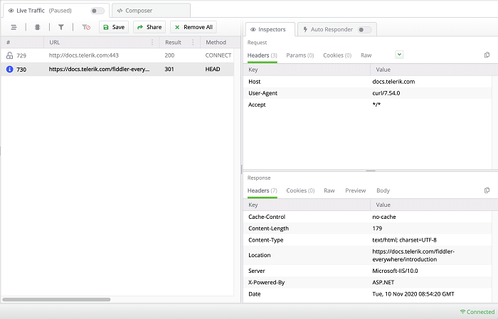

#### Environment

|   |   |
|---|---|
| Product  | Fiddler Everywhere  |
| Product Version | 1.0.0 and above  |
| Operating System | macOS  |
| 3rd-party tools | macOS Terminal, iTerm2  |

#### Description

The article explains how to set the Fiddler Everywhere proxy for commonly used command-line tools like the default [macOS Terminal](https://en.wikipedia.org/wiki/Terminal_(macOS)) or [iTerm2](https://www.iterm2.com/). 


## Set Fiddler Proxy (terminal app)

Terminal applications on macOS like the [Terminal](https://en.wikipedia.org/wiki/Terminal_(macOS)) or [iTerm2](https://www.iterm2.com/) are capable of executing HTTP and HTTPS requests. However, in the common case, they won't use the system proxy, and for Fiddler Everywhere to capture traffic that passes through them, they need to set the Fiddler Everywhere proxy explicitly. To achieve that, we could use the **export** command.

```Bash
export http_proxy=127.0.0.1:8866
export https_proxy=127.0.0.1:8866
```

Once the Fiddler Everywhere proxy is set, we could immediately capture traffic through the terminal application.

_Example for making a request while using_ **_curl_** _via iTerm2 and intercepting the traffic in Fiddler Everywhere_
```Bash
curl https://docs.telerik.com/fiddler-everywhere
```



>tip The **export** command makes a variable that will be included in a child process environment. It does not affect other already existing environments.

## Reset Fiddler Proxy (terminal app)

Once our debugging with Fiddler Everywhere is done, we could reset the current environment's proxy by merely removing the Fiddler Everywhere proxy variables. To achieve that, we could use the **unset** command.

```Shell
unset http_proxy
unset https_proxy
```

>tip If your terminal application is not supporting **unset**, then you could reset the proxy by assigning an empty string. For example via `export http_proxy=""`