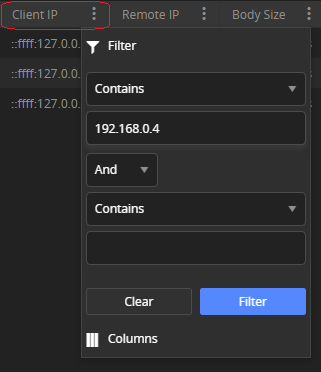

## Environment

|   |   |
|---|---|
| Fiddler Everywhere | 1.0.0 and above |
| Operating System | Windows, macOS, Linux |

## Description

Fiddler Everywhere can simultaneously capture traffic from multiple remote computers and devices (like Android and iOS smartphones).  What configuration is needed for this to happen, and how can we differentiate the traffic from each different device?

## Solution (for remote computers)

**Prerequisites**

Before you start, verify that the host and the remote computer are on the same network, and they "see" each other (no firewall restrictions).

To capture traffic from a remote computer, follow this steps:

1. Start Fiddler Everywhere on the host computer and enable **Live Traffic** (system capture). 

1. Ensure your are [ready to capture system traffic](#system-capturing).

1. Go to **Settings**  > **Connections** and ensure **Allow remote computers to connect** is checked.

1. On the remote computer, set the proxy settings to the machine name of the Fiddler host at port 8866.

1. In Fiddler Everywhere, filter the traffic through the **Client IP** column while using the local address of the connected remote computer.

    

## Solution (for mobile devices)

**Prerequisites**

- The Fiddler host and the remote mobile device should both be on the same network, and they should "see" each other (no firewall restrictions).

To capture traffic from a remote mobile device, follow this steps:

1. Start Fiddler Everywhere on the host computer and enable **Live Traffic** (system capture). 

1. Ensure your are [ready to capture system traffic](#system-capturing).

1. Go to **Settings**  > **Connections** and ensure **Allow remote computers to connect** is checked.

1. Follow the specific instructions for the different mobile operating systems as described here:

    - [Instructions for Android](#configuring-the-android-device)

    - [Instructions for iOS](#configure-the-ios-device)

1. In Fiddler Everywhere, filter the traffic through the **Client IP** column while using the local address of the connected remote mobile device.

    