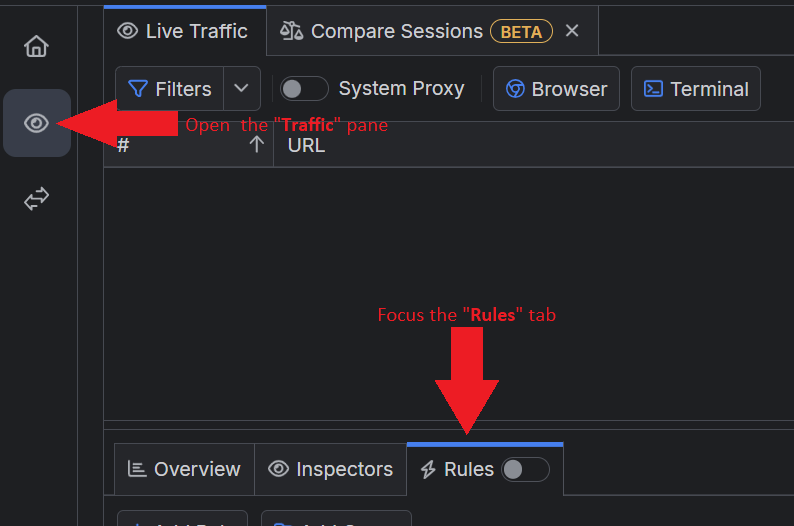
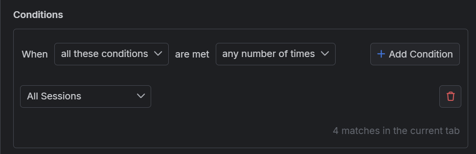
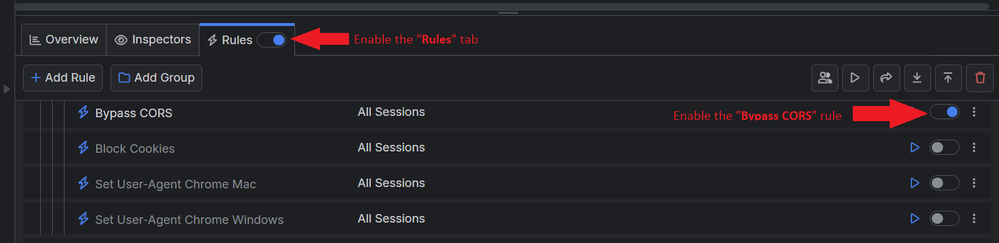
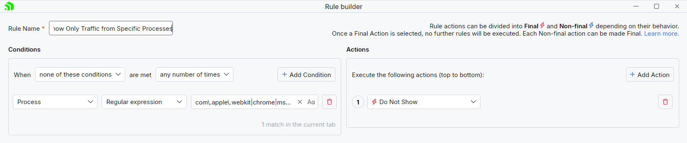
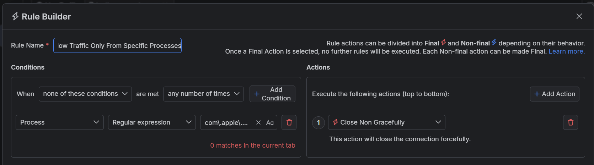

# HTTPS Traffic Modifications with Fiddler rules

At one point or another, we need to test web applications and their behavior online. Whether we are talking about a tiny front-end change in a CSS (Cascading Style Sheets) selector, reproducing a reported scenario, or a significant update of the backend API, testing online services can take much work. It often requires creating safe staging environments (so your test keeps the live production jobs untouched) and re-building and re-deploying through time and money-consuming processes. The Fiddler's Rules functionality allows you to execute your tasks quickly and effeminately through the man-in-the-middle approach.

We already discussed the **Rules** tab itself. This article will introduce you to a set of predefined rules that the team created as an entry point to display the power of the Rules in Fiddler Everywhere.

## Rules Presets

While the **Rules** tab allows users to create rules based on[ specific matching conditions and apply various actions](), the community often requires assistance in making rules. A further analysis showed that some Fiddler users needed to be made aware of the full capabilities of the Fiddler rules. For that reason, the team developed [a set of predefined rules]() that you can quickly reuse with few clicks or use as a reference for your specific testing requirements.

But first, let us make a quick recap of what a Fiddler rule stands for:

>tip A rule in Fiddler Everywhere contains [**a matching condition**](#conditions) (or set of conditions) that determines the target HTTP sessions and [**an action**](#actions) (or set of actions) that applies to the matched HTTP sessions.

Fiddler provides multiple matching conditions related to HTTPS traffic (like protocols, schemes, timings, request and response data, and many others) to help you target a specific set of sessions. Then, the matched sessions are modified through the specified actions. As a result, you can quickly create logic that modifies the traffic without changing the client or the server application (or even having access to these applications). That said, the set of predefined rules that we created can be separated into several contextual groups based on what they are meant to achieve.

## Tooling 

A set of rules that provides custom "tools" to tackle different tasks, such as [blocking cookies](), [disabling browser cache](), [bypassing cross-origin resource sharing (CORS)](), [mocking the user-agent HTTP header]() and others.

Let's show how you can create, enable, and use your own rule that bypasses [the cross-origin resource sharing](https://developer.mozilla.org/en-US/docs/Web/HTTP/CORS). CORS uses specific HTTP Response Headers to tell the client application (a browser) which domains can access its limited resources. We need to match the session and then trigger an action that updates that specific set of HTTP Response Headers.

1. Open the Fiddler **Traffic** pane and focus the **Rules** tab.

 

1. Click on **Add Rule**.

1. Create the following rule in the newly opened **Rules Builder** screen.

    * Name the rule. For demonstration purposes, we will name the rule "Bypass CORS".

    * Set a matching condition. We are creating a condition that matches all captured sessions for demonstration purposes.

 

    * Set an action that changes the HTTP Response Headers related to the CORS technology.

        1. Create an action that sets the HTTP Response header **Access-Control-Allow-Origin** with a wildcard value `*`.

        1. Create an action that sets the HTTP Response header **Access-Control-Allow-Methods** with a wildcard value `*`.

        1. Create an action that sets the HTTP Response header **Access-Control-Allow-Credentials** with a boolean value `true`.

        1. Create an action that sets the HTTP Response header **Access-Control-Allow-Headers** with a wildcard value `*`.
    
    * Save the newly created rule.

    * Once the rule is created, enable the "Bypass CORS" rule (toggle ON), enable the **Rules** tab (toggle ON), and start capturing traffic.

 

With the above rule activated, all sessions receiving the specific HTTP Response Headers will be modified, enabling you to disregard the CORS policy successfully.

## Filters

One of the first things you observe as a new Fiddler user is that once the intermediate proxy starts capturing traffic, you will receive an overwhelming number of captured sessions. Every modern application makes multiple requests (the number of HTTP requests made varies but can go up to hundreds per application startup). The predefined filters demonstrate how Fiddler can be set to show only specific traffic (for example, localhost addresses, particular processes, specific domains, etc.). 

Let's show how you can create, enable, and use your own rule that filters all sessions and leaves only HTTP sessions triggered by specific processes. We will match sessions triggered by browsers like Safari, Firefox, Edge, and Google Chrome for demonstration purposes.

1. Create a matching condition that uses the "When **none of these conditions** are met **any number of times**" pattern. This rule uses negative statements to match and apply actions to anything but the desired targets.

1. Match by a **Process** that uses a regular expression to match an application with a list of specific process names.

 ```regex
 com\.apple\.webkit|chrome|msedge
 ```

1. Create a **Do Not Show** action.

    >important The **Do Not Show** action is final. No other action or active rule placed lower in the rules queue will be executed.

This sample Fiddler rule hides all sessions except those from a Chromium-based browser like Microsoft Edge or Google Chrome.



Once the rule is created, enable the **Rules** tab, toggle the rule switch, and start capturing traffic. As a result, the **Traffic** pane will now show only HTTP sessions coming from the targeted browsers.


## Block Lists and Allow Lists

While the filters remove traffic from Fiddler's live traffic grid, requests still go through the Fiddler proxy. Sometimes, you will need to block or entirely allow specific traffic. This is where this set of rules comes in.

Let's show how you can create, enable, and use your own rule that blocks all sessions and allows only HTTP sessions triggered by specific processes. We will match sessions triggered by browsers like Safari, Firefox, Edge, and Google Chrome for demonstration purposes. This rule is similar to the one we created in the previous section - however, the difference is that the matched traffic won't be filtered or blocked entirely.

1. Create a matching condition that uses the "When **none of these conditions** are met **any number of times**" pattern. This rule uses the negative statement **none ...** to apply the desired actions to everything but the matched entries.

1. Match by a **Process** where the string value defines the targeted process by its name. The process name varies depending on the operating system and version of the client application.<br/>The example below matches different browsers on macOS while using the following regular expression: **com\.apple\.webkit|chrome|msedge**.

1. Create a **Close Non Gracefully** action.

This sample Fiddler rule matches all sessions where the processes contain one of the string literals set through the regular expression and then closes the connections made by any other unmatched process.




## Map HTTP Traffic

The terms "map," "map remote," and "map local" in the context of Fiddler are used for rules that replace the original HTTP request or response (headers and bodies) with a custom-mapped request/response. The mapping allows you to use remote API endpoints (like third-party URLs or localhost addresses), local files, predefined responses, or even to craft your response manually. The mapping is like a manually created redirect that you can use to virtually test any API scenario without access to the client or server.

## Modify HTTP Traffic

Modifying is similar to the mapping feature as it replaces the original content of the HTTP session. The difference is that you are not replacing the whole response/request but only modifying a specific targeted part. For example, you can modify a response body by replacing a particular portion of its HTML, you can change the executing of JavaScript function by adding your parameters, or you can change the avatar in your favorite game (you would be surprised to learn how desired this feature is) by adding your image to the API. The possibilities are virtually endless.

## UI Modifications

Last but not least, we created rules allowing you to modify Fiddler's user interface. The idea behind these rules is to demonstrate how you can adjust Fiddler to your own needs by marking and highlighting what is essential. 


Overall, [the rules preset]() in Fiddler Everywhere are a good starting point for understanding how to use the Rules feature. You can learn more about the rules presets in Fiddler Everywhere from [the dedicated documentation articles]() or by directly downloading them from [the Fiddler's public GitHub repository](https://github.com/telerik/fiddler-everywhere/tree/master/rules) and import them as FARX files.