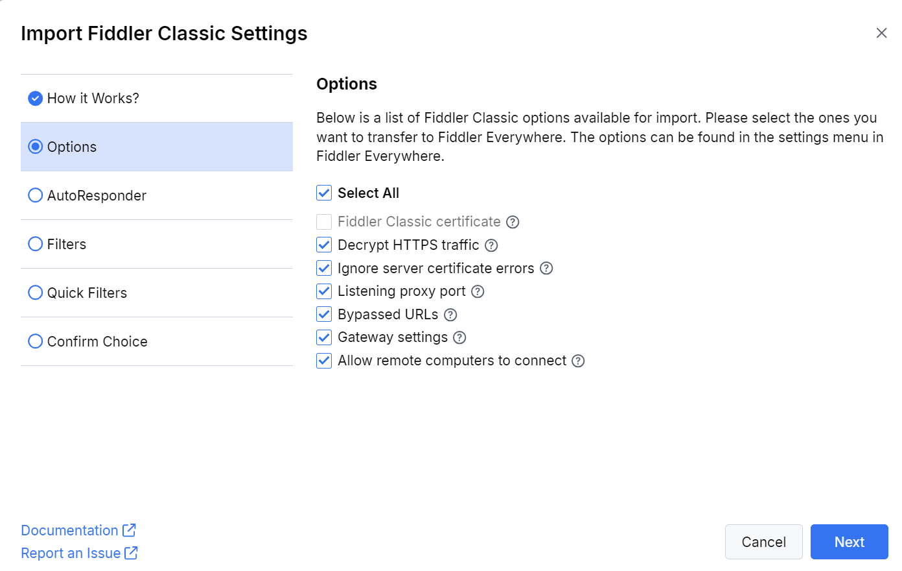
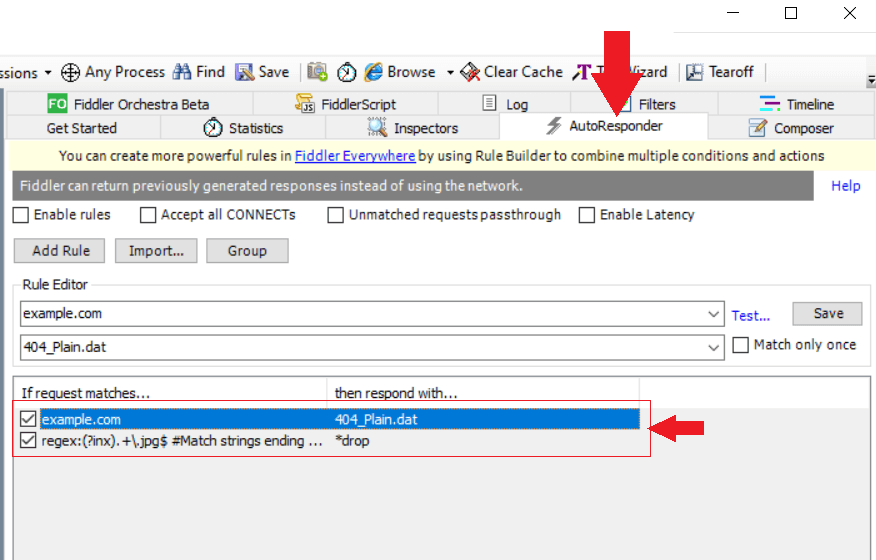
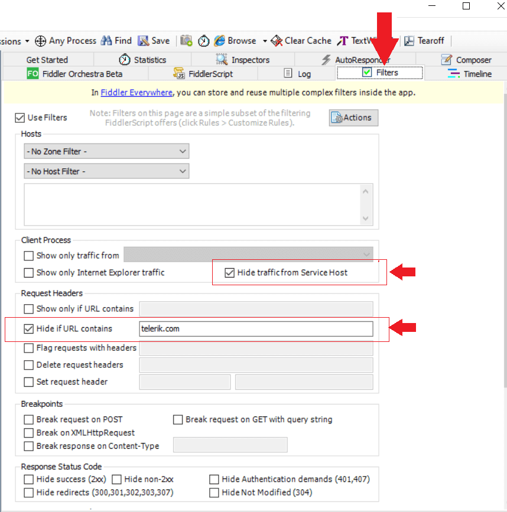
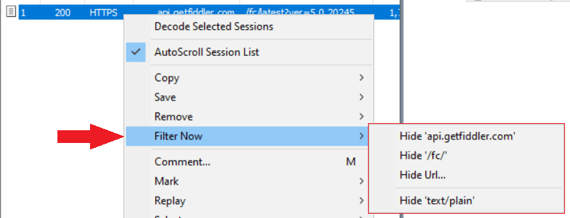

The foundation of Fiddler Everywhere is built upon the old Fiddler Classic application. While Fiddler Classic is still available, more and more users are choosing to migrate to Fiddler Everywhere (as noted on the official product page, the Fiddler Classic application is no longer in active development and offers no commitments for releases, patches or tech support). There are multiple reasons why using Fiddler Everywhere should be your preferred choice, and the below feature comparison table demonstrates some of them:

| Feature          | Fiddler Classic   | Fiddler Everywhere     | 
|:-----------------|:------------------|:-----------------------|
| OS support       | Windows only      | Windows, macOS, Linux  |
| System proxy     | Windows only      | Windows, macOS, Linux  |
| Low-level network capturing | No     | Yes (macOS) |
| Sandboxed browser capturing | No     | Yes |
| Rules to modify traffic | AutoResponder (limited options) | Rules (new enhanced functionality) |
| Comparing HTTP sessions | Third-party extensions    | Built-in Comparison tab |
| Filters | Limited pre-defined options | Advanced filtering options |
| Collaboration | Manual export | Sharing, local & cloud saves, and manual export options |
| Supported version of HTTP  | HTTP/1.x | HTTP/1.x and HTTP/2.x |
| Maximum supported version of TLS  | TLS 1.2 | TLS 1.3 |
| Support for streaming protocols  | WebSocket | WebSocket, SSE, Socket.IO, gRPC |
| Statistical and analytical data | Statistics tab | Overview tab with enhanced statistical data and diagram |
| Enterprise options | No | Technical support, SSO login, offline mode, managed app configuration, and more |

The comparison table showcases several reasons why you would like to migrate from Fiddler Classic to the new Fiddler Everywhere. In this article, we will provide information about the built-in import wizard available in Fiddler Everywhere, which enables you to quickly and efficiently import your settings, rules, and filters from the old Fiddler Classic.

## Importing Application Options

Starting with version 5.20.0, Fiddler Everywhere provides a built-in wizard allowing you to import the following configuration options from Fiddler Classic automatically. All configuration options have full feature parity meaning they behave exactly the same in both applications. Once imported the configuration options can be found in the **Settings** menu in Fiddler Everywhere.

The import wizard is accessible through the **Home** pane in Fiddler Everywhere.

- Fiddler Classic certificate&mdash;Instructs Fiddler Everywhere to use the installed Fiddler Classic certificate authority file. This option is available only if you have not installed and trusted the Fiddler Everywhere CA. The certificate option will be unavailable if Fiddler Classic's certificate is not trusted or is incompatible with Fiddler Everywhere (the supported certificate generator is BouncyCastle, a.k.a. BCCertMaker).

- Decrypt HTTPS traffic&mdash;Exports the Fiddler Classic value from **Tools > Options > HTTPS > Decrypt HTTPS Traffic** and imports as value for **Settings > HTTPS > Capture HTTPS Traffic** option in Fiddler Everywhere.
- Ignore server certificate errors&mdash;Exports the Fiddler Classic value from **Tools > Options > HTTPS > Ignore server certificate errors (unsafe)** and imports as value for **Settings > HTTPS > Ignore server certificate errors (unsafe)** option in Fiddler Everywhere.
- Listening proxy port&mdash; Exports the Fiddler Classic value from **Tools > Options > Connection > Fiddler Classic listens on port** and imports as value for **Settings > Connections > Fiddler listens on port** option in Fiddler Everywhere. 
    >important The default proxy port for Fiddler Classic is 8888, while for Fiddler Everywhere, it is 8866. This difference is often overlooked by users who follow a specific proxy tutorial but are trying solutions based on a different proxy port.
- Bypassed URLs&mdash;Exports the Fiddler Classic value from **Tools > Options > Connections > Bypass Fiddler Classic for URLs that starts with** and imports as value for **Settings > Connections > Bypass Fiddler for URLs that starts with** option in Fiddler Everywhere.
- Gateway settings&mdash;Exports the Fiddler Classic value from **Tools > Options > Gateway** and imports as value for **Settings > Gateway** option in Fiddler Everywhere. The Gateway checkbox will be unavailable if the selected option in Fiddler Classic is **Аutomatically Detect Proxy using WPAD**.
- Allow remote computers to connect;Exports the Fiddler Classic value from **Tools > Options > Connections > Allow Remote Computers to connect** and imports as value for **Settings > Connections > Allow remote devices to connect** option in Fiddler Everywhere.

## Importing AutoResponder Rules

In Fiddler Everywhere, Fiddler Classic's **AutoResponder** feature (as depicted in the screenshot below) is referred to as **Rules**. You can import only the loaded AutoResponder rules from Fiddler Classic to Fiddler Everywhere. Once imported, you'll be able to modify or delete these rules as needed.

Additionally, you can import any exported [rules archive (FARX)](slug://fiddler-saz-format) through the **Import** button in Fiddler Everywhere's **Rules** tab.

>tip If the Fiddler Classic rule has a value populated within the "Comment" field, it will be used for the rule name in Fiddler Everywhere. Any Fiddler Classic rules that have no comment will use a predefined name.

## Importing Filters

Fiddler Classic **Filters** function (refer to the screenshot) at a deeper level, excluding any traffic not explicitly requested by the user. In Fiddler Everywhere, actions are initiated through the **Rules** tab. This is why any loaded Fiddler Classic filters will be imported using separate rules.

The import wizard will effectively import only currently loaded filters. As an alternative, you can import FFX files (Fiddler Filters archive) in Fiddler Everywhere through the **Import** button in the **Rules** tab.

## Importing Quick Filters

**Quick filters** in Fiddler Classic (refer to the screenshot) function similarly to filters in Fiddler Everywhere. You can import any existing quick filters into Fiddler Everywhere and find them in the Filters dialog under "Saved Filters" at the top left corner of the Live Traffic pane.

