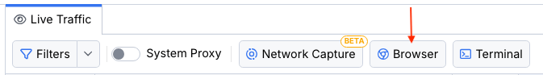
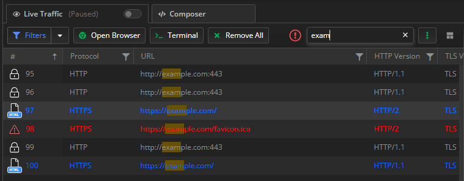
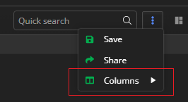
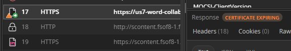
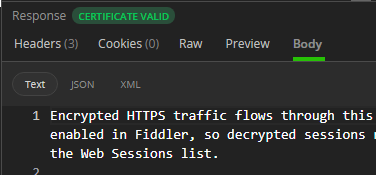
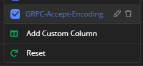
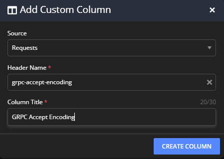
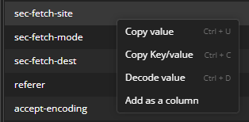
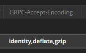
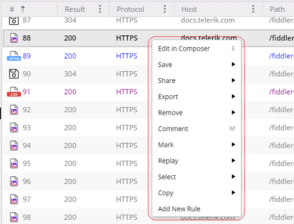

# Live Traffic Grid

The **Traffic pane** provides essential features of Fiddler Everywhere including the captured traffic visualized within the **Live Traffic grid**.

Live traffic summarizes each captured session that shows in the **Live Traffic** grid. It also provides functionalities to work with these sessions through the **Live Traffic** toolbar, the [**Inspectors**]() types, and the corresponding [**Rules**]() tab. The feature enables the saving and sharing of sessions, editing issued requests, marking, commenting sessions, and applying rules.

## Defining a Session

A (web) session represents a single transaction between a client and a server, sometimes known as a request/response pair. Each session appears as a single entry in **Live Traffic** grid. Each session object has a **Request** and a **Response**, representing the data the client sends to the server and the data the server returns to the client. The session object also maintains a set of flags that record metadata about the session and a timers object that stores timestamps logged during the processing of the session.

## Live Traffic Toolbar

The toolbar of the **Live Traffic** section provides various functionalities such as filtering by multiple criteria, using independent browser instances, searching, saving, and sharing sessions, and managing the user interface.

The **Live Traffic** toolbar provides the following functionalities:

- [Filtering Traffic](#filterin-traffic) (**Filters**)
- [independent Browser Capturing](#independent-browser-capturing) (**Open Browser**)
- [independent Terminal Capturing](#independent-terminal-capturing) (**>_Terminal**)
- [Removing All Sessions](#removing-all-sessions) (**Remove All**)
- [Searching](#searching) (**Quick Search**)
- [Saving Sessions](#saving-sessions) (**Save**)
- [Sharing Sessions](#sharing-sessions) (**Share**)
- [Managing Columns](#managing-columns) (**Columns**)
- [Toggling Layout](#toggling-layout)(**Toggle Layout Change**)

### Filtering Traffic

Use the filtering options (the [**Filters** toolbar option](#filters) and the [column filters](#column-filters)) to create and apply complex filters on your captured sessions in the **Live Traffic** grid. 

[Learn more about the filtering options in Fiddler Everywhere...]()

### Independent Browser Capturing

Use the **Open Browser** button to capture traffic from a specific browser instance without modifying the system proxy settings. 

[Learn more about the independent browser capturing...](#independent-browser-capturing)

### Terminal Capturing

Use the **>_ Terminal** button to capture traffic from a specific terminal instance without modifying the system proxy settings.

[Learn more about the independent terminal capturing...]()

### Removing All Sessions

Use the **Remove All** button to automatically remove all captured traffic from the **Live Traffic** grid. To remove only specific sessions, select the desired ones and use the remove options from [the context menu](#remove).

### Searching

To search for specific values in the URL and the headers of all sessions, use the **Quick Search** text input. The search action immediately filters all sessions containing the search terms and highlights the matched data. If a match is in a hidden column (for example, due to an applied filter), a warning icon shows next to the search box, which helps you show the column(s) quickly.

### Saving Sessions

To save captured sessions, use the main menu's **Save** button, automatically saving all captured traffic. To save only specific sessions, select the desired ones and use the advanced saving options from [the context menu](#save).

To save sessions for later or prepare sessions for sharing:

1. Click the **Save** button. As a result, a **Save Sessions** prompt window appears.

1. Enter a session name in the **Give your session a name** field.

1. Choose whether to store the session in the **Local Storage** or in the **Cloud Storage**.

1. (Optional) Choose a folder (within the Fiddler UI) to store the session.

1. (Optional) Use the **password protection** switch to enable encryption and set a password.

1. Click **Save**. The saved session immediately loads in the save **Sessions** tree.

### Sharing Sessions

Sharing sessions dramatically improve collaboration, and Fiddler Everywhere provides the following options to export and share sessions:

- Sharing through the **Share** button from a saved session entry in [the save **Sessions** tree](#sharing-sessions).

- Sharing through the **Share** option from [the **Live Traffic** grid context menu](#share).

- Sharing through the **Share** button from the **Live Traffic** grid toolbar. The **Live Traffic** toolbar comes with a **Share** button that will save in a file the currently displayed sessions, captured within the **Live Traffic** grid, and then will share them through an explicitly provided email.

To share a session through the toolbar:

1. Click the **Share** button. As a result, the **Save Session** prompt window appears.

1. In the **Save Sessions** prompt window, enter a valid name and choose a folder to store the session.

1. In the **Share Sessions** prompt window, enter a valid email and click **Share**. Entering notes is optional.

### Managing Columns

Use the **Columns** menu to manage which columns to show up in the [Live Traffic grid](#live-traffic-list). You can also [create a custom column through the **Add Custom Column** option](#creating-custom-columns) near the bottom of the menu.

[Learn more about each column present in the Live Traffic grid here...](#columns)

### Toggling Layout

The last icon on the right side of the toolbar presents an option to restructure the main Fiddler Everywhere layout structure for the [**Live Traffic grid**](#live-traffic-list) and the [**Inspectors**](). The layout change option is available for the **Live traffic** tab, comparison, and saved sessions tabs. The layout options are as follows:

- (Default layout) **Live Traffic grid** on the left side and the **Inspectors** on the right (top for **Request Inspectors** and bottom for **Response Inspectors**).
- (Alternative layout) **Live Traffic grid** at the top and the **Inspectors** at the bottom (left for **Request Inspectors** and right for **Response Inspectors**).

>tip You can collapse the side panels ([**Sessions**]() and [**Requests**]()) and toggle the main layout to optimize your working space.

## Live Traffic Grid

The **Live Traffic** grid displays all captured web sessions with their technical details strucutred in columns.

Many operations begin by selecting one or more entries in the **Live Traffic** grid and activating other features.

- To select more than one session, hold the **Ctrl** (**Command** on Mac) or **Shift** keys while clicking the desired rows.

- Double-click or press **Enter** (**Return** on Mac) to activate the default inspectors for a single selected session.

When the **Inspectors** are activated, they will automatically decide which inspector type is best suited to display the request and response of the selected session.

### List Icons

The **Live Traffic grid** uses icons to provide additional context for each recorded session. To trigger an explanatory tooltip, hover over a **Live Traffic** grid entry icon.

The following table displays the icons which **Live Traffic** grid supports for its entries:

<table style="width: 80%; border-collapse: collapse;">
    <colgroup>
       <col span="1" style="width: 12%;">
       <col span="1" style="width: 88%;">
    </colgroup>
    <thead>
        <tr>
            <th>Icon Name</th>
            <th>Description</th>
        </tr>
    </thead>
    <tbody>
        <tr>
            <td></td>
            <td>Represents a generic successful response.</td>
        </tr>
        <tr>
            <td></td>
            <td>Uploading content for a session in progress (the request is being sent to the server).</td>
        </tr>
        <tr>
            <td></td>
            <td>Uploading paused for the session in progress.</td>
        </tr>
        <tr>
            <td></td>
            <td>Downloading content for the session in progress (the response is being read from the server).</td>
        </tr>
        <tr>
            <td></td>
            <td>Downloading paused for the session in progress.</td>
        </tr>
        <tr>
            <td></td>
            <td>The session was aborted by the client, Fiddler, or the Server.</td>
        </tr>
        <tr>
            <td></td>
            <td>The response was a server error.</td>
        </tr>
        <tr>
            <td></td>
            <td>The response returned status code 401 Unauthorized.</td>
        </tr>
        <tr>
            <td></td>
            <td>The response redirect status code 300, 301, 302, 303 or 307.</td>
        </tr>
        <tr>
            <td></td>
            <td>A tunnel is used for WebSocket traffic.</td>
        </tr>
        <tr>
            <td></td>
            <td>The request used the <b>HTTP CONNECT</b> method - establishes a tunnel used for HTTPS traffic.</td>
        </tr>
        <tr>
            <td></td>
            <td>A tunnel used for RPC traffic.</td>
        </tr>
        <tr>
            <td></td>
            <td>No content loaded.</td>
        </tr>
        <tr>
            <td></td>
            <td>Not modified.</td>
        </tr>
        <tr>
            <td></td>
            <td>Partial content.</td>
        </tr>
        <tr>
            <td></td>
            <td>The response was an image.</td>
        </tr>
        <tr>
            <td></td>
            <td>The response was a JavaScript file.</td>
        </tr>
        <tr>
            <td></td>
            <td>The response was a CSS file.</td>
        </tr>
        <tr>
            <td></td>
            <td>The response was an HTML file.</td>
        </tr>
        <tr>
            <td></td>
            <td>A tunnel is used for GRPC traffic.</td>
        </tr>
        <tr>
            <td></td>
            <td>The response was a Flash file.</td>
        </tr>
        <tr>
            <td></td>
            <td>The response was an XML file.</td>
        </tr>
        <tr>
            <td></td>
            <td>The response was a Silverlight file.</td>
        </tr>
        <tr>
            <td></td>
            <td>The response was an audio file.</td>
        </tr>
        <tr>
            <td></td>
            <td>The response was a video file.</td>
        </tr>
        <tr>
            <td></td>
            <td>The response was a font file.</td>
        </tr>
        <tr>
            <td></td>
            <td>The response was a JSON file.</td>
        </tr>
        <tr>
            <td></td>
            <td>The request used the POST method.</td>
        </tr>
    </tbody>
</table>

### Certificate Indicators

Each [list icon](#list-icons) can contain an additional triangle warning that indicates different server certificate issues.

- A small orange triangle warning indicates that the server uses a certificate that is about to expire within 30 days. You can expand and inspect the certificate expiration warning in detail through the Response inspector notification.

    

- A small red triangle warning indicates that there are certificate errors. You can expand and inspect the certificate error in detail through the Response inspector notification.

    

- Absence of the triangle warning means no issues with the server certificate. You can still expand and inspect the used certificate in detail through the Response inspector notification. 

    

[Learn more about how to use the server certificate details in Fiddler Everywhere here...]()

## Columns

The following table lists the **Live Traffic** columns and the information they display. Apart from just being a descriptive tag, each column name can be applied as a matching condition filter (for example, you can create a filter that matches TLS Version column values and apply actions applicable only for a session with TLS 1.3). In addition to the predefined columns listed below, Fiddler Everywhere allows you to cr[eate your own custom columns](#creating-custom-columns).

<table style=" width: 100%">
    <colgroup>
       <col span="1" style="width: 20%;">
       <col span="1" style="width: 80%;">
    </colgroup>
    <thead>
        <tr>
            <th>Column name</th>
            <th>Description</th>
        </tr>
    </thead>
    <tbody>
        <tr>
            <td><b>#</b></td>
            <td>A unique identification number generated by Fiddler Everywhere. The column also contains <a href="#list-icons">an icon</a> that represents the session type and might contain <a href="#certificate-indicators">certificate expiration indicator.</a></td>
        </tr>
        <tr>
            <td><b>Protocol</b></td>
            <td>The protocol type (HTTP or HTTPS) used by the session.</td>
        </tr>
        <tr>
            <td><b>Host</b></td>
            <td>The hostname and the server's port to which the request was sent. The column also indicates requests with <b>CONNECT</b> method with the <b>Tunnel to</b> value (<a href="https://textslashplain.com/2015/11/19/understanding-connect-tunnels/">CONNECT tunnels in Fiddler</a>).</td>
        </tr>
        <tr>
            <td><b>Path</b></td>
            <td>The path refers to the exact location of a page, post, file, or asset. The path resides after the hostname and is separated by a forward slash (<code>/</code>).</td>
        </tr>
        <tr>
            <td><b>URL</b></td>
            <td>The URL contains the protocol, the hostname, the port, and the path from the request.</td>
        </tr>
        <tr>
            <td><b>HTTP Version</b></td>
            <td>The protocol version used for communication between the client and the server (<b>HTTP/1.1</b>, <b>HTTP/2</b>, <b>HTTP/2 + HTTP/1.1</b>, and <b>HTTP/1.1 + HTTP/2</b>)</td>
        </tr>
        <tr>
            <td><b>TLS Version</b></td>
            <td>The TLS version used for communication between the client and Fiddler and between Fiddler and the server. The possible values are <b>SSL 2.0</b>, <b>SSL 3.0</b>, <b>TLS 1.0</b>, <b>TLS 1.1</b>, <b>TLS 1.2</b>, <b>TLS 1.3</b>, and combination of all listed in scenarios when the TLS version differs for the request and response. <a href="">https://docs.telerik.com/fiddler-everywhere/security#tls-version-specifics</a>Learn more about the TLS version specifics in Fiddler Everywhere here...</td>
        </tr>
        <tr>
            <td><b>Status Code</b></td>
            <td>The HTTP response <a href="https://developer.mozilla.org/en-US/docs/Web/HTTP/Status">status code</a></td>
        </tr>
        <tr>
            <td><b>Method</b></td>
            <td>The HTTP method used by the request that was made (<b>GET</b>, <b>POST</b>, <b>PUT</b>, and so on)</td>
        </tr>
        <tr>
            <td><b>Process</b></td>
            <td>The local OS process from which the traffic originated&mdash;for example, `chrome:8212` indicates a Google Chrome browser instance.</td>
        </tr>
        <tr>
            <td><b>Client IP</b></td>
            <td>Indicates the client IP that sent this request. Mostly applicable when multiple computers on a network are pointed to a single Fiddler instance.</td>
        </tr>
        <tr>
            <td><b>Remote IP</b></td>
            <td>Indicates the IP address of the server used for this request.</td>
        </tr>
        <tr>
            <td><b>Body Size</b></td>
            <td>The number of bytes in the response body.</td>
        </tr>
        <tr>
            <td><b>Caching</b></td>
            <td>Values from the <b>Expires</b> and <b>Cache-Control</b> headers of the response.</td>
        </tr>
        <tr>
            <td><b>Content-Type</b></td>
            <td>The <b>Content-Type</b> header from the response.</td>
        </tr>
        <tr>
            <td><b>Request Time</b></td>
            <td>Indicates when the session was executed in an <code>HH:MM:SS:ms</code> format.</td>
        </tr>
        <tr>
            <td><b>Request Date</b></td>
            <td>Indicates the date when the session was executed in a <code>MM:DD:YYYY</code> format.</td>
        </tr>
        <tr>
            <td><b>Duration</b></td>
            <td>Indicates the duration (in milliseconds) that took for the session to complete.</td>
        </tr>
        <tr>
            <td><b>Rules Modified</b></td>
            <td>Indicates if the session is modified by active rules from the <b>Rules</b> tab.</td>
        </tr>
        <tr>
            <td><b>Comments</b></td>
            <td>Shows the custom comments added by you or the author of a shared session.</td>
        </tr>
     </tbody>
</table>

### Creating Custom Columns

Add, edit, or remove a custom column to the columns list. Afterward, these columns can be hidden or shown similarly to the Fiddler's predefined columns. 

**Add a custom column** through one of these actions:

- Open the [**Columns** menu](#managing-columns) and the click on the **Add Custom Column** item. 

    

- In the prompted custom column dialog, specify an HTTP Header (it's value will populate the column data) and assign a column name. The header's value will appear in the session grid if the header is present in the captured session. Otherwise, the column stays empty.

    

- Open the **Headers** inspector in HTTP request/response, right-click on a selected header to load the context menu, and choose  **Add as a column**.

    

After the successful creation, the new column is immediately available in the **Live Traffic** grid.

**Edit a custom column** through the [**Columns** menu](#managing-columns) and click the edit icon. **Remove a custom column** through the [**Columns** menu](#managing-columns) and click on the remove icon (a deletion confirmation displays).

### Reset Columns

To reset all columns to their default Fiddler's state, open the [**Columns** menu](#managing-columns) and use the **Reset** option at the bottom. This action resets all columns (shows the default selection) but won't remove any custom-made columns (it will only hide them).

## Traffic Sorting and Filtering

By default, the captured traffic is sorted in the order sessions appear during the traffic capturing, sorted by the unique identification number column, and no active filters are applied. You can use the built-in [sorting](#sorting-options) and [filtering](#filtering-options) options to optimize the outcome.

### Sorting Options

To create a custom sorting order, click the desired column. For example, click the **URL** column to sort alphabetically based on the URL or click the **Body Size** column to sort based on the session size in bytes. The default sorting order is based on the unique identification number (order of appearance).

### Filtering Options

Each column has a **filter** button, which popups an additional **Filter** menu to create.

The column **Filter** menu lets you add filters for the currently selected column &mdash;for example, filter all the traffic by the **host** name or by a specific **status code**. Columns with active filters will have a blue filter indicator. You can remove a column filter through the **Clear** button in the **Filter** menu (for the filtered column) or through the **Filters** toolbar option.

>tip Apply complex filters by using the [**Filters** toolbar option](#filtering) (which supports [all Fiddler's columns](#columns) as possible match conditions) or learn more about the [**Column Filters** options](#columns-filters).

## Context Menu Options

The context menu for the **Live Traffic** grid exposes actions you can apply for one or more sessions. To show the context menu, right-click (Windows OS), or press **Control** and mouse-click (macOS).

- [Editing in the Composer](#editing-in-the-composer) (**Edit in Composer**)
- [Saving](#saving) (**Save**)
- [Sharing](#sharing) (**Share**)
- [Exporting](#exporting) (**Export**)
- [Removing](#removing) (**Remove**)
- [Commenting](#commenting) (**Comment**)
- [Marking](#marking) (**Mark**)
- [Replaying](#replaying) (**Replay**)
- [Selecting](#selecting) (**Select**)
- [Copying](#copying) (**Copy**)
- [Comparing](#comparing) (**Compare**)
- [Adding Sessions to Compare Groups](#adding-sessions-to-compare-groups) (**Add to compare group**)
- [Adding New Rules](#adding-new-rules) (**Add New Rule**)
- [Bypassing the Proxy](#bypassing-the-proxy) (**Bypass**)

### Editing in the Composer

The **Edit in Composer** context menu option loads the selected request in a new composer window where it can be edited, saved for later usage and sharing, and reissued.

### Saving

To save selected sessions, use the **Save** context menu option. The saved sessions will appear in the save **Sessions** tree to the left of the Fiddler Everywhere interface, and from there, you can later re-open, export, and share them.

- **Selected sessions**&mdash;Saves all chosen sessions; can be accessed with the keyboard by pressing `S`.

- **Unselected sessions**&mdash;Saves all unselected Sessions; can be accessed with the keyboard by pressing `Shift` +`Cmd` +'S` (on Mac), or `Shift`+`S` (on Windows).

- **All Sessions**&mdash;Saves all captured traffic; can be accessed with the keyboard by pressing `Cmd`+`S` (on Mac), or `Ctrl`+`S` (on Windows).

All options will display a **Save** prompt window. To save the desired sessions:

1. Select the sessions, open the context menu, and click the **Save** option.

1. Enter your session name and choose the folder storing the entry.

1. (Optional) Use the **password protection** switch to enable encryption and set a password. Only users with knowledge of the password can open the entry.

1. Click **Save**. The saved session immediately loads in the save **Sessions** tree.

1. Double-click the saved session to load it in a new **Composer** tab. Note that encrypted sessions will prompt for a password before loading.

Alternatively, you can save all captured traffic [through the **Save** button from the toolbar](#save).

### Sharing

The **Share** context menu option enables the sharing of sessions. Before any session is shared, it is saved as an entry in the save **Sessions** tree. Then, the threshold can be transmitted through email.

- **Selected sessions**&mdash;Saves and shares all selected sessions.

- **Unselected sessions**&mdash;Saves and shares all unselected sessions.

- **All Sessions**&mdash;Saves and shares all captured traffic.

All options will initially display a **Save** and then a **Share** prompt window.

1. Select the sessions, open the context menu, and click the **Share** option.

1. The selected sessions are saved. Enter your session name and click **Save and proceed**.

1. The **Share** prompt window appears. Enter a valid email and, optionally, add notes. Once ready, click **Share**. Note that when sharing an encrypted session, the recipient will need the password to access it.

Alternatively, you can share captured traffic [through the **Share** button from the toolbar](#share).

### Exporting

The **Export** context menu option allows you to export the captured traffic in various formats such as SAZ (Fiddler Archive), HTTPArchive, WCAT, MeddlerScript, cURLScript, and more.

- **Selected sessions**&mdash;Saves and shares all selected sessions.

- **Unselected sessions**&mdash;Saves and shares all unselected sessions.

- **All Sessions**&mdash;Saves and shares all captured traffic.

### Removing

To delete sessions from your **Live Traffic** grid, use the **Remove** context menu options.

- **Selected sessions**&mdash;Removes all selected sessions; can be accessed with the keyboard by pressing `Cmd`+`Back` (on Mac), `Del` (on Windows).

- **Unselected sessions**&mdash;Removes all unselected sessions; can be accessed with the keyboard by pressing `Shift`+`Cmd`+`Back` (on Mac), or `Shift`+`Del` (on Windows).

- **All Sessions**&mdash;Removes all captured traffic; can be accessed with the keyboard by pressing `Cmd`+`X` (on Mac), or `Ctrl`+`X` (on Windows).

### Commenting

To add comments on single or multiple sessions, use the **Comment** context menu option.

1. Select the sessions, open the context menu, and click the **Comment** option, which can be accessed with the keyboard by pressing `M`.

1. A **Comment** dialog appears. Enter the comment and click **Ok**.

1. The text is added to the comment field for the selected sessions.

Saved and shared sessions will contain the added comments.

### Marking

Use the **Mark** context menu option to apply colors or strike out single or multiple sessions.

1. Select the sessions, open the context menu, and click the **Mark** option.

1. Click the preferred marking style to apply it.

Saved and shared sessions will contain the custom marking.

### Replaying

To replay previously captured sessions, use the **Replay** context menu option, which can be accessed with the keyboard by pressing `R`.

### Selecting

To select sessions directly related to the currently selected session, use the **Select** context menu option. You choose **parent**, **children**, and **duplicate** sessions.

- **Parent request**&mdash;selects the session that is a parent of the currently selected session; can be accessed with the keyboard by pressing `P`.

- **Children requests**&mdash;selects the sessions that are children of the currently selected session; can be accessed with the keyboard by pressing `C`.

- **Duplicate request**&mdash;selects the session that is identical to the currently selected session; can be accessed with the keyboard by pressing `D`.

### Copying

To place session information in the clipboard, use the **Copy** context menu option, which supports the following options:

- **URL**&mdash;provides the session URL; can be accessed with the keyboard by pressing `Cmd`+`U` (on Mac), or `Ctrl`+`U` (on Windows).

- **Full Summary**&mdash;provides verbose session details; can be accessed with the keyboard by pressing `Cmd`+`C` (on Mac), or `Ctrl`+`C` (on Windows).

- **Copy as Powershell**&mdash;converts the request as a **Windows PowerShell** code and puts it in the system clipboard.

    >important The **Copy as PowerShell** feature generates Windows PowerShell code, not PowerShell (NetCore). These two PS variations use different APIs for HTTP requests (`WebRequest` vs. `HttpClient`), making the generated code compatible only with Windows PowerShell.

- **Copy as Fetch**&mdash;converts the request as a Fetch code and puts it in the system clipboard.

- **Copy as Curl**&mdash;converts the request as a Curl command and puts it in the system clipboard.

- **Copy as Python (requests)**&mdash;converts the request as a Python code and puts it in the system clipboard.

### Comparing

Select two sessions and use the **Compare** context menu option to load the **Compare Sessions** tab.

[Learn more on how to compare sessions with Fiddler Everywhere here...](#comparing-live Traffic Sessions)

### Adding Sessions to Compare Groups

Add sessions to compare groups through the **Add to compare groups**. This functionality allows you to add and inspect more sessions in the **Compare Sessions** tab.

[Learn more on how to work with compare groups here...](#adding-sessions-to-the-compare-groups)

### Adding New Rules

You can use a captured session entry to quickly mock client or server behavior. For similar cases, you can use the session URL alongside the [**Rules** tab](). Creating rules allows you to test complex scenarios and various mock responses.

To add a new rule:

1. Select the desired session entry and right-click to open the context menu. Select **Add New Rule**.

1. A new rule is automatically created. The rule will use the URL from the selected session entry and, by default, will apply the initial response through the **Manual Response** action option.

### Bypassing the Proxy

The **Bypass** option lets you quickly add a root domain or specific subdomain address to the bypass list on-the-fly while actively capturing. that the Fiddler Everywhere proxy will explicitly bypass. To add an endpoint to the bypass list:

1. Select the desired session entry.

1. Right-click to open the context menu. Then choose one of the following bypass options:

 - Select **Bypass > Add <*.domain.xxx> to the bypass list** to add the root domain and its subdomains to the bypass list. Adds a wildcard entry in the form ***.domain.xxx**.

 - Select **Bypass > Add <subdomain.domain.xxx> to the bypass list** to add a specific domain address to the bypass list.

Consider the following rules when bypassing a domain:

- All endpoints added through **Bypass** option are part of the operating system bypass list until the [Fiddler Everywhere proxy captures system traffic](#system-capturing).
- All endpoints added through **Bypass** option will be explicitly bypassed when the [Fiddler Everywhere proxy uses independent browser capturing](#independent-browser-capturing).
- You can remove added endpoints from the bypass list through [**Bypass Fiddler for URLs that starts with**]().
- You can manually add more endpoints to the bypass list through [**Bypass Fiddler for URLs that starts with**]() or through the **Live Traffic** context menu.
- Toggling off the [Fiddler Everywhere system capturing](#system-capturing) removes Fiddler Everywhere as a system proxy and clears the operating system bypass list set by Fiddler Everywhere. Note that the Fiddler Everywhere bypass list ([**Bypass Fiddler for URLs that starts with**]()) will remain unchanged and applicable for [independent browser capturing](#independent-browser-capturing).
- Closing the Fiddler Everywhere application resets the system proxy and clears the operating system bypass list set by Fiddler Everywhere. Note that the Fiddler Everywhere bypass list ([**Bypass Fiddler for URLs that starts with**]()) will remain unchanged and applicable for [independent browser capturing](#independent-browser-capturing).
- The **Bypass** option is inactive and not applicable for [HTTP CONNECT tunnels](https://textslashplain.com/2015/11/19/understanding-connect-tunnels/), and localhost addresses (for example, localhost, 127.0.0.1, ::1).
