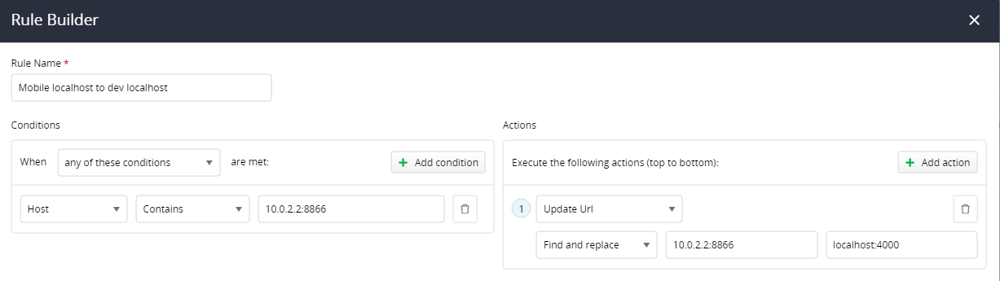

## Environment

|   |   |
|---|---|
| Product   |  Fiddler Everywhere  |
| Product Version | 1.0.0 and above  |

## Description

How can I configure Fiddler Everywhere to direct localhost traffic from the Android loopback address to the host localhost address?

## Solution

Each Android device and emulator uses special alias like 10.0.2.2 (might differ on different emulators) to your host loopback interface (i.e., 127.0.0.1 on your development machine). To direct the traffic generated from the alias address to the desired localhost endpoint, [enable capturing from Android device](slug://capture-mobile-android-traffic) and then use [the Rule Builder](slug://modify-traffic-get-started) to [create a rule](slug://modify-traffic-get-started#adding-new-rules) with the following conditions and actions:
- A condition where the **Host** contains the mobile loopback address and the Fiddler proxy port. For example: `10.0.2.2:8866`
- An action to **find and replace** the mobile loopback address and the Fiddler proxy port with the desired localhost endpoint on the Fiddler host machine. For example: `localhost:4000`

That's it! Enable the rule and any request on the Android device to `10.0.2.2:8866` will be directed to **localhost:4000**. Fiddler Everywhere is effectively acting as a reverse proxy.