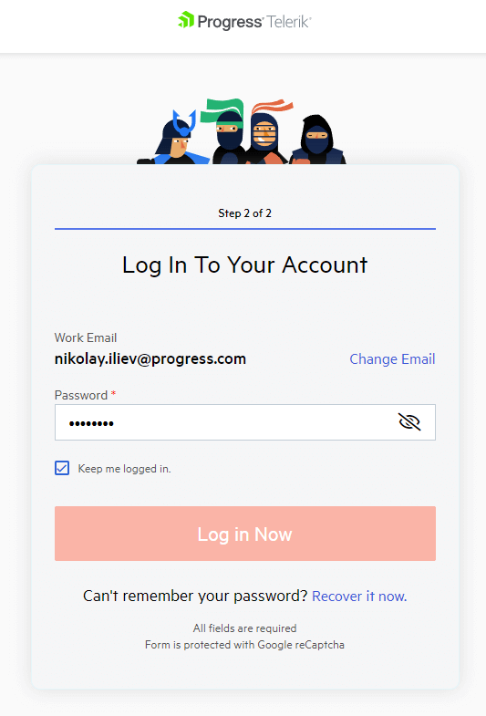

## Environment

|   |   |
|---|---|
| Product | Fiddler Everywhere, Fiddler Jam |
| Admin Panel "My Account" section | https://www.telerik.com/account/ |
| Admin Panel "Your License" section | https://www.telerik.com/account/your-licenses |

## Description

Until recently, we managed the Fiddler Everywhere license and seats in a dedicated system known as [Fiddler Dashboard](https://dashboard.getfiddler.com). However, as Fiddler Everywhere is part of the extensive portfolio of products developed by Progress, it was time that we integrated the license and seat management into the core administrative panel at https://www.telerik.com/account/. This way, our clients will benefit from using a single account and have a single entry point for managing all active licenses. This article explains how to migrate your existing Fiddler subscription plan from the obsolete system to the administrative panel on Telerik.com.

## Migrating Fiddler Everywhere License

To migrate your active Fiddler Everywhere subscription, follow these steps:

- Open the **latest** version of the Fiddler Everywhere application.

- Follow the **Sign In** link, which lands on the https://identity.telerik.com form that prompts you to enter your email.
    

- Enter the email used in Fiddler Everywhere.
    * In case the email exists as an active Telerik account, it will prompt you for your Telerik credentials. You can start managing your migrated license at https://www.telerik.com/account/your-licenses and using the Fiddler Everywhere (if your email is also assigned as a seat).
        

    * In case the email does not exist as an active Telerik account, you will be prompted to input a password and account information. 
        

        Confirm and finalize your Telerik account creation through the received activation link. Once the activation is completed, you can start managing your migrated license at https://www.telerik.com/account/your-licenses and using the Fiddler Everywhere (if your email is also assigned as a seat).