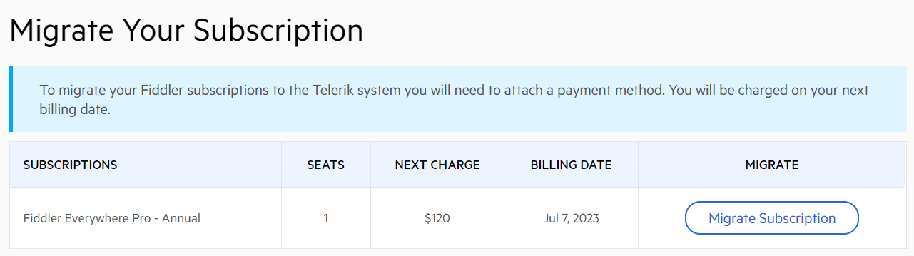
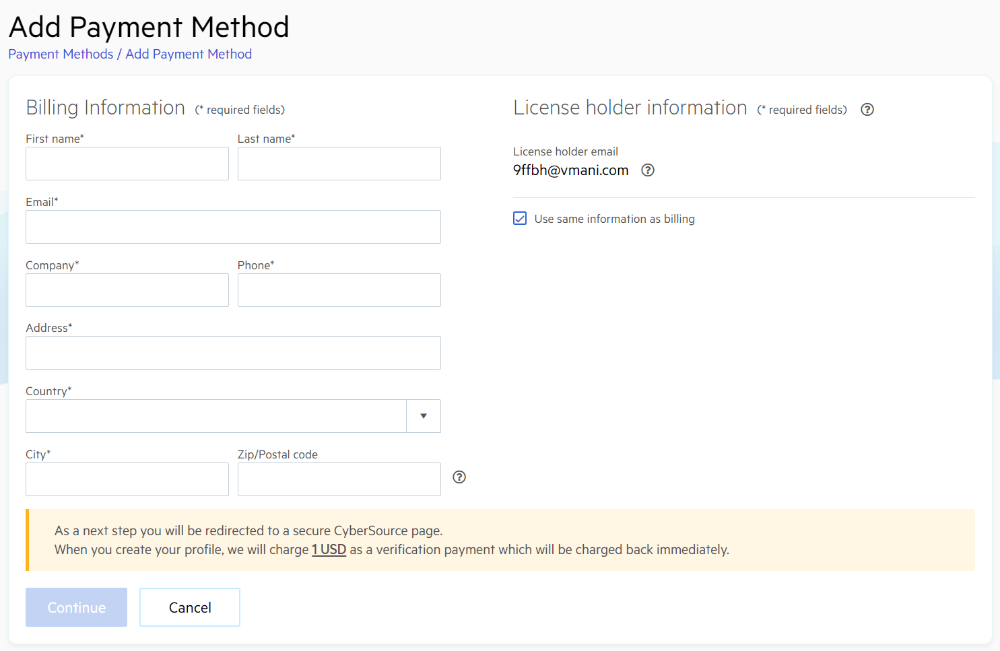
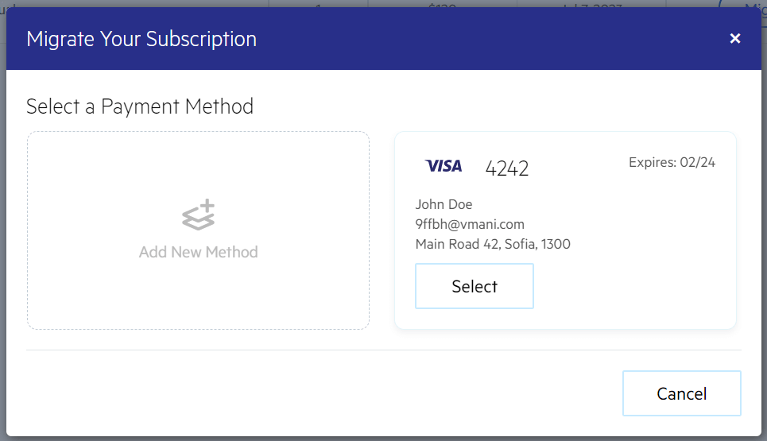
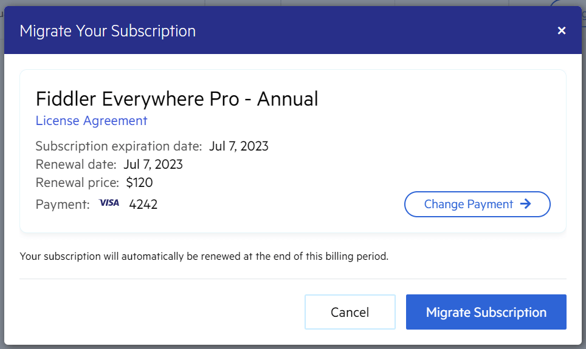
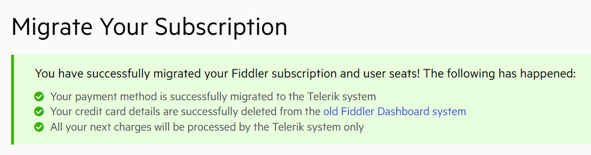

## Migrating Fiddler Accounts and Subscriptions

Fiddler products are now part of Progress Telerik's extensive portfolio. This article explains how to migrate your existing Fiddler accounts and subscriptions to the new unified Telerik system.

Depending on the license status, your Fiddler account presents one of the following roles:

* **License holder**&mdash;This user owns and manages the Fiddler subscriptions. The license holder can edit or update subscriptions and access billing details and invoices. The license holder can access the product if they have an assigned Fiddler seat (licensed developer).
* **Licensed developer**&mdash;This user has an assigned seat to a Fiddler subscription and has access to the respective Fiddler product.

>tip [Learn more on why Fiddler products moved to Telerik.com and what improvements you can expect...](https://www.telerik.com/blogs/fiddler-moving-telerik-what-expect).

## Account Migration

>note The following steps are directed at all users – **license holders** and **licensed developers**.

Each Fiddler account must migrate to the Telerik system and create a Telerik account through the following steps:

1. Open the latest version of the [Fiddler Everywhere application](https://www.telerik.com/download/fiddler-everywhere).
1. Follow the **Sign In or Create a New Account** link.
1. Enter your Fiddler account email or sign in with Google.
    >important To migrate successfully, create a new Telerik account (or use Google authentication) with the **same** email address as your original Fiddler account. If you use a different email, the system will perceive you as a new user, and you will not see your previous Fiddler subscription and data.
1. Enter a password and account information in the account creation form.
1. After confirmation, you will receive an email with an account activation link.
1. Open the activation link to finalize your Telerik account creation.
1. Once the activation completes, you can immediately sign in and continue using your Fiddler product.

## Subscription Migration

>tip The following steps are directed only at **license holders**.

A license holder must migrate the active Fiddler product subscription to the Telerik system. The subscription migration can be done through the following steps:

1. [Create your Telerik account](#account-migration)
    >important To migrate successfully, create a new Telerik account (or use Google authentication) with the **same** email address as your original Fiddler account. If you use a different email, the system will perceive you as a new user, and you will not see your previous Fiddler subscription and data.
1. Go to the [Telerik migration page](https://www.telerik.com/account/fiddler-migration).
1. Choose the subscription from the migration page and follow the **Migrate Subscription** link.
    
1. Add one or more payment methods by entering credit card details. Note that a charge of 1 USD will be used for verification payment (the amount will be returned immediately). The method populates your payment list, from which you can select one for recurring payments. 
    
1. Select your preferred payment method (from the list of added payment methods) for your subscription renewals and recurring payments.
    
    >important By default, none of the added payment methods are selected. You must explicitly choose a preferred payment method and confirm your choice through the **Select** button.
1. Follow the **Migrate Subscription** link to confirm your subscription migration.
    

After a successful migration, you will see a message confirming the operation, and your payment details will be deleted from the old Fiddler system. All future subscription renewals will be charged through the Telerik system only (processed by Cybersource) using the selected payment method. Note that if your migration is not successful, you will see an error or warning message instead of the screen depicted below - in such case, please get in touch with us through [the Support Center](https://www.telerik.com/account/support-center/contact-us/licensing-support).

## Additional Resources

Explore and learn more about the unified Telerik system through the following resources:

- [Account Overview](https://www.telerik.com/account/)
- [Your Account FAQ](https://www.telerik.com/account/faqs)
- [Your Licenses](https://www.telerik.com/account/your-licenses)
- [Purchasing & Licensing FAQs](https://www.telerik.com/purchase/faq/licensing-purchasing)
- [Support Center](https://www.telerik.com/account/support-center)
- [Learn more about Fiddler's move to Telerik](https://www.telerik.com/blogs/fiddler-moving-telerik-what-expect).