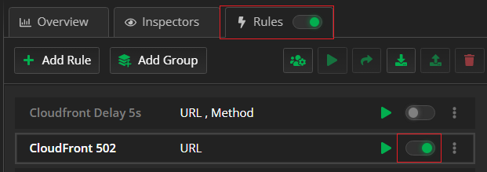
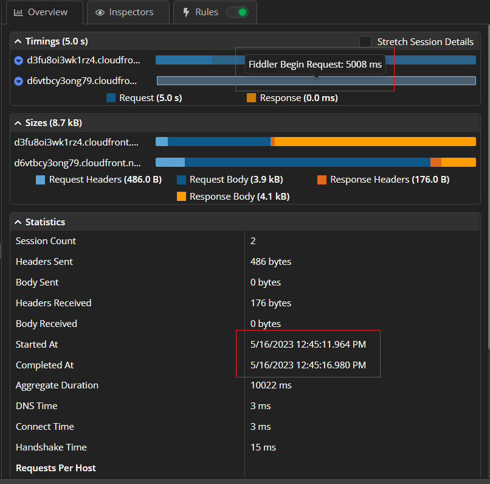

## Fiddler Everywhere Use Cases

Nowadays, Fiddler Everywhere is far from being just another proxy tool. The latest version of the application provides a comprehensive mechanism for inspecting traffic, extracting data, collaboration, mocking abilities, organizing collections, and more.

Fiddler Everywhere can help multiple personas and fit different cases: 

- A **quality engineer** can test many cases - for example, different rules for testing failing CSS, network delays, failed access to endpoints, and so on. 

- A **technical support engineer** can reproduce client scenarios - for example, the client shares that they are under a restricted corporate network with no direct access to AWS or other endpoints. A **developer** can receive prerecorded sessions that demonstrate the above scenarios and helps them in debugging and implementing the proper solution. 

- A **web developer** can use Fiddler Everywhere to optimize their site by testing and improving the implementations related to font loading, CDN fallback, third-party library, resource usage, testing different UI designs on the fly, and so on. 

- A **security officer** can use Fiddler Everywhere to examine the generated traffic for possible sensitive data leaks, test GDPR policies, and catch unwanted requests (such as ones made by malware or third-party actors). 

- An **end-user** can use Fiddler Everywhere to capture specific issue (that they hit) and then share it with the application creators for further investigation. 

- Being a man-in-the-middle proxy, Fiddler can also be used to mock hacking scenarios and test how different hacking approaches can affect your applications & servers.

The discussed cases above barely scratches the surface! An ocean of possibilities of what you can do and achieve with Fiddler Everywhere awaits you. Below we will cover some practical examples of using and combining the tool's different features to your advantage during everyday work.

## Real-Life Examples

The main functionalities of the Fiddler Everywhere application are as follows:

 - Capturing the HTTP/HTTPS traffic. Fiddler can be set as a system proxy (in that mode, it will capture all traffic that goes through the OS proxy), a preconfigured browser proxy (works on a specific browser instance), or as an explicit proxy (configure a particular application to go through the Fiddler Everywhere proxy address explicitly). 

 - Presenting the captured data statistically through the **Overview** tab and technically through the various **HTTP(S) Request and Response inspectors**. 

 - Mocking custom server and client app behavior through the **Rules** tab. This is one of the most advanced features that will allow you to test different scenarios and mock request/response data on the fly without modifying the application or server, investigating possible hacking cases, etc.

 - Composing API requests through the **Composer**. A core feature that allows you to create and execute your own requests with custom request headers and bodies.

 - Inspecting different sessions side-by-side through the **Compare** tab. The comparison is handy for testing what can cause a specific issue to appear on different requests. Combined with the collaboration and import functionalities, the comparison can solve multiple QA and support cases.

 - Preserving captured sessions, compose requests, create rules for later usage, and share them with collaborators. The Fiddler Everywhere application provides multiple options for saving snapshots (of captured sessions), request collections, and rules. You can save the data locally or use the cloud option. Sharing is even easier as you have built-in sharing possibilities with each other Fiddler users, but you also have the opportunity to export the snapshots in different known formats.

The listed above functionalities can be used for solving a multitude of real-life scenarios handled daily by developers, quality assurance engineers, support personas, or anyone that virtually needs to work with network data. 

### Capturing, Inspecting, Testing, and Mocking

One of the common scenarios for Fiddler Everywhere usage combines capturing traffic and modifying the requests/responses on the fly so that you can test different cases and reproduce various issues.

Let's assume that your site's client is behind a corporate network with strict restrictions. It can be a security tool that restricts access to several domains, including the ability to open a specific CDN. Or it might be a network connection issue, resulting in the request to the CDN to drop or to be extremely slow. You know your site uses the CDN to render the site UI, so you wonder how your page will look in similar conditions. Let's use Fiddler Everywhere to mock the behavior.

- Start capturing with Fiddler Everywhere and test your login page without any modifications. For example, let's use the Fiddler Everywhere documentation site at https://docs.telerik.com/fiddler-everywhere. 

Immediately, we can extract information on how the page works and understand that the entered URL is not the canonical endpoint and that we are redirected (status 301) to https://docs.telerik.com/fiddler-everywhere/introduction.

Scrolling further reveals sessions fetching resources from CloudFront CDN (an Amazon content distribution service).

- Now that we know the CDN endpoints, we can break the page UI with ease. Note that we will only break our site locally without the need to modify or halt the production services on Telerik.com or the CDN server.

    1. In Fiddler Everywhere, right-click on the chosen CDN session and choose **Add New Rule**. That will automatically add a new rule in the **Rules** tab. Alternatively, create your own rule with custom match conditions and actions.

    1. Rename your rule, leave the condition to match the CloudFront CDN endpoint, and change the action with predefined response 502 (Unreachable). Press **Save** to exit the rules builder.

        

        >tip For demonstration purposes, we choose an action with predefined response 502. However, you can use actions like non-graceful close, delay (in milliseconds), custom response, etc. The **Rules builder** is potent and comes with various conditions and actions.

  The newly created rule is automatically placed at the bottom of your list of rules. If you have multiple active rules, you need to explicitly order them to promote the rules that are non-blocking and demote the rules that have blocking consequences (all rules that depend on the response are blocking). 
  
    1. Ensure that the **Rules** tab and your new rule are switched.

        

    1. When ready, turn on Live Traffic capturing, return to your browser, and retry the login at [https://docs.telerik.com/fiddler-everywhere](https://docs.telerik.com/fiddler-everywhere). As expected, the loaded page will lack some  styles and fonts that were required from the CDN. Luckily, the Telerik team provided fail-safe CSS styles that still render the site readable.

The above test demonstrates how, quickly, within a few minutes, with the help of Fiddler Everywhere traffic capturing and rules, we can test various scenarios, reverse engineer a site logic and structure, or inspect different aspects and functionalities. Once an issue or a pattern is determined, we can save the sessions and use them for further investigation or share them with collaborators.

Interested in learning more? Checkout the following YouTube videos for more practical examples and demonstrations:

- [How to Simulate Hard to Show Web Failures Using Fiddler Everywhere?](https://www.youtube.com/watch?v=bV2oSyQHQ0g)
- [How to Use Fiddler Everywhere to Troubleshoot a Remote Device?](https://www.youtube.com/watch?v=_PFWwmkxw-g)
- [Expert Network Debugging Techniques You Won't Find Elsewhere](https://www.youtube.com/watch?v=G_ruDbfCKQs&t=600s)
- [How to Evaluate a Site's Web Performance Techniques Using Fiddler Everywhere](https://www.youtube.com/watch?v=CE_J4knF2ho)

### Using Statistical Data and Timings

Technically, Fiddler Everywhere allows you to capture HTTP/HTTPS traffic, make modifications, mock server behavior, compose requests, and much more. All these features generate a **lot** of HTTP session data initially available only in its raw form through the Fiddler's Request and Response inspectors. The community requested a more elaborate and structured way to access some of the data, and the Fiddler team delivered! We will talk about the exciting tab called **Overview**.

Let's assume that our page loads unexpectedly slowly for some reason, and we want to investigate what's causing the issue. Our demonstration uses the Fiddler Everywhere documentation landing page, as in the example in the previous section. To simulate the unexpected slow loading of resources, we will create a rule that mocks unexpected behavior by the CloudFront CDN (similar to the previous example).

1. Create a rule that delays the CloudFront CDN by 5 seconds (5000 milliseconds).

    

    >tip Note that the demo rule action will be applied for all endpoints that contain the **CloudFront** keyword. At the same time, it won't be used for any CONNECT tunnel, which will prevent the double execution of the action.

1. Ensure that the **Rules** tab and the rule itself are active.

    

1. When ready, turn off Live Traffic capturing, clean all previously captured traffic, and use [the **Open Browser** option](https://docs.telerik.com/fiddler-everywhere/traffic/capture-traffic#preconfigured-browser-capturing) with the following URL: [https://docs.telerik.com/fiddler-everywhere](https://docs.telerik.com/fiddler-everywhere).

>tip The **Open Browser** option uses a dedicated browser instance that goes through the Fiddler proxy. This is very convenient for testing a specific site without having to capture all the system traffic (it can accumulate quickly and pollute your Live Traffic list). Opening a preconfigured browser instance will also spare you the need to explicitly clear the cache from your browser. 
  
As a result, the login page will load with unwanted delay. In a real-life scenario, we can track which request/response has a longer duration (through the **Duration** column in the **Live Traffic** list of captured sessions) and then observe the **Overview** for clues.

The above screenshots depict how we can extract information from the **Overview** tab. Our rule delayed the CDN loading by 5000 milliseconds. In the **Overview** tab and specifically in **Statistics** > **Request Details**, we can examine the **Times** values. The investigation shows the delay between the **Client Connected** and **Server Connected** events.

Voila - the reason for the delay is the MITM proxy (expected as we delayed the request on purpose through our own rule). In real life, this is the place to observe if a request or response causes the delay and if the client application, the server, or a third party causes the delay.

Interested in learning more about the **Overview** tab? Checkout the following articles about the Overview tab and its capabilities:

- [https://docs.telerik.com/fiddler-everywhere/user-guide/overview](https://docs.telerik.com/fiddler-everywhere/user-guide/overview)
- [https://www.telerik.com/blogs/what-you-can-uncover-new-overview-tab-fiddler-everywhere-2-0](https://www.telerik.com/blogs/what-you-can-uncover-new-overview-tab-fiddler-everywhere-2-0)

## The Conclusion

Fiddler Everywhere stands out as a modern multifunctional tool that upgrades a MITM proxy to a Swiss аrmy кnife network application. Whether you will use it to debug an issue, optimize your applications & servers, inspect traffic for irregularities, or exploit a hack, it is the tool that keeps on giving. The Fiddler Everywhere team has an aggressive release policy that aims to bring more new exciting features constantly - functionalities like GDPR support, environment variables, new advanced Rules options, and many more are just around the corner. Welcome to the brave new Fiddler world!