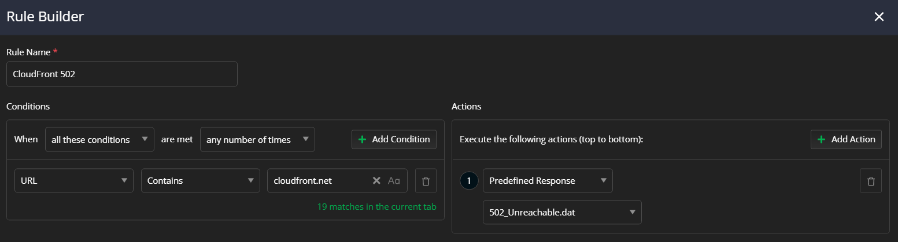

## Environment

|   |   |
|---|---|
| Product   |
| Product Version | 1.0.0 and above  |
| Operating System | macOS, Windows, Linux |

## Description

Apart from the technicality, what are the real-life examples where Fiddler can help?

## Solution

Fiddler Everywhere is far just from being another proxy tool. The latest version provides a comprehensive mechanism for inspecting the captured data, extracting statistical data, collaboration functionalities, mocking abilities, organized collections, and many more. Below we will cover some practical examples of how you can use and combine the tool's different features to your advantage during everyday work.

Fiddler Everywhere can help multiple different personas. A **quality engineer** can brute-force test other cases - for example, different rules for testing failing CSS, network delays, failed access to endpoints, and so on. A **technical support engineer** can reproduce client scenarios - for example, the client shares that he is under a restricted corporate network that has no direct access to AWS or other endpoints. A **developer** can receive pre-recorded sessions that demonstrate the above scenarios and helps them in debugging and implementing the proper solution. A **web developer** can use Fiddler Everywhere to optimize their site by testing and improving the implementations related to font loading, CDN fallbacks, third-party library, resource usage, testing different UI designs on the fly, and so on. A **security officer** can use Fiddler Everywhere to examine the generated traffic for possible leaks of sensitive data, test GDPR policies, and catch unwanted requests (e.g., by malware or third-party actors). An **end-user** can use Fiddler Everywhere to capture specific issue that he faces with an app and share it with the application creators for further investigation.

The discussed case above barely scratches the surface - there is an ocean of possibilities of what you can do and achieve with Fiddler Everywhere.

## Real-Life Examples

The main functionality of Fiddler Everywhere is as follows:

 - Capture the HTTP/HTTPS traffic 
 - Present the captured data statistically through the **Overview** tab and technically through the **HTTP Request and Response inspectors**. 
 - Mock custom server and client app behavior through the **Rules** tab.
 - Compose API requests through the **Composer**.
 - Inspect different sessions side-by-side through the **Compare** tab.
 - Preserve captured sessions, compose requests, create rules for later usage and share them with collaborators.

The listed above functionalities can be used for solving a multitude of real-life scenarios handled daily by developers, quality assurance engineers, support personas, or anyone that virtually has to work with network data. 

### Capturing, Inspecting, Testing, and Mocking

One of the common scenarios for Fiddler Everywhere usage combines capturing traffic and making modifications in the requests/responses on the fly so that you can test different cases and reproduce various issues.

Let's assume that a client of your site is behind a corporate network with strict restrictions. It might be a security tool that restricts access to several domains, including the ability to open a specific CDN. Or it might be a network connection issue, resulting in the request to the CDN to drop or to be extremely slow. You know your site is using the CDN to render the site UI, so you wonder how your page will look in similar conditions. Let's use Fiddler Everywhere to mock the behavior.

- Start capturing with Fiddler Everywhere and test your login page without any modifications. For example, let's use the Fiddler Everywhere documentation site at https://docs.telerik.com/fiddler-everywhere. 

Immediately, we can extract information on how the page is working and understand that the entered URL is not the canonical endpoint and that we are redirected (status 301) to https://docs.telerik.com/fiddler-everywhere/introduction.

Scrolling a bit further reveals several sessions fetching resources from Cloudfront CDN (an Amazon content distribution service).

- Now that we noticed the CDN endpoints, we can break the page UI easily. Note that we will only break things locally without the need to modify or halt the production services on Telerik.com or the CDN server.

    1. In Fiddler Everywhere, right-click on the chosen CDN session and choose **Add New Rule**. That will automatically add a new rule in the **Rules** tab. Alternatively, create your own rule with custom match conditions and actions.

    1. Rename your rule, leave the condition to match the Cloudfront CDN endpoint, and change the action with predefined response 502 (Unreachable). Press **Save** to exit the rules builder.

        

        >tip For demonstration purposes, we choose an action with predefined response 502. However, you can use different actions like non-graceful close, delay (in milliseconds), custom response, etc. The **Rules builder** is potent and comes with various conditions and actions.

  Note that the newly created rule is automatically placed at the bottom of your list of rules. If you have multiple active rules, you need to explicitly order them to promote the rules that are non-blocking and demote the rules that have blocking consequences (basically, all rules that depend on the response are blocking). 
  
    1. Ensure that the **Rules** tab and your new rule are switched.

        

    1. When ready, turn on Live Traffic capturing, go back to your browser and retry the login at [https://docs.telerik.com/fiddler-everywhere](https://docs.telerik.com/fiddler-everywhere). As expected, the loaded page will lack several styles and fonts that were required from the CDN. Luckily, the Telerik team provided fail-safe CSS styles that still render the site readable.

The above test demonstrates how easily, within a few minutes, with the help of Fiddler Everywhere traffic capturing and rules, we can test various scenarios, reverse engineer a stite logic and structure, or simply inspect different aspects and functionalities. Subsequently, once an issue or a pattern is determined, we can save the sessions and use them for further investigation or share them with collaborators.

Interested in learning more? Checkout the following YouTube videos for more practical examples and demonstrations:

https://www.youtube.com/watch?v=bV2oSyQHQ0g
https://www.youtube.com/watch?v=_PFWwmkxw-g
https://www.youtube.com/watch?v=G_ruDbfCKQs&t=600s
https://www.youtube.com/watch?v=CE_J4knF2ho

### Using Statistical Data and Timings

Technically, Fiddler Everywhere allows you to capture HTTP/HTTPS traffic, make modifications, mock server behavior, compose requests, and so on. All these features generate a **lot** of HTTP session data that was initially available only in its raw form through the Fiddler's Request and Response inspectors. The community requested a more elaborate and structured way to access some of the data, and the Fiddler team delivered! We will talk a bit about the exciting tab called **Overview**.

Let's assume that our page loads unexpectedly slowly for some reason, and we want to investigate what's causing the issue. Our demonstration uses the Fiddler Everywhere documentation landing page, as in the example in the previous section. To simulate the unexpected slow loading of resources, we will create a rule that mocks unexpected behavour byt the Cloudfront CDN (similar to the prevoius example).

1. Create a rule that delays the Cloudfront CDN by 2.5 seconds. Ensure that the rule is active. 

    

1. When ready, turn off Live Traffic capturing, clean all plreviously captured traffic, and use the **Open Browser** option with [https://docs.telerik.com/fiddler-everywhere](https://docs.telerik.com/fiddler-everywhere).

>tip The **Open Browser** option uses a preconfigured browser instance that goes through the Fiddler proxy. This is very convinient for testing a specific site without having to capture all the system traffic (which can be a lot and can polute your Live Traffic list). Opening a preconfigured browser instance will also spare you the need to explicitly clear the cache from your browser. 
  
As a result, the login page will load with unwanted delay. In a real-life scenario, we can track which request/response has a longer duration (through the **Duration** column in the **Live Traffic** list of captured sessions) and then observe the **Overview** for clues.

The above screenshots depict how we can extract information from the **Overview** tab. Our rule delayed the CDN loading by 2500 milliseconds. In the **Overview** tab and specifically in **Statistics** > **Request Details**, we can examine the **Times** values. The investigation shows the delay between the **Client Done Request** and **Fiddler Begin Request** events. 

Voila - the reason for the delay is the MITM proxy (expected as we delayed the request on purpose through our own rule). In real life, this would be the place to observe if a request or response causes the delay and if the delay is caused by the client application, the server, or a third party.

Interested in learning more? Checkout the following articles about the Overview tab and its capabilities:

https://docs.telerik.com/fiddler-everywhere/user-guide/overview
https://www.telerik.com/blogs/what-you-can-uncover-new-overview-tab-fiddler-everywhere-2-0