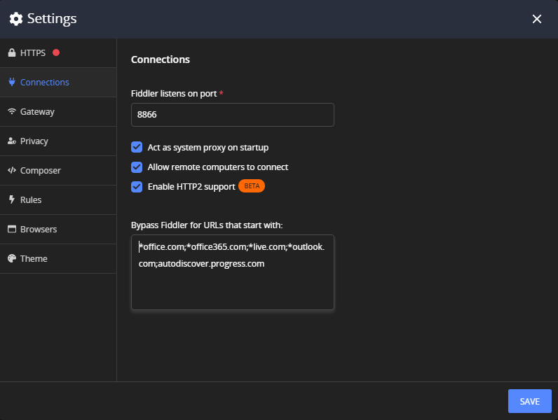

## Environment

|   |   |
|---|---|
| Product | Fiddler Everywhere |
| 3rd-party application | Office 365 applications, Microsoft Outlook, MS Teams |
| Operating System | Windows, macOS |

## Description

Some third-party applications like Microsoft Outlook and Office 365 tools are not working seamlessly alongside MITM proxies like Fiddler Everywhere.  How can I instruct Fiddler to disregard their traffic?

## Solution

In some cases, the proxy usage in third-party applications is restricted when the traffic goes through the MITM proxy. In other cases, the applications are not handling well the dynamic change of the system proxy. The desktop application Microsoft Outlook is one example of an application that might stop working when Fiddler Everywhere acts as a system proxy. To resolve issues with Outlook not working when Fiddler is turned on, follow these steps:

- Close the Office 365 application (for example, **Microsoft Outlook**, **MS Teams**, etc.). Make sure it is **not** running in the background. 

- Start Fiddler Everywhere and go to **Settings** > **Connections**.

- In the **Bypass Fiddler for URLs that start with:** field, enter the endpoints that need to be bypassed and click **Save**.

    ```curl
    *.office.com;*.office.net;*.office365.com;*.live.com;*.outlook.com;autodiscover.yourcompany.com
    ```

    Note that the last entry is a company-specific Office 365 endpoint and will differ for different Office365 users.

    

- Toggle the **System Proxy** capturing.

- Restart the Office 365 application.

That's it! After the above, the traffic generated from Outlook will bypass the Fiddler proxy. The same approach can be applied to any other client application you would like to skip the Fiddler Everywhere proxy.


>tip To bypass an application entirely, you need to know all the endpoints the application uses. That might not be a trivial job and can require bypassing outside Fiddler Everywhere. For example, bypassing Office365, [the list of endpoints is dynamically changing](https://docs.microsoft.com/en-us/microsoft-365/enterprise/urls-and-ip-address-ranges?view=o365-worldwide), so you might want to use the PAC script generated by Microsoft and create your proxy that Fiddler Everywhere will chain to.

## Related Links

* [Capturing Traffic from Microsoft Applications]()