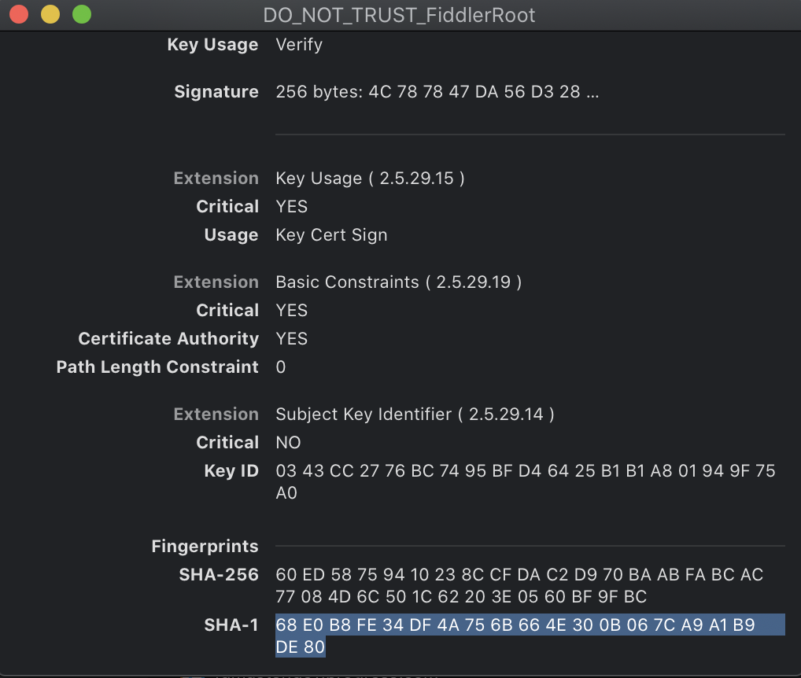

## Environment

|   |   |
|---|---|
| Product   |
| Product Version | 1.0.0 and above  |
| Supported OS | macOS |
| OS tool | Keychain Access |

## Description

To capture secure (HTTPS) traffic on macOS, Fiddler Everywhere requires the installation of a root trust certificate in the macOS Keychain Access application. This process failed and I'd like to know how can I handle the `"Fiddler root certificate NOT trusted successfully"` error?

## Solution

Test the import of the Fiddler Everywhere root certificate on macOS by using custom bash scripts and terminal commands.

1. Create a Bash file, for example, `import.sh`.

1. Save the following script in `import.sh`:

    ```Bash
    login_keychains_paths=$(security list-keychains | grep -e "\Wlogin.keychain\W");

    if [ -z "$login_keychains_paths" ]
        then
            echo "No login keychain found.";
            exit 10;
    fi
    security add-trusted-cert -k login.keychain ~/Desktop/FiddlerRootCertificate.crt;

    security_exit_code=$?;
    if [ $security_exit_code -ne 0 ]
        then
            echo "security add-trusted-cert failed with error code $security_exit_code";
    fi
    ```

1. Make the `import.sh` file executable.

    ```Bash
    chmod +x import.sh
    ```

1. Execute the created file in your Bash shell.

    ```Bash
    ./import.sh
    ```

1. After successfully executing the file, you will be prompted for your macOS username and password. Enter the credentials, and the generated trust certificate will be added in the Keychain Access application in **login** > **Certificates** as **DO_NOT_TRUST_FiddlerRoot**.

1. Test that the certificate generated from Fiddler is successfully installed and trusted by running the following command in your Bash shell:

    ```Bash
    security trust-settings-export /tmp/trustSettings.xml
    ```

    As a result, the command outputs a success message:

    ```Bash
    ...Trust Settings exported successfully.
    ```

1. Go to **login** > **Certificates** and confirm that the **DO_NOT_TRUST_FiddlerRoot** is present in the Keychain Access application. Double-click  the certificate, scroll to the bottom and note the `SHA-1` value. Open the exported settings file from `/tmp/trustSettings.xml` and check that the `SHA-1` value is present there. For example, the certificate from your Keychain Access application will be identical to the `SHA-1`.

    The `SHA-1` key in the `trustSettings.xml` file will also be present in the Keychain Access application.

    ```XML
    <key>68E0B8FE34DF4A756B664E300B067CA9A1B9DE8</key>
    ```

    

1. (Optional) Delete the `/tmp/trustSettings.xml` file after troubleshooting the issue as it is only needed to check that the `SHA-1` key is properly exported.
