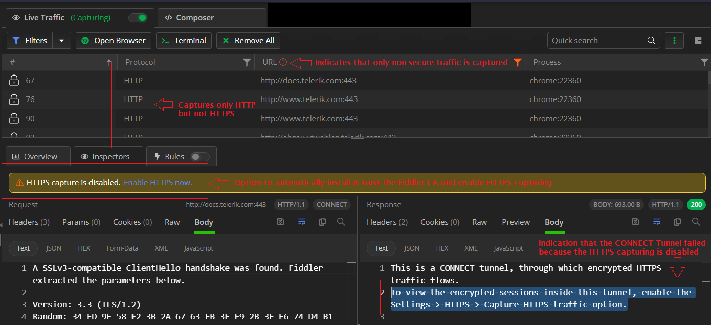

## Environment

|   |   |
|---|---|
| Product  | all versions of Fiddler Everywhere  |
| Supported OS | Windows, macOS, Linux |

## Description

Once Fiddler Everywhere is up and running, you might find it cannot capture HTTP(S) traffic. This article lists some possible reasons why this behavior might occur and provides guidance on possible solutions.

## System Capture Not Working

**Observations:** 
- The Fiddler Everywhere application is up and running.
- The Fiddler root CA is installed.
- The system capturing mode is turned ON (by toggling the **Live Traffic** switch).

**Result**: No HTTP(S) traffic appears in the Live Traffic grid.

Multiple different reasons might prevent Fiddler Everywhere from acting as a system proxy. Below we are covering some of the most common scenarios:

 - [Lack of administrative rights](#lack-of-administrative-rights) to set and unset the system proxy.
 - [Incompatibility with VPN tools](#capture-not-working-alongside-vpn).
 - [Incompatibility with security tools](#capture-not-working-alongside-security-tools) (firewalls, antivirus, zero-trust tools, security policies).
 - [Incompatibility with other preset system proxies](#capture-not-working-alongside-another-preset-proxy).
 - [Incompatibility with other proxy tools]().
 - Third-party tooling meddling with the proxy setting after Fiddler Everywhere is set as a system proxy.

### Lack of Administrative Rights

**Observations:**
- The Fiddler Everywhere application is up and running.
- The system capturing mode is turned ON (by toggling the **Live Traffic** switch).

**Result**: The operating system proxy settings remain unchanged. No HTTP(S) traffic appears in the Live Traffic grid.

**Troubleshooting approach**: Fiddler Everywhere requires administrative rights to modify the operating system proxy settings. If the currently logged user does not have rights to change the proxy settings and Fiddler Everywhere was not installed with such rights, it will fail to set and unset the OS proxy settings. You can confirm that scenario through the following steps:

- Start the Fiddler Everywhere application.
- Start the system capturing mode (by toggling the **Live Traffic** switch).
- Open the operating system proxy settings.
- Observe if Fiddler Everywhere is set as a manual proxy (by default with the following address: **127.0.0.1:8866**).

Failure to set/unset the Fiddler Everywhere proxy while toggling the system capturing indicates that Fiddler Everywhere lacks administrative rights to operate correctly. 

**Solution**: Reinstall Fiddler Everywhere with administrative rights or contact your system administrator.

### Capture Not Working alongside VPN

**Observations:**
- The company/home VPN is up and running.
- The Fiddler Everywhere application is up and running.

**Result**: No HTTP(S) traffic appears in the Live Traffic grid.

**Troubleshooting approach**: Start Fiddler Everywhere, toggle the system capturing, and then start the company/home VPN tool.

**Solution**: Fiddler Everywhere is incompatible with some third-party VPN tools. In case your VPN prevents Fiddler Everywhere from capturing HTTP(S) traffic, then you can bypass the VPN endpoints through the following steps:

1. Disconnect the VPN client.
1. Start the Fiddler Everywhere application.
1. Go to  **Settings** > **Connections** and add the VPN addresses of your VPN servers in the **Bypass Fiddler for URLs that start with** field. 
1. Click the **Save** button to preserve the bypass list.
    
1. Start the VPN client and connect to the VPN network.
1. Start the system capturing mode (by toggling the **Live Traffic** switch).

### Capture Not Working alongside Security Tools

**Observations:**
- The company/home security tooling/policies are up and running.
- The Fiddler Everywhere application is up and running.

**Result**: No HTTP(S) traffic appears in the Live Traffic grid.

**Solution**: Many modern-day tools automatically strip applications of administrative rights. Some security tools and administrators apply zero-trust policies, often automatically blocklisting all newly installed software. To resolve similar issues, contact your system administrator or explicitly allowlist Fiddler Everywhere to run with administrative rights on the preferred port (by default, port 8866) and to be able to set/unset the operating system proxy settings.

### Capture Not Working Alongside Another Preset Proxy

**Observations:**
- The operating system uses another system proxy.
- The Fiddler Everywhere application is up and running.

**Result**: No HTTP(S) traffic appears in the Live Traffic grid.

**Troubleshooting approach**: Check if your system uses a proxy through PAC scripts or other remote resources.

**Solution**: Some systems use complex proxy configurations through remote servers and/or scripts like PAC (automatic proxy configurations). These configurations might prevent Fiddler Everywhere from successfully chaining to the default proxy. This, in terms results in Fiddler Everywhere not intercepting the system traffic. 

To resolve the issue, try to apply the following solutions:

- Ensure that the default proxy does not limit the Fiddler proxies (for example, Fiddler Everywhere [requires access to specific endpoints](#prerequisites)).
- Ensure that the PAC script (or the alternative proxy script) is in a proper format.
- Contact your network administrators and ask them to verify that the default proxy can be chained (to the Fiddler Everywhere proxy).

Alternatively, if none of the above is applicable, you can use other [capturing modes]() that Fiddler Everywhere provides.

### Capture Not Working Alongside Another Proxy Tools

**Observations:**
- The Fiddler Everywhere application is up and running.
- The system capturing mode is turned ON (by toggling the **Live Traffic** switch).
- Start third-party proxy tool.

**Result**: No HTTP(S) traffic appears in the Live Traffic grid.

**Solution**: By design, Fiddler Everywhere will respect all other proxies, including preset system proxies (including manual proxies or automatically configured), and will automatically chain to them. When Fiddler Everywhere is unset as a proxy, it will revert the system proxy settings to their default. However, that is not the case for all proxy tools out in the wild - some tools might neglect pre-existing proxy settings and try to replace them. When a third-party tool removes Fiddler Everywhere as an intermediate proxy, that will immediately cause the Fiddler application not to capture HTTP(S) traffic.

To resolve the issue, ensure the third-party proxy tool is not explicitly configured to overwrite pre-existing proxy configurations. Alternatively, if the solution is not applicable, you can use other [capturing modes]() that Fiddler Everywhere provides.

## Independent Browser Instance Capture Not Working

**Observations:** 
- The Fiddler Everywhere application is up and running.
- The **Browser** option opens a new browser instance.

**Result**: No HTTP(S) traffic appears in the Live Traffic grid.

**Troubleshoting approach**:

## Terminal Instance Capturing Not Working

**Observations:** 
- The Fiddler Everywhere application is up and running.
- The **Terminal** option opens a new terminal instance.

**Result**: An HTTP(S) request made through the terminal instance does not appear in the Live Traffic grid.

**Troubleshoting approach**:

## Captures Only HTTP Traffic (Fails to Capture HTTPS)

**Observations:** 
- Fiddler Everywhere captures only non-secure HTTP traffic and CONNECT Tunnels. 
- The proxy fails to capture HTTPS traffic. 
- The client application returns errors related to failed TLS handshake.
- The client application returns errors related to security risks and possible MITM attacks.

**Troubleshooting approach**: By default, Fiddler Everywhere acts as an HTTP proxy and can capture only non-secure HTTP traffic. Fiddler Everywhere must be a TLS proxy to capture and decrypt HTTPS traffic. For that to happen, you must install and trust the Fiddler root CA (certificate authority). 

_Fiddler Everywhere indicators that HTTPS capturing is disabled_

Use one of the UI indicators to install the Fiddler root CA and enable HTTPS capturing automatically. Alternatively, go through the manual instructions provided in [this documentation section]().