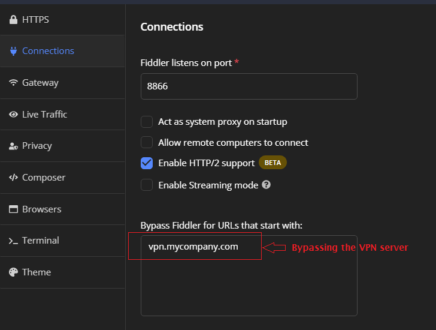

You can encounter a situation where Fiddler Everywhere is active but unable to capture HTTP(S) traffic despite the following observations being true:

- The Fiddler Everywhere application is launched and running.
- The Fiddler root CA (certificate authority) is correctly installed.
- The system capturing mode is enabled by toggling the Live Traffic switch.
- No active filters or rules obstruct the traffic.

In addition to the above, instead of captured traffic, the sessions grid displays the message _"It looks like you are unable to capture traffic. You might have a configuration issue - check our troubleshooting page for more information."_.

In such cases, we recommend referring to the troubleshooting guides below for further help resolving the configuration issue. The guides provide detailed information and guidance to help you identify and resolve any underlying problems affecting the traffic capture functionality of Fiddler Everywhere.

## Troubleshooting and Solutions  

Various reasons can result in Fiddler Everywhere not acting as a system proxy. Below, we list some of the most common scenarios, alongside troubleshooting instructions and possible solutions:

 - [Lack of administrative rights](#lack-of-administrative-rights) to set and unset the system proxy.

 - [Incompatibility with VPN tools](#incompatibility-with-vpn-tools).

 - [Incompatibility with security tools](#incompatibility-with-security-tools) (firewalls, antivirus, zero-trust tooling, security policies).

 - [Incompatibility with other preset system proxies](#incompatibility-with-other-preset-system-proxies).

 - [Incompatibility with third-party proxy tools](#incompatibility-with-third-party-proxy-tools).

 - [Limited Internet Connectivity](#limited-internet-connectivity)

 - [Incompatibility with graphic drivers (White screen or failing startup)](#incompatibility-with-graphics-drivers)
 
 - [Receiving "ERR_CONNECTION_RESET" error](#)

## Lack of Administrative Rights

Fiddler Everywhere requires administrative rights to set and unset the operating system proxy settings.

### Troubleshooting approach

Troubleshoot the lack of administrative rights through the following steps:

1. Start Fiddler Everywhere with administrative rights.

2. [Start the system capturing mode](#system-capturing).

3. Open the operating system proxy settings.

4. Observe if Fiddler Everywhere sets the system's manual proxy (by default with the following address: **127.0.0.1:8866**).

Failure to set/unset the Fiddler Everywhere proxy while toggling the system capturing indicates that Fiddler Everywhere lacks administrative rights to work correctly.

### Solution

To solve the above, reinstall Fiddler Everywhere with administrative rights or consult your system administrator.

## Incompatibility with VPN tools

Some third-party VPN tools make additional network modifications which can result in Fiddler Everywhere not working correctly as an intermediate proxy. 

### Troubleshooting approach

1. Test and verify if Fiddler Everywhere captures HTTP(S) traffic while your VPN application is disconnected.

2. Test and verify if Fiddler Everywhere captures HTTP(S) traffic while your VPN application is connected.

If Fiddler successfully captures traffic after the first step but fails to do so after the second, then that confirms that your issue is related to the VPN tooling.

### Solution - Bypass the VPN servers

You can instruct Fiddler Everywhere to bypass the VPN server endpoints through the following steps explicitly:

1. Disconnect the VPN application.

1. Start Fiddler Everywhere.

1. Go to **Settings** > **Connections** and add the VPN addresses of your VPN servers in the **Bypass Fiddler for URLs that start with** field. 

1. Click the **Save** button to preserve the bypass list.

    

1. Start the VPN application and connect to the VPN network.

1. [Start the system capturing mode](#system-capturing).

### Solution - Using Alternative Capturing Modes

The system capturing mode can set and unset the operating system proxy, which may result in configuration conflicts with the VPN tooling. To avoid such conflicts, consider the alternative capturing modes provided below as substitutes for the system capturing mode.

- The [dedicated browser capturing mode](#independent-browser-capturing-browser-capturing).

- The [dedicated terminal capturing mode](#independent-browser-capturing-terminal-capturing). 

## Incompatibility with security tools

In modern-day environments, it's common for security tools to remove administrative rights from applications automatically. Additionally, administrators may enforce zero-trust policies, often automatically blocklisting all newly installed software like Fiddler Everywhere.

### Troubleshooting approach

To troubleshoot this scenario, it's advisable to thoroughly audit the security tooling and administrative policies implemented on your machine by your company. Take into consideration the following components and procedures that may be impacting the currently logged-in user:

- Zero-trust Tooling: Review any zero-trust tooling or security measures that may restrict network access or proxy configurations.
- Antivirus Software: Check if the antivirus software installed on your machine has policies that can potentially interfere with network connections or proxy settings.
- Firewalls: Examine firewall configurations to ensure they are not blocking necessary network connections or proxy usage.
- Group Network Policies: Evaluate group network policies that restrict network access, proxy configurations, or specific user privileges.
- Restricted rights to modify system settings (including the OS network settings).
- Restricted file system read/write rights.
- Limited access to third-party endpoints including access to [the required Fiddler Everywhere endpoints](#prerequisites).

The existence of any of the above can prevent Fiddler Everywhere from running correctly.

### Solution - Elevate Fiddler's Application

Contact your system administrator and ask them to:

- Enable Fiddler Everywhere to run with administrative rights.
- Enable Fiddler Everywhere to set/unset the operating system proxy settings. 
- Open the preferred proxy port (by default, port 8866).
- Verify that the host system covers [the requirements for running Fiddler Everywhere](#prerequisites).

### Solution - Using Alternative Capturing Modes

The system capturing mode can set and unset the operating system proxy, which may result in configuration conflicts with security tooling and administrative policies. To avoid such conflicts, consider the alternative capturing modes provided below as substitutes for the system capturing mode.

- The [dedicated browser capturing mode](#independent-browser-capturing-browser-capturing).

- The [dedicated terminal capturing mode](#independent-browser-capturing-terminal-capturing). 


## Incompatibility with other preset system proxies

Some systems use complex proxy configurations through remote servers and scripts like PAC (automatic proxy configurations). These configurations can prevent Fiddler Everywhere from successfully chaining to the upstream proxy. This, in terms, results in Fiddler Everywhere not intercepting the system traffic. 

### Troubleshooting approach

Test if Fiddler Everywhere can capture traffic when the upstream proxy is removed from the OS proxy settings.

### Solution - Reconfigure the Upstream Proxy

To resolve the issue, please consider applying the following solutions:

- Configure the upstream proxy to allow unrestricted usage of the Fiddler Everywhere proxy through its default address (`127.0.0.1:8866`).

- Adjust the configuration of the upstream proxy to remove any limitations on [the required endpoints for Fiddler Everywhere](#prerequisites).

- Ensure that the PAC script or alternative proxy script is correctly formatted and properly set up.

- Reach out to your network administrators and request their assistance verifying that the default upstream proxy can be successfully chained to the Fiddler Everywhere proxy.

### Solution - Using Alternative Capturing Modes

The system capturing mode can set and unset the operating system proxy, which may result in configuration conflicts with third-party upstream proxies. To avoid such conflicts, consider the alternative capturing modes provided below as substitutes for the system capturing mode.

- The [dedicated browser capturing mode](#independent-browser-capturing-browser-capturing).

- The [dedicated terminal capturing mode](#independent-browser-capturing-terminal-capturing). 


## Incompatibility with third-party proxy tools

As part of its design, Fiddler Everywhere respects other upstream proxies, including system proxies or third-party proxy tools. Fiddler automatically chains to these proxies, ensuring seamless integration. Additionally, when Fiddler Everywhere is unset as a proxy, it will revert the system proxy settings to their default state.

However, it's important to note that not all third-party proxy tools follow the same behavior. Some tools may disregard existing proxy settings and try to replace them instead of chaining to them. If a third-party tool removes Fiddler Everywhere as an intermediate proxy, it will immediately interrupt Fiddler's ability to capture HTTP(S) traffic.

When the system capturing mode is enabled, Fiddler detects if a third-party tries to change the OS settings and warns you with the message below.

```
Your proxy was changed multiple times by other apps. Click here to learn for possible issues. Click to reenable capturing.
```

You can let Fiddler Everywhere automatically recover its proxy settings by following the `Click to reenable capturing` link or, alternatively, follow the troubleshooting instructions below.

### Troubleshooting approach

To troubleshoot if a third-party proxy tool is interfering with Fiddler's proxy, please follow these steps:

- Start Fiddler Everywhere.

- Enable the system capturing mode.

- Confirm that system capturing mode functions correctly by capturing a page like https://example.com.

- Start the third-party proxy tool and activate its system capturing mode.

If Fiddler Everywhere ceases to capture traffic at this point, the third-party tool is **not** correctly chaining the proxy configuration and instead overwriting it. 

### Solution - Change the Proxy Startup Order

Run the third-party proxy tool **before** enabling Fiddler's system capture. This way, you will allow Fiddler Everywhere to chain the upstream proxy.

### Solution - Stop the Third-Party Proxy Tool

Sometimes, a third-party software automatically sets the system proxy (by explicitly overwriting any other proxy configuration, including the one Fiddler Everywhere sets). The solution is to stop that service/software before starting the Fiddler Everywhere application.

### Solution - Reconfigure the Third-Party Proxy Application

Check the third-party tool documentation for configuration options related to chaining to upstream proxies.

### Solution - Set Fiddler as a Gateway

Use the third-party tool settings to set the Fiddler's proxy address (**127.0.0.1:8866**) as the default gateway.

### Solution - Using Alternative Capturing Modes

The system capturing set and unset the operating system proxy, which can cause a configuration conflict with third-party proxy applications. You can substitute the system capturing mode with the listed alternative capturing modes.

- The [dedicated browser capturing mode](#independent-browser-capturing-browser-capturing).

- The [dedicated terminal capturing mode](#independent-browser-capturing-terminal-capturing). 


## Limited Internet Connectivity

Fiddler Everywhere has a personalized user interface with different authentication options, collaboration functionalities, and cloud saves. These features utilize the following online endpoints, which must be accessible from the machine that hosts Fiddler.

```curl
  https://*.telerik.com/
  https://*.getfiddler.com/
  https://fiddler-backend-production.s3-accelerate.amazonaws.com
```

In case the above endpoints are inaccessible, then you can experience a login error that contains the following message **_"HTTP failure response for
https://identity.getfiddler.com/oauth/token:0 Unknown Error"_**.

### Solution - Provide Access to the Fiddler's Endpoints

To ensure that Fiddler Everywhere can start, use a network that allows access to the listed API endpoints.


### Solution - Use Fiddler's Offline Mode

The [Fiddler Everywhere enterprise tier](https://www.telerik.com/purchase/fiddler) includes the offline mode feature (currently available only for Windows and after covering specific technical requirements). Contact us if you want to learn more about the offline mode and using Fiddler Everywhere without an internet connection.


## Incompatibility with Graphics Drivers

In some cases, the Fiddler Everywhere application won't start at all, or will start with broken UI (like hanging white screen). One of the most common reasons for that to happen is incompatibility of the installed graphics drivers with the Electron application (the UI of the Fiddler Everywhere). 

### Solution - Update the Graphics Driver

The first thing to do is to ensure that your system uses an up-to-date graphics driver. Use the official download sources to obtain the latest version of the driver for your video card.

### Solution - Disable the Hardware Acceleration

The Fiddler Everywhere application provides an option to explicitly turn off the hardware acceleration through a boolean flag called `disableHardwareAcceleration` in the `electron-settings.json` file. This flag turns GPU-accelerated rendering on or off. Fiddler will use a software output device for rendering in the CPU when the hardware acceleration is explicitly disabled.

- Open the following folder 
  ```bash
  %userprofile%\.fiddler\Settings\electron-settings.json
  ```

- Add the bellow key-value pair to disable the hardware acceleration and force software rendering instead.
    ```JSON
    "disableHardwareAcceleration" : true
    ```

[Learn more about disabling the hardware acceleration here...]()

## Receiving AutoProxy Detection Failed Error

Sometimes, your system administrator can create a proxy group policy by setting `ProxySettingsPerUser` to `0`. This means that instead of the default Windows behavior (each user has their proxy settings), all user accounts share one set of proxy settings. In that case, Fiddler requires administrative privilegie to set a proxy for all users. 

To resolve the issue, apply one of the following solutions:

* Run Fiddler Everywhere as admin

OR

* Change the value of the registry entry to `1` or delete the whole entry `ProxySettingsPerUser`

[Learn more about resolving the issue while uisng ProxySettingsPerUser group policy here...]()

## Receiving ERR_CONNECTION_RESET Error

Sometimes, traffic that goes through the Fiddler Everywhere proxy might fail with the error **ERR_CONNECTION_RESET** instead of loading the expected HTTP response. This error usually indicates that the client application (for example, the browser) fails to establish a connection with the server. While the actual reasons vary, when the error appears only with the Fiddler proxy in the middle, we can assume that the most likely cause is the improper installation of the Fiddler Certificate Authority (CAs).

### Solution - Reinstall the Fiddler Certificate Authority

The Fiddler Everywhere application allows automatically reinstalling or completely removing any preinstalled Fiddler's CA. The first thing to do is to try the automatic preinstallation of the Fiddler Everywhere CA through the following action:

1. Open the Fiddler Everywhere application.

1. Navigate to **Settings > HTTPS > Advanced Settings**.

1. Click on the **Reset CA** option.

1. Restart your client application (e.g., the browser) to ensure the changes are in place, and then retry executing the HTTP request.

In case the issue persists, you can explicitly and entirely remove all Fiddler CA through the following steps:

1. Open the Fiddler Everywhere application.

1. Navigate to **Settings > HTTPS > Advanced Settings**.

1. Click on the **Remove Fiddler's CA*** option.

1. Open the operating system certificate manager application and explicitly delete any other Fiddler CA that might not have been deleted automatically. All FIddler CA files contain either **DO_NO_TRUST_Fiddler** or **Fiddler Root Certificate** within the name of the CA.

1. Once the Fiddler's CA files are explicitly and entirely removed from your operating system, open the Fiddler Everywhere application and reinstall its CA through the **Settings > HTTPS > Trust CA** option.

>tip The **ERR_CONNECTION_RESET** is reportedly appearing in some cases with the [Fiddler's independent browser capturing mode](). In that case, an explicit manual removal of all installed Fiddler CA files is recommended.

## Capture Not Working - All Other Scenarios

If you cannot resolve your issue, then please do not hesitate to contact us. Our support engineers and developers can provide technical support through [the Telerik Support Center](https://www.telerik.com/account/support-center) and through [the public GitHub bug and feature request tracker](https://www.telerik.com/support/fiddler-everywhere). When posting a ticket to our support team, consider delivering the following:

- Detailed description of the encountered issue. If possible, provide steps and screenshots that depict the issue reproduction.
- Technical details about your environment, like used operating system, third-party security tools, VPN tools, administrative limitations, etc.
- Add the [Fiddler Everywhere application log files](). These files contain crucial information about the application startup, login process, local environment, and possible UI and backend errors.

### Testing macOS Network Access

Specific macOS network configurations or administrative limitations can prevent Fiddler from properly recognizing and using the active network adapter. Use the technique described in [this KB article]() to investigate possible issues related to macOS network access.


## See Also

* [Accessing and Inspecting Fiddler Everywhere Application's Log Files]()
* [Resetting Fiddler Everywhere Settings to Default]()
* [Troubleshooting macOS Proxy Settings]()
* [Troubleshooting macOS Trust Certificate Issues]()
* [Fiddler Support Options]()
