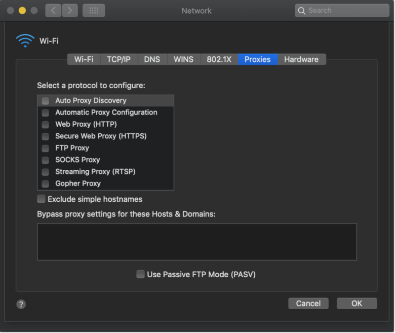
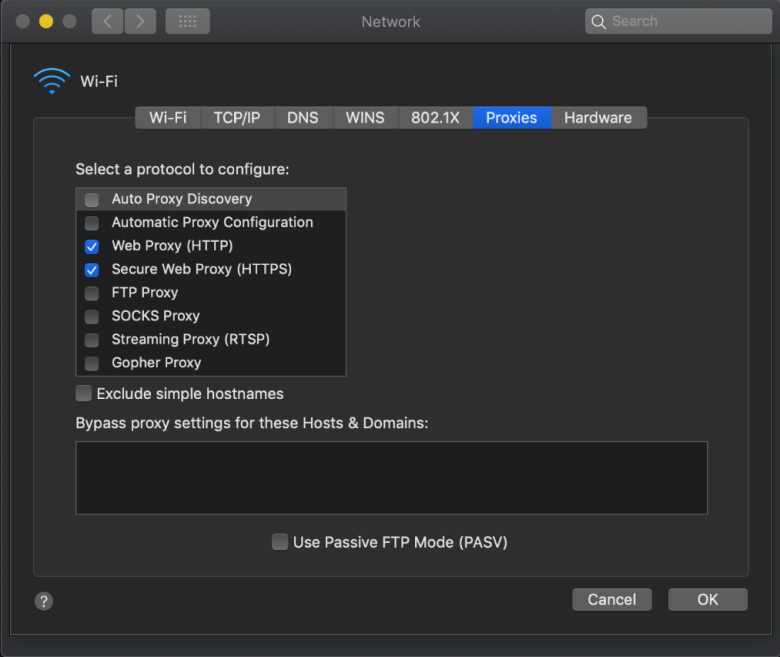

## Environment

|   |   |
|---|---|
| Product   |  Fiddler Everywhere  | [Fiddler Everywhere](https://www.telerik.com/fiddler/fiddler-everywhere) |
| Product Version |  1.0.0 and above  |
| Operating System| macOS version 11 or above |

## Description

How can I verify and troubleshoot changes in the macOS proxy settings? How can I confirm that the [Fiddler Everywhere](https://www.telerik.com/fiddler/fiddler-everywhere) is successfully set as a system proxy?

## Solution

To troubleshoot common Mac scenarios, verify the Mac proxy settings. For example, after [installing Fiddler Everywhere on a Mac](), Fiddler Everywhere may not be able to start capturing traffic. This issue may be caused by various reasons and may require troubleshooting.

To troubleshoot this issue:

1. [Reset the Fiddler Everywhere settings to their default values]().
1. Close Fiddler Everywhere.
1. [Verify the Mac proxy settings](#verifying-the-mac-proxy-settings).
1. Open Fiddler Everywhere.
1. [Re-verify the Mac proxy settings](#verifying-the-mac-proxy-settings).

### Verifying the Mac Proxy Settings

Go to the Apple Mac proxy settings in **System Preferences** > **Network** > **Advanced**. Note that each network adapter will have proxy settings. For example, if the Internet is available through an Ethernet port and a WiFi connection, you will see two adapters, each with separate proxy settings.

When Fiddler Everywhere is closed with the default settings, the **System Proxy Settings** will look like the following.

When Fiddler Everywhere is open with the default settings, the **System Proxy Settings** will look like the following.

## See Also

* [Download the latest Fiddler Everywhere](https://www.telerik.com/download/fiddler-everywhere)
* [Get Started with Fiddler Everywhere on macOS]()
* [Troubleshooting Fiddler Everywhere Network Access]()
* [Troubleshooting HTTPS Capturing on macOS]()
* [Troubleshooting macOS Trust Certificate Issues]()
* [Resetting Fiddler Everywhere Settings to Default]()
* [Inspecting the Fiddler Everywhere application logs]()
