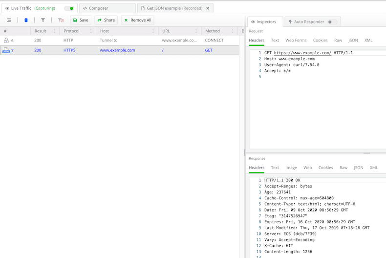

#### Environment

|   |   |
|---|---|
| Product  | Fiddler Everywhere  |
| Product Version | 1.0.0 and above  |
| Operating System | macOS |

#### Description

Test if **Fiddler Everywhere** is correctly configured to capture HTTPS traffic on macOS. 


## Troubleshooting macOS Capturing

The user can execute a simple **cURL** command in the **macOS** terminal and check the output in the terminal and inside Fiddler Everywhere:

1. Open Fiddler Everywhere and ensure that it is configured to capture HTTPS traffic (Settings > HTTPS > Capture HTTPS traffic is checked). There is no need to turn Live Traffic on - it does not matter in this test.

2. Open a terminal and enter the following command: 

    ```Shell
    curl -v --url https://www.example.com/ -x 127.0.0.1:8866
    ```

    The `-x` option sets the Fiddler Everywhere proxy. The `-v` option provides verbose logs. Optionally, you could use the `-k` option to disable SSL verification.

3. Check the command output. There should be a line related to the Server certificate, and under it, the certificate should list Fiddler's URL (http://www.fiddler2.com)

    ```Console
    *   Trying 127.0.0.1...
    * TCP_NODELAY set
    * Connected to 127.0.0.1 (127.0.0.1) port 8866 (#0)
    * Establish HTTP proxy tunnel to www.example.com:443
    > CONNECT www.example.com:443 HTTP/1.1
    > Host: www.example.com:443
    > User-Agent: curl/7.54.0
    > Proxy-Connection: Keep-Alive
    > 
    < HTTP/1.1 200 Connection Established
    < FiddlerGateway: Direct
    < StartTime: 12:06:48.719
    < Connection: close
    < 
    * Proxy replied OK to CONNECT request
    * ALPN, offering h2
    * ALPN, offering http/1.1
    * Cipher selection: ALL:!EXPORT:!EXPORT40:!EXPORT56:!aNULL:!LOW:!RC4:@STRENGTH
    * successfully set certificate verify locations:
    *   CAfile: /etc/ssl/cert.pem
    CApath: none
    * TLSv1.2 (OUT), TLS handshake, Client hello (1):
    * TLSv1.2 (IN), TLS handshake, Server hello (2):
    * TLSv1.2 (IN), TLS handshake, Certificate (11):
    * TLSv1.2 (IN), TLS handshake, Server key exchange (12):
    * TLSv1.2 (IN), TLS handshake, Server finished (14):
    * SSL connection using TLSv1.2 / ECDHE-RSA-AES256-GCM-SHA384
    * ALPN, server did not agree to a protocol
    * Server certificate:
    *  subject: OU=Created by http://www.fiddler2.com; O=DO_NOT_TRUST_BC; CN=*.example.com
    *  start date: Oct  2 00:00:00 2020 GMT
    *  expire date: Oct  9 00:00:00 2022 GMT
    *  subjectAltName: host "www.example.com" matched certs "*.example.com"
    *  issuer: OU=Created by http://www.fiddler2.com; O=DO_NOT_TRUST_BC; CN=DO_NOT_TRUST_FiddlerRoot
    *  SSL certificate verify ok.
    > GET / HTTP/1.1
    > Host: www.example.com
    > User-Agent: curl/7.54.0
    > 
    < HTTP/1.1 200 OK
    < Age: 596717
    < Cache-Control: max-age=604800
    < Content-Type: text/html; charset=UTF-8
    < Date: Fri, 09 Oct 2020 09:06:49 GMT
    < Etag: "3147526947+ident"
    < Expires: Fri, 16 Oct 2020 09:06:49 GMT
    < Last-Modified: Thu, 17 Oct 2019 07:18:26 GMT
    < Server: ECS (dcb/7EC6)
    < Vary: Accept-Encoding
    < X-Cache: HIT
    < Content-Length: 1256
    ```

4. Check the Fiddler Everywhere application window. A new session should be visible in the Live Traffic tab, and the protocol should be **HTTPS**, and there should be no Tunnel to indicate in the Host column. If the above is correct, the Fiddler Everywhere is configured to capture HTTPS traffic.

    

5. After the above steps, the user should try turning the Live Traffic to **Capturing** mode and open the Chrome browser. Use the incognito mode to make sure no credentials or cookies are cashed. Then open each of these URLs and see if they are captured inside Fiddler Everywhere:

    - http://httpbin.org (notice this requst is using **HTTP**)

    - https://www.example.com (notice this request is using **HTTPS** and not HTTP)

    - https://www.google.com 

 
6. After opening each of the above URLs, check the Live Traffic list and see if the traffic is captured. Additionally, make sure that no active filters are hiding the captured traffic - [use the Clear All Filters option](#clear-all-filters) to remove any preset filters. 

If the issue persist or unsure, for example, there are too many captured sessions, and you cannot find the three URLs above, save the captured sessions (_File > Save Archive > All Sessions)_, and post them in [the support channels](). 


## See Also

*   [Troubleshoot Mac Proxy Settings]()
*   [Access and Inspect Fiddler Everywhere log files]()
*   [Troubleshoot macOS Trust Certificate Issues]()
*	[How-To Installing Fiddler Everywhere on a Mac](https://docs.telerik.com/fiddler-everywhere/getting-started/installation)
*	[How-To Reset Fiddler Everywhere Settings to Default](how-to-reset-fiddler-everywhere-settings-to-default)
