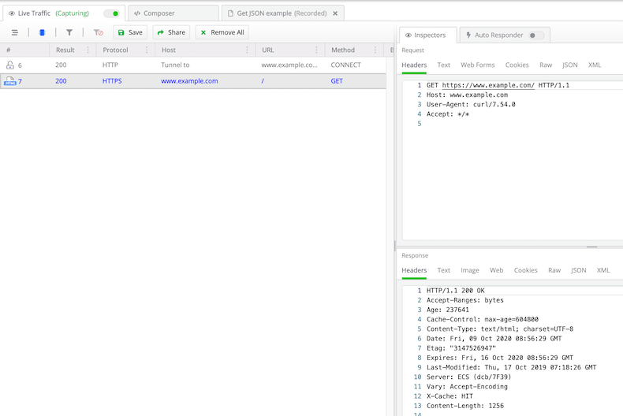

## Environment

|   |   |
|---|---|
| Product   |  Fiddler Everywhere  |
| Product Version | 1.0.0 and above  |
| Operating System | macOS |

## Description

How can I troubleshoot traffic capturing on macOS?

## Solution

Test if Fiddler Everywhere is correctly configured to capture HTTPS traffic on macOS by executing a cURL command in the macOS terminal and checking the output in the terminal and inside Fiddler Everywhere:

1. Open Fiddler Everywhere and ensure that the root certificate is installed and trusted, and **Settings** > **HTTPS** > **Capture HTTPS traffic** is checked.
1. Open a terminal and enter the following command:
    ```sh
    curl -v --url https://www.example.com/ -x 127.0.0.1:8866
    ```

    The `-x` option sets the Fiddler Everywhere proxy. The `-v` option provides verbose logs. Optionally, you can use the `-k` option to disable SSL verification.
1. Check the command output for a line related to the server certificate. Under it, the certificate will list the Fiddler URL (http://www.fiddler2.com).
    ```sh
    *   Trying 127.0.0.1...
    * TCP_NODELAY set
    * Connected to 127.0.0.1 (127.0.0.1) port 8866 (#0)
    * Establish HTTP proxy tunnel to www.example.com:443
    > CONNECT www.example.com:443 HTTP/1.1
    > Host: www.example.com:443
    > User-Agent: curl/7.54.0
    > Proxy-Connection: Keep-Alive
    >
    < HTTP/1.1 200 Connection Established
    < FiddlerGateway: Direct
    < StartTime: 12:06:48.719
    < Connection: close
    <
    * Proxy replied OK to CONNECT request
    * ALPN, offering h2
    * ALPN, offering http/1.1
    * Cipher selection: ALL:!EXPORT:!EXPORT40:!EXPORT56:!aNULL:!LOW:!RC4:@STRENGTH
    * successfully set certificate verify locations:
    *   CAfile: /etc/ssl/cert.pem
    CApath: none
    * TLSv1.2 (OUT), TLS handshake, Client hello (1):
    * TLSv1.2 (IN), TLS handshake, Server hello (2):
    * TLSv1.2 (IN), TLS handshake, Certificate (11):
    * TLSv1.2 (IN), TLS handshake, Server key exchange (12):
    * TLSv1.2 (IN), TLS handshake, Server finished (14):
    * SSL connection using TLSv1.2 / ECDHE-RSA-AES256-GCM-SHA384
    * ALPN, server did not agree to a protocol
    * Server certificate:
    *  subject: OU=Created by http://www.fiddler2.com; O=Fiddler Root Certificate Authority; CN=*.example.com
    *  start date: Oct  2 00:00:00 2020 GMT
    *  expire date: Oct  9 00:00:00 2022 GMT
    *  subjectAltName: host "www.example.com" matched certs "*.example.com"
    *  issuer: OU=Created by http://www.fiddler2.com; O=Fiddler Root Certificate Authority; CN=Fiddler Root Certificate Authority
    *  SSL certificate verify ok.
    > GET / HTTP/1.1
    > Host: www.example.com
    > User-Agent: curl/7.54.0
    >
    < HTTP/1.1 200 OK
    < Age: 596717
    < Cache-Control: max-age=604800
    < Content-Type: text/html; charset=UTF-8
    < Date: Fri, 09 Oct 2020 09:06:49 GMT
    < Etag: "3147526947+ident"
    < Expires: Fri, 16 Oct 2020 09:06:49 GMT
    < Last-Modified: Thu, 17 Oct 2019 07:18:26 GMT
    < Server: ECS (dcb/7EC6)
    < Vary: Accept-Encoding
    < X-Cache: HIT
    < Content-Length: 1256
    ```
1. Check the Fiddler Everywhere application window. A new session will be visible in the **Live Traffic** tab, the protocol will be **HTTPS**, and no **Tunnel** to indicate in the **Host** column will be available. If this is correct, then Fiddler Everywhere is configured to capture HTTPS traffic.
    
1. Enable the **System Proxy** capturing mode and open a Chrome browser. Use the incognito mode to make sure no credentials or cookies are cached. Then open each of these URLs and see if they are captured inside Fiddler Everywhere:
    - `http://example.com` (note that this request uses **HTTP**)
    - `https://www.example.com` (note that this request uses **HTTPS**)
    - `https://www.google.com`
1. After opening each of the above URLs, check the sessions grid and see if the traffic is captured. Additionally, make sure that no active filters are hiding the captured traffic&mdash;to remove any preset filters, use the **Clear All Filters** option.

If the issue persists save the captured sessions by going to **File** > **Save Archive** > **All Sessions** and post them in [the support channels](slug://support).

## See Also

* [Troubleshooting Mac Proxy Settings](slug://troubleshoot-mac-proxy-settings)
* [Accessing and Inspecting Fiddler Everywhere Log Files](slug://fiddler-log-files)
* [Troubleshooting macOS Trust Certificate Issues](slug://troubleshoot-certificate-error)
* [Resetting Fiddler Everywhere Settings to Default](slug://how-to-reset-fiddler-everywhere-settings-to-default)
