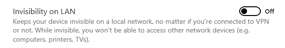
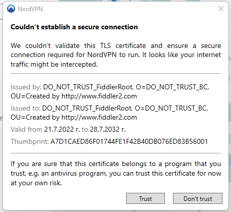

## Environment

|   |   |
|---|---|
| Product  | Version |
| Fiddler Everywhere |  1.0.0 and above  |
| NordVPN | 6.x.x and above |

## Description

Can I use NordVPN alongside Fiddler Everywhere, and what configuration settings should I consider?

## Solution

You can use the NordVPN and Fiddler Everywhere applications simultaneously, benefiting from all that virtual private networks offer, including testing and investigating possible network, page, and server issues from different world regions. Follow these steps to test your configuration:

- Start the Fiddler Everywhere application.

- Toggle ON the **System Proxy** switch to start network capturing.

- Start the NordVPN application.

- Go to **Settings > Advanced** and ensure that **Invisibility on LAN** is turned on. This will allow you to see and capture traffic from other devices on the local network.

    

- Connect to a selected VPN. At some point, NordVPn will detect and warn you about the existence of the Fiddler Root Certificate. Confirm that you recognize the certificate by using the **Trust** option.

    