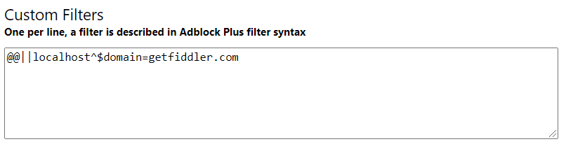

#### Environment

|   |   |
|---|---|
| Product  | Version |
| Fiddler Everywhere |  1.0.0 and above  |
| Brave Browser | all versions |

#### Description

Fiddler Everywhere provides an option to use a unique Fiddler account or Google Authentication. When using the Google Authentication option with the Brave browser (set as default OS browser), the fallback might fail silently due to the default adblock filters applied by the Brave configuration. The issue prevents Fiddler Everywhere users from using Google Authentication with Brave set as the default OS browser.

## Solution

The user can configure a custom adblock filter in the Brave browser configuration. Use a filter exception to bypass the Fiddler endpoint and, as a result, complete the Google Authentication process successfully.

To add an exception filter for the Fiddler Everywhere endpoint, follow these steps:

- Open the Brave browser and in type **brave://adblock** in the address field. Brave opens the **Additional filters** configuration page.
- Scroll down to the **Custom Filters** option. Type the following exception rule on a new line:
```
@@||localhost^$domain=getfiddler.com
```

- Exit the page and restart the Brave browser.
- Start Fiddler Everywhere and use the Google Authentication with Brave as a default OS browser.

