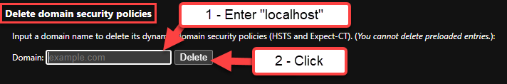

## Environment

|   |   |
|---|---|
| Product | Fiddler Everywhere |
| Google Chrome | all versions |

## Description

Fiddler Everywhere provides an option to use a unique Fiddler account or Google authentication. When using the Google authentication option when Google Chrome is set as the default OS browser, the callback may fail silently and Fiddler Everywhere never finishes authenticating the user.

This is due to a Google Chrome advanced setting that automatically redirects localhost HTTP traffic to HTTPS. This is known as [HSTS](https://en.wikipedia.org/wiki/HTTP_Strict_Transport_Security) and has a detrimental effect on the authentication flow of Fiddler Everywhere.

## Solution

To resolve this, you can remove `localhost` from the list of addresses that Microsoft Edge enforces HSTS on. As a result, the callback is successful and Fiddler Everywhere finishes authenticating.

Take the following steps:

1. Open the Google Chrome and enter `chrome://net-internals/#hsts` in the address field. Chrome will open a special **net-internals** configuration page.
2. Locate the "Delete domain security policies" section.
3. Enter `localhost` into the box, then click the **Delete** button.
4. Start Fiddler Everywhere and use the Google authentication option again.

Here is a screenshot of the setting and what to do:

