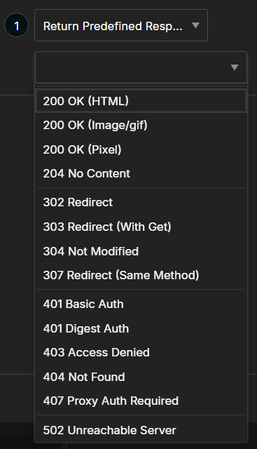
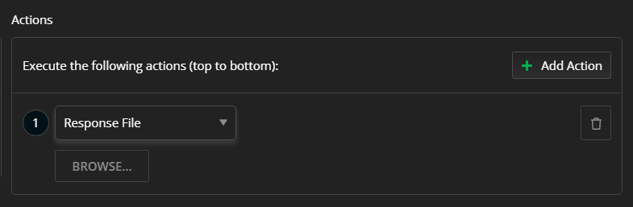

## Environment

|   |   |
|---|---|
| Product  |
| Product Version | 1.5.0 and above  |
| Operating System | macOS, Windows, and Linux |

## Description

The [**Rules** tab]() is a powerful debugging functionality in Fiddler Everywhere. How can I use each of the predefined actions in the **Actions** drop-down and customize a rule?

## Solution

The main idea behind the **Rules** tab is to provide a set of rules based on match rules and actions, which quickly mock a server response and behavior without the need to modify the server. Within seconds, you can execute many complex and different rules, and test your site against multiple scenarios.

>important All response modification actions are final. Final actions will immediately stop any other consecutive actions and rules from execution.

### Using the Predefined Actions in Rule Builder

The **Return Predefined Response** action in the **Rules Builder** provides predefined options with descriptive names for the simulated response.



The content of each predefined option is as follows:


* `200 OK (HTML)`

    ```HTTP
    HTTP/1.1 200 OK
    FiddlerTemplate: True
    Date: Fri, 25 Jan 2013 16:49:29 GMT
    Content-Length: 51

    This is a simple Fiddler-returned <B>HTML</B> page.
    ```

* `200 OK (Image/gif)`

    ```HTTP
    HTTP/1.1 200 OK
    Date: Fri, 25 Jan 2013 16:49:29 GMT
    FiddlerTemplate: True
    Content-Length: 308
    Content-Type: image/gif

    GIF89a# #encoded string for a sample GIF follows here
    ```

* `200 OK (Pixel)`

    ```HTTP
    HTTP/1.1 200 OK
    Date: Fri, 25 Jan 2013 16:49:29 GMT
    FiddlerTemplate: True
    Content-Type: image/gif
    Content-Length: 49

    GIF89a #encoded string for a transparent GIF follows here
    ```

* `204 No Content`

    ```HTTP
    HTTP/1.1 204 No Content
    FiddlerTemplate: True
    Date: Fri, 25 Jan 2013 16:49:29 GMT
    Content-Length: 0
    ```

* `302 Redirect`

    ```HTTP
    HTTP/1.1 302 Redirect
    FiddlerTemplate: True
    Date: Fri, 25 Jan 2013 16:49:29 GMT
    Location: https://www.telerik.com/fiddler/fiddler-everywhere
    Content-Length: 0
    ```

* `303 Redirect (With Get)`

    ```HTTP
    HTTP/1.1 303 Redirect Using GET
    FiddlerTemplate: True
    Date: Fri, 25 Jan 2013 16:49:29 GMT
    Location: https://www.telerik.com/fiddler/fiddler-everywhere
    Content-Length: 0
    ```

* `304 Not Modified`

    ```HTTP
    HTTP/1.1 304 Not Modified
    FiddlerTemplate: True
    Date: Fri, 25 Jan 2013 16:49:29 GMT
    Content-Length: 0
    ```

* `307 Redirect (Same Method)`

    ```HTTP
    HTTP/1.1 307 Redirect using same Method
    FiddlerTemplate: True
    Date: Fri, 25 Jan 2013 16:49:29 GMT
    Location: https://www.telerik.com/fiddler/fiddler-everywhere
    Content-Length: 0
    ```

* `401 Basic Auth`

    ```HTTP
    HTTP/1.1 401 Authentication Required
    FiddlerTemplate: True
    Date: Fri, 25 Jan 2013 16:49:29 GMT
    WWW-Authenticate: Basic realm="Fiddler"
    Content-Type: text/html
    Content-Length: 520

    Fiddler: HTTP/401 Basic Server Auth Required.    
    ```

* `401 Digest Auth`

    ```HTTP
    HTTP/1.1 401 Authentication Required
    FiddlerTemplate: True
    Date: Fri, 25 Jan 2013 16:49:29 GMT
    WWW-Authenticate: Digest realm="realm@example.com",qop="auth,auth-int",nonce="dcd98b7102dd2f0e8b11d0f600bfb0c093",opaque="5ccc069c403ebaf9f0171e9517f40e41"
    Content-Type: text/html
    Content-Length: 520

    Fiddler: HTTP/401 Digest Server Auth Required.
    ```

* `403 Access Denied`

    ```HTTP
    HTTP/1.1 403 Access Denied
    FiddlerTemplate: True
    Date: Fri, 25 Jan 2013 16:49:29 GMT
    Content-Length: 520

    Fiddler: HTTP/403 Access Denied.   
    ```

* `404 Not Found`

    ```HTTP
    HTTP/1.1 404 Not Found
    FiddlerTemplate: True
    Date: Fri, 25 Jan 2013 16:49:29 GMT
    Content-Type: text/html
    Content-Length: 520

    Fiddler: HTTP/404 Not Found
    ```

* `407 Proxy Auth Required`

    ```HTTP
    HTTP/1.1 407 Proxy Auth Required
    FiddlerTemplate: True
    Date: Fri, 25 Jan 2013 16:49:29 GMT
    Proxy-Authenticate: Basic realm="Fiddler (just hit Ok)"
    Content-Type: text/html
    Content-Length: 520

    Fiddler: HTTP/407 Proxy Auth Required.
    ```

* `502 Unreachable Server`

    ```HTTP
    HTTP/1.1 502 Unreachable Server
    Date: Fri, 25 Jan 2013 16:49:29 GMT
    FiddlerTemplate: True
    Content-Type: text/html
    Content-Length: 520

    Fiddler: HTTP/502 unreachable server.
    ```

### Using the Custom Response File

The **Actions** drop-down of the **Rule Builder** provides an option to load your own custom DAT file with an entirely custom HTTP response:

1. Scroll the drop-down **Actions** menu and select **Return file**.
1. In the file selection window, load the DAT file with the custom HTTP response.
1. Click **Save** to create or update the rule.



### Using the Custom Manual Response

Another option that the **Rule Builder** provides is to create the mocked custom HTTP response manually:

1. Scroll the drop-down **Actions** menu and select **Return Manual Response**.
1. Write the custom HTTP response in the text field.
1. Click **Save** to create or update the rule.


